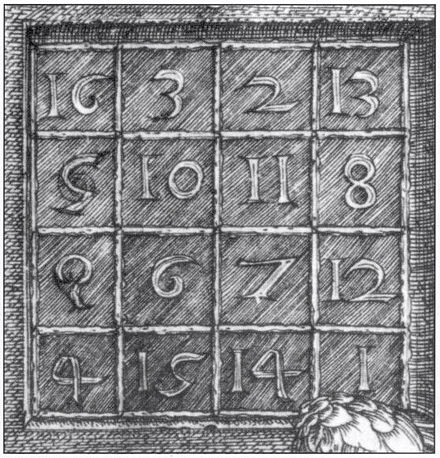
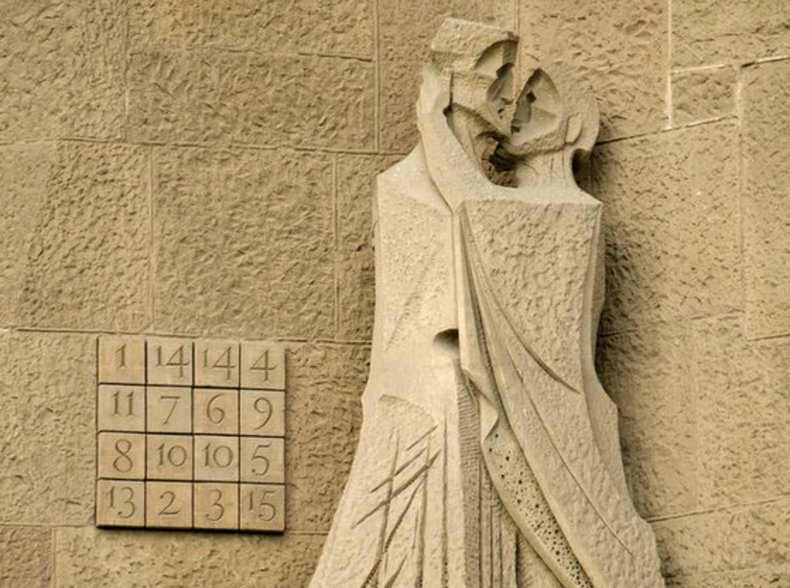

# Aplicació: Quadrats màgics (P99555)



Aquesta lliçó presenta una solució del problema [P99555](https://jutge.org/problems/P99555) del Jutge que consisteix a determinar si certs arranjaments de números constitueixen o no quadrats màgics. La solució d'aquest problema involucra matrius i llistes.


## Quadrats màgics

Una matriu d'$n\times n$ enters és anomenada un **quadrat màgic** si tots els nombres entre 1 i $n²$ hi apareixen exactament un cop, i si totes les files, les columnes i les diagonals sumen el mateix valor. Als quadrats màgics s'els associa propietats sobrenaturals i apareixen en algunes obres d'art. Per exemple, hi ha un quadrat que és quasi màgic a la Sagrada Família (però conté elements repetits):

<center>

</center>


## El problema

El problema consisteix en llegir una seqüència de quadrats de mida variable i dir, per a cadascun d'ells, si és o no és màgic.

A l'entrada, cada quadrat comença pel seu nombre de files i columnes $n$ seguit dels $n²$ valors que el formen, per files. Quan és màgic cal escriure `yes` i quan no ho és `no`. 

Per exemple, per a l'entrada

```text
3
1 6 8
5 7 3
9 2 4
4
4 5 16 9
14 11 2 7
1 8 13 12
15 10 3 6
```

cal obtenir la sortida 

```text
no
yes
```

Comproveu perquè.


## Estructura del programa

És evident que la resolució d'aquest problema demana a crits la creació d'una funció que, donat un quadrat, indiqui si aquest és màgic o no. Aquesta funció podria tenir la capçalera i especificació següent:

```python
def es_quadrat_magic(q: Quadrat) -> bool:
    """Indica si q és un quadrat màgic o no."""
```

El tipus `Quadrat` representarà matrius quadrades de nombres i ve donat per aquesta definició de tipus:

```python
from typing import TypeAlias

Quadrat: TypeAlias = list[list[int]]
```

Amb això ja podem muntar un programa principal que llegeixi quadrats i escrigui si són màgics o no:

```python
from yogi import read, tokens

def main() -> None:
    for n in tokens(int):
        q = [[read(int) for _ in range(n)] for _ in range(n)]
        print('yes' if es_quadrat_magic(q) else 'no')
```

Mentre es puguin llegir valors de `n` amb `tokens`, es llegeixen `n²` enters que es desen en una matriu `q` de mida `n ⨉ n`, per la qual s'escriu el resultat usant la funció `es_quadrat_magic`. 


## Funció per determinar la propietat

Queda ara fer la part més essencial: Escriure la funció `es_quadrat_magic` que indica si una matriu quadrada de mida `n ⨉ n` és o no màgica. Per fer-ho, cal assegurar dues condicions:

1. Tots els seus valors es troben entre 1 i `n²` i no tenen repetits.
2. La suma dels valors de cada fila, de cada columna i de cada diagonal són iguals.

Podríem doncs descompondre `es_quadrat_magic` en dues noves funcions `bons_valors` i `sumes_iguals` que indiquin el resultat de la primera i segona condició respectivament:

```python
def es_quadrat_magic(q: Quadrat) -> bool:
    """Indica si q és un quadrat màgic o no."""

    return bons_valors(q) and sumes_iguals()
```

La funció `bons_valors` ha de comprovar primer que tots els valors es troben entre 1 i `n²`: Això es pot fer fàcilment amb una cerca del valor erroni per totes les files i columnes. Després, ha de comprovar que no hi ha cap repetit: Això es pot fer de moltíssimes maneres. Una d'elles és crear una llista `vistos` de `n² + 1` booleans, de forma que `vistos[i]` indiqui si el nombre `i` és a la matriu o no (la posició zero no s'utilitza). Al principi, cap element és vist. Després, per cada element `x` de la matriu, si encara no s'havia vist, es marca com a vist. Si ja s'havia vist, vol dir que aquell element és repetit.

```python
def bons_valors(q: Quadrat) -> bool:
    n = len(q)
    # comprovar que tots els valors són entre 1 i n²
    for i in range(n):
        for j in range(n):
            if not 1 <= q[i][j] <= n*n:
                return False
    # comprovar que no hi ha elements repetits
    vistos = [False for i in range(n * n + 1)]
    for i in range(n):
        for j in range(n):
            x = q[i][j]     # ja se sap que 1 <= x <= n*n. per tant els accessos següents no són fora del vector
            if vistos[x]:  
                return False
            vistos[x] = True
    # en aquest punt, ha passat totes les comprovacions
    return True
```

La funció `sumes_iguals` ha de mirar si la suma dels valors de cada fila, de cada columna i de cada diagonal són iguals. Per fer-ho, es pot calcular primer la suma dels elements de la primera diagonal. A continuació, es mira que la suma dels elements de la segona diagonal i de cada fila i de cada columna coincideixin:

```python
def sumes_iguals(q: Quadrat) -> bool:
    n = len(q)
    # trobar suma primera diagonal
    suma = sum([q[i][i] for i in range(n)])
    # comprovar suma segona diagonal
    if suma != sum([q[n - i - 1][i] for i in range(n)]):
        return False
    # comprovar sumes de cada fila i
    for i in range(n):
        if suma != sum(q[i]):
            return False
    # comprovar sumes de cada columna j
    for j in range(n):
        if suma != sum([q[i][j] for i in range(n)]):
            return False
    # en aquest punt, ha passat totes les comprovacions
    return True
```

I el programa complet és aquest:

```python
from typing import TypeAlias
from yogi import read, tokens


Quadrat: TypeAlias = list[list[int]]


def main() -> None:
    for n in tokens(int):
        q = [[read(int) for _ in range(n)] for _ in range(n)]
        print('yes' if es_quadrat_magic(q) else 'no')


def es_quadrat_magic(q: Quadrat) -> bool:
    """Indica si q és un quadrat màgic o no."""

    return bons_valors(q) and sumes_iguals()


def bons_valors(q: Quadrat) -> bool:
    n = len(q)
    # comprovar que tots els valors són entre 1 i n²
    for i in range(n):
        for j in range(n):
            if not 1 <= q[i][j] <= n*n:
                return False
    # comprovar que no hi ha elements repetits
    vistos = [False for i in range(n * n + 1)]
    for i in range(n):
        for j in range(n):
            x = q[i][j]     # ja se sap que 1 <= x <= n*n. per tant els accessos següents no són fora del vector
            if vistos[x]:  
                return False
            vistos[x] = True
    # en aquest punt, ha passat totes les comprovacions
    return True


def sumes_iguals(q: Quadrat) -> bool:
    n = len(q)
    # trobar suma primera diagonal
    suma = sum([q[i][i] for i in range(n)])
    # comprovar suma segona diagonal
    if suma != sum([q[n - i - 1][i] for i in range(n)]):
        return False
    # comprovar sumes de cada fila i
    for i in range(n):
        if suma != sum(q[i]):
            return False
    # comprovar sumes de cada columna j
    for j in range(n):
        if suma != sum([q[i][j] for i in range(n)]):
            return False
    # en aquest punt, ha passat totes les comprovacions
    return True


if __name__ == '__main__':
    main()
```

## Les funcions `all` i `any`

Donada una llista de booleans, la funció predefinida `all` indica si tots són certs. Igualment, donada una llista de booleans, la funció predefinida `any` indica si algun és cert. Per exemple:

```python
>>> all([True, True, False])
False
>>> all([True, True, True])
True
>>> all([])
True
>>> any([False, False, True])
True
>>> any([])
False
```

Aquestes funcions són molt útils quan se'ls passa una llista per comprensió. Per exemple, per comprovar que tots els valors són entre 1 i `n²` a la funció `bons_valors` es podria fer

```python
    if not all([1 <= q[i][j] <= n*n for i in range(n) for j in range(n)]):
        return False
```

enlloc de 

```python
    for i in range(n):
        for j in range(n):
            if not 1 <= q[i][j] <= n*n:
                return False
```

com havíem fet abans.

De forma semblant per comprovar si alguna de les sumes de les files és diferent de `suma` a `sumes_iguals` es podria fer

```python
    if any([sum(fila) != suma for fila in q]):
        return False
```

enlloc de 

```python
    for i in range(n):
        if suma != sum(q[i]):
            return False
```

I, usant la mateixa idea, tota la funció es podria reescriure així:

```python
def sumes_iguals(q: Quadrat) -> bool:
    n = len(q)
    suma = sum([q[i][i] for i in range(n)])  # suma primera diagonal
    return suma == sum([q[n - i -1][i] for i in range(n)]) \  # suma segona diagonal
        and all([sum(fila) == suma for fila in q]) \    # sumes files
        and all([sum([q[i][j] for i in range(n)]]) == suma for j in range(n)])  # sumes columnes
```

Nota: ho deixo amb llistes per comprensió i no generadors per no embolicar més la troca.


<Autors autors="jpetit"/> 

