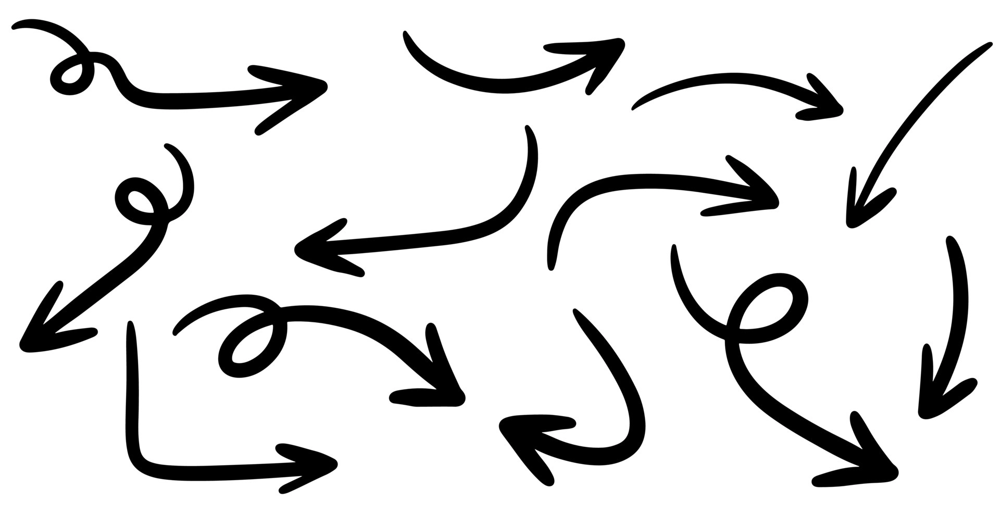

# Referències




Aquesta lliçó continua amb detalls importants sobre les llistes i les referències. En particular, es considera un problema que hom es pot trobar freqüentment quan tracta amb llistes de llistes i s'analitzen diferents solucions possibles. De fet, aquí no hi ha res de nou, però veure-ho en el context de les matrius reforça la comprensió de les referències als objectes.


## El problema

Considereu primer aquest petit programa:

```python
fila = [0, 0, 0]
matriu = [fila, fila, fila]
print(matriu)
```

És evident que aquest programa escriu una matriu de 3⨉3 zeros ~~[[0, 0, 0], [0, 0, 0], [0, 0, 0]]~~. Perfecte.

Ara, per fer que la posició 0,0 de la matriu canviï a 9, sembla que només cal fer una petita modificació:

```python
fila = [0, 0, 0]
matriu = [fila, fila, fila]
matriu[0][0] = 9
print(matriu)
```

Oli en un llum, oi? El programa ara hauria d'escriure ~~[[9, 0, 0], [0, 0, 0], [0, 0, 0]]~~.

Doncs no! El programa escriu ~~[[9, 0, 0], [9, 0, 0], [9, 0, 0]]~~ 😵‍💫. I, de fet, al final del programa, la variable `fila` val `[9, 0, 0]` 😱.

Per entendre el que passa, executeu el programa anterior instrucció a instrucció amb el Python Tutor:

<iframe width="800" height="500" frameborder="0" src="https://pythontutor.com/iframe-embed.html#code=fila%20%3D%20%5B0,%200,%200%5D%0Amatriu%20%3D%20%5Bfila,%20fila,%20fila%5D%0Amatriu%5B0%5D%5B0%5D%20%3D%209%0Aprint%28matriu%29&codeDivHeight=400&codeDivWidth=350&cumulative=false&curInstr=0&heapPrimitives=nevernest&origin=opt-frontend.js&py=3&rawInputLstJSON=%5B%5D&textReferences=false"> </iframe>

Quan s'executa `fila = [0, 0, 0]`, veiem que es crea un variable `fila` i que el seu valor, com sabem, és una referència a un objecte llista amb tres zeros.

Quan s'executa `matriu = [fila, fila, fila]`, també es crea una variable `matriu` i el seu valor és una referència a un objecte llista (perquè les matrius no són altra cosa que llistes de llistes). I, ara, fixeu-vos-hi: cada element d'aquesta nova llista és una referència a `fila`. Això pot resultar sorprenent, però és perfectament coherent amb el que sabem.

Per això, quan es fa `matriu[0][0] = 9`, el que es modifica és la llista `[0, 0, 0]` que passa a ser `[9, 0, 0]` i, de retruc, es modifica `fila`, `matriu[0]`, `matriu[1]` i `matriu[2]` perquè totes hi feien referència.

Tràgic, oi? Però, de fet, previsible: Les llistes es manipulen a través de referències. Per tant, les llistes de llistes són referències a llistes de referències a llistes, tal com es veu al dibuix.


## Possibles solucions (bones i dolentes)

El problema amb el qual ens hem trobat anteriorment és que `matriu` no era realment una matriu amb nou elements. Era una llista on cada element era *la mateixa* llista. En el fons, només hi havia tres elements.

Per arreglar-ho, podríem pensar en diverses alternatives a l'assignació `matriu = [fila, fila, fila]`:

1. Si fem `matriu = [fila] * 3`, el resultat és el mateix. L'operador de repetició de llistes replica les referències a les llistes. [Vegeu-ho](https://pythontutor.com/render.html#code=fila%20%3D%20%5B0,%200,%200%5D%0Amatriu%20%3D%20%5Bfila%5D%20*%203%0Amatriu%5B0%5D%5B0%5D%20%3D%209%0Aprint%28matriu%29&cumulative=false&curInstr=0&heapPrimitives=nevernest&mode=display&origin=opt-frontend.js&py=3&rawInputLstJSON=%5B%5D&textReferences=false) amb Python Tutor.

1. Si fem `matriu = [fila[:]] * 3`, el resultat és quasi el mateix. La còpia de `fila` amb `fila[:]` fa que `matriu` i `fila` siguin independents (bé!) però l'operador de repetició de llistes encara comparteix les tres files de la matriu (malament!). [Vegeu-ho](https://pythontutor.com/render.html#code=fila%20%3D%20%5B0,%200,%200%5D%0Amatriu%20%3D%20%5Bfila%5B%3A%5D%5D%20*%203%0Amatriu%5B0%5D%5B0%5D%20%3D%209%0Aprint%28matriu%29&cumulative=false&curInstr=0&heapPrimitives=nevernest&mode=display&origin=opt-frontend.js&py=3&rawInputLstJSON=%5B%5D&textReferences=false).

1. Si fem `matriu = [fila for _ in range(3)]`, el resultat és també el mateix que al principi. La comprensió de llistes replica les referències a les llistes. [Vegeu-ho](https://pythontutor.com/render.html#code=fila%20%3D%20%5B0,%200,%200%5D%0Amatriu%20%3D%20%5Bfila%20for%20_%20in%20range%283%29%5D%0Amatriu%5B0%5D%5B0%5D%20%3D%209%0Aprint%28matriu%29&cumulative=false&curInstr=0&heapPrimitives=nevernest&mode=display&origin=opt-frontend.js&py=3&rawInputLstJSON=%5B%5D&textReferences=false).

1. En canvi, si fem `matriu = [fila[:] for _ in range(3)]`, el resultat és ara el desitjat 👍: La comprensió de llistes avalua cada cop l'expressió `fila[:]` per a cada element del `range` i, per tant, crea 3 còpies independents. [Vegeu-ho](https://pythontutor.com/render.html#code=fila%20%3D%20%5B0,%200,%200%5D%0Amatriu%20%3D%20%5Bfila%5B%3A%5D%20for%20_%20in%20range%283%29%5D%0Amatriu%5B0%5D%5B0%5D%20%3D%209%0Aprint%28matriu%29&cumulative=false&curInstr=0&heapPrimitives=nevernest&mode=display&origin=opt-frontend.js&py=3&rawInputLstJSON=%5B%5D&textReferences=false).

1. Si prescindim de la variable `fila`, fer `matriu = [[0, 0, 0] for _ in range(3)]` també crea la matriu desitjada. La raó, una altra vegada, és que a cada iteració del `for`, s'avalua de nou el `[0, 0, 0]` que produeix una nova llista cada cop. [Vegeu-ho](https://pythontutor.com/render.html#code=matriu%20%3D%20%5B%5B0,%200,%200%5D%20for%20_%20in%20range%283%29%5D%0Amatriu%5B0%5D%5B0%5D%20%3D%209%0Aprint%28matriu%29&cumulative=false&curInstr=0&heapPrimitives=nevernest&mode=display&origin=opt-frontend.js&py=3&rawInputLstJSON=%5B%5D&textReferences=false).

1. Curiosament, fer `matriu = [[0] * 3 for _ in range(3)]` també produeix el bon resultat. Com que `0` és un enter i no una llista, `[0] * 3` replica tres cops l'enter zero, i no pas tres referències a l'enter zero.

Les diferències són subtils, i poden passar desapercebudes fàcilment. Cal doncs entendre-les bé.


## Exercici

Tenim una matriu `m`, com ara aquesta:

```python
matriu = [
    [1, 2, 3, 4],
    [9, 8, 7, 6],
    [1, 2, 2, 1],
]
```

Digueu quina o quines des les instruccions següents copien *completament* la matriu `matriu` en `matriu2`. Aquí, "completament" vol dir que ambdues matrius queden totalment deslligades i independents: els canvis en una no afecten els canvis a l'altra.

- `matriu2 = matriu`

- `matriu2 = matriu[:]`

- `matriu2 = matriu[:][:]`

- `matriu2 = [fila for fila in matriu]`

- `matriu2 = [fila[:] for fila in matriu]`

- `matriu2 = [[element for element in fila] for fila in matriu]`

- `matriu2 = [[matriu[i][j] for j in range(len(matriu[i]))] for i in range(len(matriu))]`

Comproveu la vostra resposta [aquí](https://pythontutor.com/render.html#code=matriu%20%3D%20%5B%0A%20%20%20%20%5B1,%202,%203,%204%5D,%0A%20%20%20%20%5B9,%208,%207,%206%5D,%0A%20%20%20%20%5B1,%202,%202,%201%5D,%0A%5D%0A%0Amatriu2%20%3D%20matriu%0A%23%20no%20funciona%3A%20tot%20queda%20compartit%0A%0Amatriu2%20%3D%20matriu%5B%3A%5D%0A%23%20no%20funciona%3A%20cada%20fila%20queda%20compartida%0A%0Amatriu2%20%3D%20matriu%5B%3A%5D%5B%3A%5D%0A%23%20no%20funciona%3A%20cada%20fila%20queda%20compartida%20%28fa%20c%C3%B2pia%20de%20la%20c%C3%B2pia%29%0A%0Amatriu2%20%3D%20%5Bfila%20for%20fila%20in%20matriu%5D%0A%23%20no%20funciona%3A%20cada%20fila%20queda%20compartida%0A%0Amatriu2%20%3D%20%5Bfila%5B%3A%5D%20for%20fila%20in%20matriu%5D%0A%23%20funciona%3A%20les%20dues%20matrius%20no%20comparteixen%20informaci%C3%B3&cumulative=false&curInstr=0&heapPrimitives=nevernest&mode=display&origin=opt-frontend.js&py=3&rawInputLstJSON=%5B%5D&textReferences=false).


## Matrius com a paràmetres

Recordeu que el pas de paràmetres és equivalent a una assignació. Per tant, quan es passa una matriu com a paràmetre real, el paràmetre formal corresponent és una còpia de la seva referència, no del seu valor (perquè, al cap i la fi, les matrius són llistes).

Això ens permet, per exemple, escriure una acció que transposi una matriu quadrada d'aquesta forma:

```python
def transposar(M: Matriu) -> None:
    """Transposa la matriu quadrada M."""

    n = len(M)
    for i in range(n):  #  per cada índex fila
        for j in range(i + 1, n):  # per cada columna per sota de la diagonal
            M[i][j], M[j][i] = M[j][i], M[i][j]
```

En efecte, si tenim que `a = [[1, 2], [3, 4]]`, després de cridar a `transposar(a)`, el valor d'`a` serà `[[1, 3], [2, 4]]`, tal com cal.

En canvi, aquesta implementació és incorrecta:

```python
def transposar_kk(matriu: list[list[float]]) -> None:
    """Transposa la matriu quadrada donada. No funciona!"""

    n = len(matriu)
    matriu ❌ = [[matriu[j][i] for j in range(n)] for i in range(n)]
```

En aquest cas, després de cridar a `transposar_kk(a)`, el valor d'`a` continuarà sent l'original. Això és perquè, malgrat que la matriu per comprensió calcula correctament la transposta de `matriu`, genera un nova matriu que es desa (amb l'operador d'assignació) a la variable `matriu`. Per tant, es deslliga la relació entre el paràmetre formal i el real.

Evidentment, enlloc de fer una acció que transposi la matriu que reb, es podria haver decidit fer una funció que retorni la transposta d'una matriu donada, sense modificar per res l'original:

```python
def transposta(matriu: list[list[float]]) -> list[list[float]]:
    """Retorna la transposta d'una matriu quadrada donada."""

    n = len(matriu)
    return [[matriu[j][i] for j in range(n)] for i in range(n)]
```

De passada, fixeu-vos que el nom de la funció (`transposta`) i el nom de l'acció (`transposar`) ja mostra el diferent efecte volgut: En el cas de la funció hem preferit un substantiu, per emfatitzar el resultat obtingut, mentre que en el cas de l'acció hem preferit un infinitiu (un imperatiu també estaria bé), per emfatitzar el canvi. La versió en funció o en acció serà més o menys adient depenent del context. En general, les funcions, al no canviar les coses i lliurant nous resultats, són més segures. A canvi, les accions, al no haver de crear duplicats, són més eficients.


## Exercici

Digueu quines de les accions següents posa correctament a zero tots els valors d'un matriu (no buida) donada:

```python
def posar_a_zero(matriu: list[list[int]]) -> None:
    m, n = len(matriu), len(matriu[0])
    for i in range(m):
        for j in range(n):
            matriu[i][j] = 0
```

```python
def posar_a_zero(matriu: list[list[int]]) -> None:
    for fila in matriu:
        for element in fila:
            element = 0
```

```python
def posar_a_zero(matriu: list[list[int]]) -> None:
    for fila in matriu:
        for j in range(len(fila)):
            fila[j] = 0
```

```python
def posar_a_zero(matriu: list[list[int]]) -> None:
    m, n = len(matriu), len(matriu[0])
    matriu = [[0 for _ in range(n)] for _ in range(m)]
```

```python
def posar_a_zero(matriu: list[list[int]]) -> None:
    m, n = len(matriu), len(matriu[0])
    for i in range(m):
        matriu[i] = [0] * n
```

```python
def posar_a_zero(matriu: list[list[int]]) -> None:
    m, n = len(matriu), len(matriu[0])
    zeros = [0 for _ in range(n)]
    for i in range(m):
        matriu[i] = zeros
```

```python
def posar_a_zero(matriu: list[list[int]]) -> None:
    m, n = len(matriu), len(matriu[0])
    zeros = [0] * n
    for i in range(m):
        matriu[i] = zeros
```

```python
def posar_a_zero(matriu: list[list[int]]) -> None:
    m, n = len(matriu), len(matriu[0])
    zeros = [0] * n
    for i in range(m):
        matriu[i] = zeros[:]
```


## Sumari

Com que les llistes són objectes, les llistes de llistes es tracten com a referències a llistes de referències a llistes. Això fa que sigui molt fàcil compartir dades, cosa que pot ser molt útil en algunes ocasions, però desastrós en altres.

Un lloc on sovint s'aprofita la compartició de dades és en les accions, per tal de poder modificar els continguts dels objectes rebuts. En aquest cas, cal no badar en assignar nous valors als paràmetres.

Quan no es vol compartir dades sinó tenir-ne còpies, treballar amb llistes per comprensió i usar llesques `[:]` sol ser una bona aproximació.


Se suposava que Python havia de ser fàcil. En aquest cas, realment no ho és tant. *C'est la vie!*


<Autors autors="jpetit"/>
