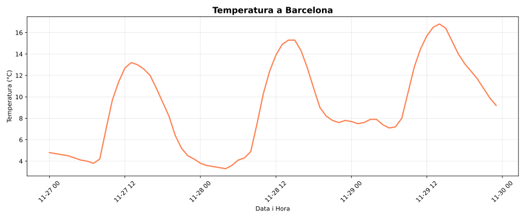

# Pandas


Pandas és una llibreria de Python per a l'anàlisi i manipulació de dades. Proporciona estructures de dades flexibles i eficients per treballar amb dades tabulars i series temporals.

Les seves principals funcionalitats inclouen:

-   Càrrega i exportació de dades en diferents formats (CSV, Excel, JSON, SQL)
-   Neteja i preparació de dades
-   Anàlisi exploratòria i estadística
-   Transformació i agregació de dades
-   Gestió de dades amb valors mancants

Pandas és àmpliament utilitzat en ciència de dades, aprenentatge automàtic, finances, investigació i qualsevol àmbit que requereixi processament de dades estructurades.

## Casos d'ús habituals

Pandas és ideal per:

-   Analitzar vendes mensuals d'una empresa
-   Processar resultats d'experiments científics
-   Netejar dades de sensors o dispositius IoT
-   Preparar dades per a models d'aprenentatge automàtic
-   Combinar dades de múltiples fonts
-   Generar informes i estadístiques automàtiques

Penseu en Pandas com una versió programada d'una full de càlcul, però amb molt més poder i flexibilitat per a l'anàlisi de dades.

## Instal·lació i importació

Per instal·lar Pandas:

```bash
python3 -m pip install pandas
```

La convenció estàndard per importar Pandas és:

```python
import pandas as pd
```

Això permet utilitzar totes les funcions de Pandas amb el prefix `pd`, que és més breu i segueix les convencions de la comunitat.

## Relació amb NumPy i altres llibreries

Pandas està construït sobre NumPy, heretant-ne l'eficiència en operacions numèriques. Les estructures de Pandas internament utilitzen arrays de NumPy.

Pandas s'integra fàcilment amb:

-   **NumPy**: per operacions matemàtiques i arrays multidimensionals
-   **Matplotlib**: per visualització de dades
-   **Scikit-learn**: per aprenentatge automàtic
-   **SciPy**: per computació científica

Aquesta integració permet fluxos de treball complets, des de la càrrega de dades fins a la modelització i visualització.

## Primer exemple d'ús

Considereu que voleu un programa que fa el següent:

1. Baixa dades d'una API pública (Open-Meteo) amb la previsió del temps de Barcelona.
2. Manipula les dades amb Pandas (calcula mitjana, màxim i mínim).
3. Pinta un gràfic amb matplotlib mostrant l'evolució de la temperatura.

Aquí teniu el codi complet amb Pandas i Matplotlib:

```python
import pandas as pd
import matplotlib.pyplot as plt

# Descarregar dades de l'API de dades obertes de la UE sobre temperatures
url = "https://api.open-meteo.com/v1/forecast?latitude=41.39&longitude=2.16&hourly=temperature_2m&forecast_days=3"

# Llegir les dades directament amb pandas
df = pd.read_json(url)

# Extreure les temperatures i hores
temps = pd.DataFrame({
    'Hora': pd.to_datetime(df['hourly']['time']),
    'Temperatura': df['hourly']['temperature_2m']
})

# Calcular estadístiques bàsiques
print("Temperatures a Barcelona (pròxims 3 dies)")
print(f"Temperatura mitjana: {temps['Temperatura'].mean():.1f}°C")
print(f"Temperatura màxima: {temps['Temperatura'].max():.1f}°C")
print(f"Temperatura mínima: {temps['Temperatura'].min():.1f}°C")

# Crear un gràfic
plt.figure(figsize=(12, 5))
plt.plot(temps['Hora'], temps['Temperatura'], linewidth=2, color='coral')
plt.title('Temperatura a Barcelona', fontsize=14, fontweight='bold')
plt.xlabel('Data i Hora')
plt.ylabel('Temperatura (°C)')
plt.grid(True, alpha=0.3)
plt.xticks(rotation=45)
plt.tight_layout()
plt.show()
```

La sortida del programa és quelcom com ara:

```text
Temperatures a Barcelona (pròxims 3 dies)
Temperatura mitjana: 9.0°C
Temperatura màxima: 16.8°C
Temperatura mínima: 3.3°C
```

I la gràfica obtinguda és:



A continuació, expliquem pas a pas què fa cada part del codi amb Pandas.

1. **Descarregar dades JSON:**

    ```python
    df = pd.read_json(url)
    ```

    Pandas pot llegir directament un JSON des d'una URL. El resultat ja és un **DataFrame** (l'estructura de dades principal de Pandas, com una taula d'Excel en memòria).

2. **Crear un DataFrame estructurat:**

    ```python
    temps = pd.DataFrame({
        'Hora': pd.to_datetime(df['hourly']['time']),
        'Temperatura': df['hourly']['temperature_2m']
    })
    ```

    Un **DataFrame** és com un diccionari de llistes, però amb superpoders:

    - Cada clau és una **columna**.
    - Pandas entén tipus de dades especials com dates (`pd.to_datetime()` converteix textos a objectes de data).
    - Es pot accedir a les dades per files, columnes o condicions.

3. **Operacions sobre columnes:**

    ```python
    temps['Temperatura'].mean()
    temps['Temperatura'].max()
    temps['Temperatura'].min()
    ```

    Aquí és on brilla Pandas! Quan accedeix a una columna (`temps['Temperatura']`), obtens una **sèerie** (com una llista millorada). Les sèries tenen mètodes directes per estadístiques:

    - No cal fer bucles `for`.
    - No cal `sum(llista)/len(llista)` per la mitjana.
    - Tot està optimitzat internament amb NumPy.

4. **Visualització:**

    Matplotlib agafa directament les columnes del DataFrame i les dibuixa. Pandas i matplotlib treballen molt bé junts!

Les lliçons següents aprofundiran més en les funcionalitats de Pandas, però aquest exemple mostra com es pot utilitzar per carregar, manipular i analitzar dades de manera eficient.

<Autors autors="jpetit"/>
