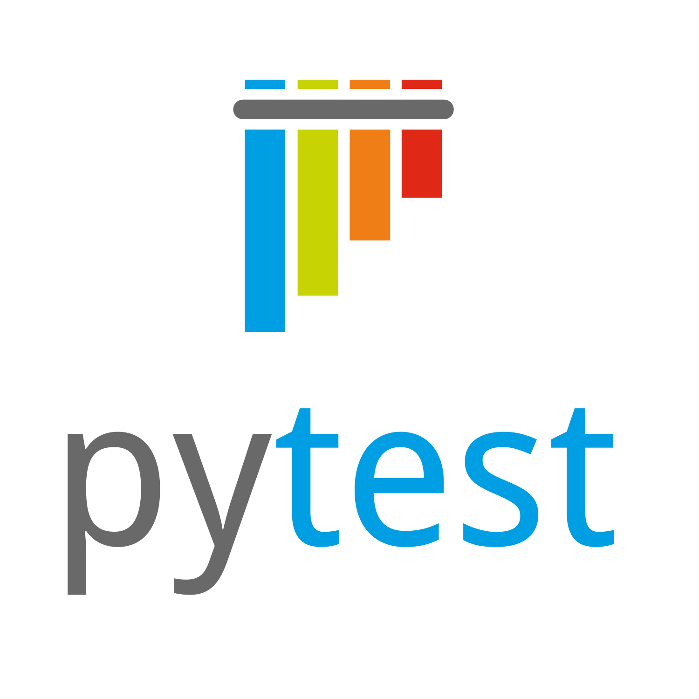
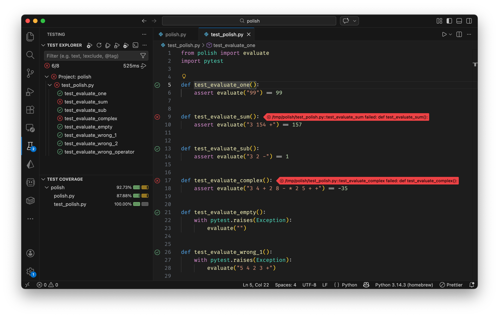

# Proves unitàries amb pytest



Aquesta lliçó presenta les proves unitàries amb pytest com a tècnica per comprovar automàticament que el codi fa el que s’espera. S’explica la importància de les proves, com escriure tests amb asserts, i en què es diferencien les proves unitàries de la verificació de tipus estàtica (mypy). El material inclou un exemple complet (avaluador en notació polonesa) i, al final, una activitat i exercicis per practicar.

## Importància de les proves unitàries

Escriure codi que “funcioni” una vegada no n’assegura el comportament en el temps. Quan afegim funcionalitats, corregim errors o refactoritzem, podem introduir regressions sense adonar-nos-en. Les **proves unitàries** són tests automatitzats que executen fragments del programa (per exemple funcions) amb entrades conegudes i comproven que els resultats coincideixen amb els esperats.

Els beneficis principals són:

- **Seguretat en els canvis**: podeu modificar o estendre el codi sabent que, si els tests continuen passant, no heu trencat el que ja funcionava.
- **Documentació viva**: els tests mostren com s’utilitzen les funcions i què es considera correcte; són especificacions executables.
- **Disseny més clar**: codi fàcil de provar tendeix a tenir responsabilitats ben delimitades i dependències explícites.
- **Detecció ràpida d’errors**: en pocs segons podeu executar desenes o centenars de comprovacions en lloc de provar manualment cada cas.

En aquesta introducció ens limitem a tests que criden funcions i comproven resultats amb **asserts**, sense entrar en mocks, fixtures avançades ni cobertura de codi. Podeu trobar més informació sobre pytest a la [documentació de pytest](https://docs.pytest.org/en/stable/).

Evidentment, les proves unitàries no són una única tècnica infallible per a comprovar el correcte funcionament d'un programa. Però sempre és millor tenir-ne que no tenir-ne.

## Proves unitàries amb pytest

En Python, una eina molt estesa per a proves unitàries és **pytest**. Els tests s’organitzen en fitxers i funcions amb noms que pytest reconeix.

### Organització dels fitxers

Per al fitxer que voleu provar (per exemple `modul.py`), cal tenir un fitxer de tests amb el prefix `test_`, per exemple `test_modul.py`. Dins d’aquest fitxer s’importen les funcions o mòduls que es volen posar a prova.

### Funcions de test

Cada test és una funció el nom de la qual comença amb `test_`. Les altres funcions del fitxer poden ser auxiliars. Dins d’una funció de test, es crida el codi a provar i es comprova el resultat amb **assert**:

```python
def test_suma():
    assert 2 + 2 == 4

def test_longitud():
    assert len([1, 2, 3]) == 3
```

Si l’expressió després de `assert` és `False`, el test falla i pytest mostra quin test ha fallat i on.

### Comprovar excepcions

Quan el que voleu comprovar és que en certes entrades es llança una excepció, podeu fer servir `pytest.raises`:

```python
import pytest

def test_no_sabem_parsejar_una_paraula():
    with pytest.raises(ValueError):
        int("xyz")
```

Si dins del bloc `with` no es llança l’excepció indicada, el test falla.

## Exemple: avaluador en notació polonesa

Suposem que tenim un avaluador d’expressions en notació polonesa inversa com el que cal pel problema [P25023](https://jutge.org/problems/P52023_ca) de Jutge.org. El codi (al fitxer `polish.py`) podria ser com el següent:

```python
def evaluate(expression: str) -> int:
    stack: list[int] = []
    for word in expression.split():
        if word.isdigit():
            stack.append(int(word))
        else:
            assert len(stack) >= 2, "Not enough operands"
            p1 = stack.pop()
            p2 = stack.pop()
            if word == "+":
                stack.append(p1 + p2)
            elif word == "-":
                stack.append(p2 - p1)
            elif word == "*":
                stack.append(p1 * p2)
            else:
                assert False, "Unknown operator"
    assert len(stack) == 1, "Syntax error"
    return stack[0]
```

Fixeu-vos com el codi és molt clar i fàcil de comprendre i verificar que tot funciona com cal amb assercions.

Els tests (al fitxer `test_polish.py`) poden comprovar casos concrets amb asserts sobre el valor retornat:

```python
from polish import evaluate
import pytest

def test_un_sol_numero():
    assert evaluate("99") == 99

def test_suma():
    assert evaluate("3 154 +") == 157

def test_resta():
    assert evaluate("3 2 -") == 1

def test_expressio_complexa():
    assert evaluate("3 4 + 2 8 - * 2 5 + +") == -35
```

I per als casos en què s’espera una excepció (expressió buida, operadors insuficients, operador desconegut):

```python
def test_expressio_buida():
    with pytest.raises(Exception):
        evaluate("")

def test_massos_operands():
    with pytest.raises(Exception):
        evaluate("5 4 2 3 +")

def test_operador_desconegut():
    with pytest.raises(Exception):
        evaluate("5 4 $")
```

Així, qualsevol canvi futur a `evaluate` es pot validar executant aquests tests; si tots passen, el comportament comprovat es manté.

## Executar els tests des de la línea de comandes

Per executar els tests des de la línia de comandes, cal tenir instal·lat pytest. Podeu instal·lar-lo amb

```bash
python3 -m pip install pytest
```

Llavors, dins de la carpeta del projecte (on es troben els fitxers `*_test.py` o `test_*.py`), podeu executar:

```bash
pytest
```

pytest descobrirà els fitxers de test i executarà les funcions que comencen per `test_`. Si algun test falla, es mostrarà el missatge d'error i el nombre de línia on ha fallat. Per exemple, amb el codi de l'exemple anterior, si executem `pytest`, obtindrem un resultat com el següent (s'han eliminat algunes línies per brevetat):

```text
============= test session starts ==============
collected 8 items
test_polish.py ........                                                                [100%]
============== 8 passed in 0.01s ===============
```

No hi ha hagut errors, per tant tots els tests han passat.

Si,en canvi, canviem el programa arròniament fent

```python
         if word == "+":
                stack.append(p1 + p2)
```

llavors obtindrem un resultat com el següent:

```text
========== test session starts ===========
collected 8 items

test_polish.py .F.F....                                                                [100%]
================ FAILURES ================
____ test_evaluate_sum ____

    def test_evaluate_sum():
>       assert evaluate("3 154 +") == 157
E       AssertionError: assert 462 == 157
E        +  where 462 = evaluate('3 154 +')

test_polish.py:10: AssertionError
____ test_evaluate_complex ____

    def test_evaluate_complex():
>       assert evaluate("3 4 + 2 8 - * 2 5 + +") == -35
E       AssertionError: assert -720 == -35
E        +  where -720 = evaluate('3 4 + 2 8 - * 2 5 + +')

test_polish.py:18: AssertionError
======== short test summary info =========
FAILED test_polish.py::test_evaluate_sum - AssertionError: assert 462 == 157
FAILED test_polish.py::test_evaluate_complex - AssertionError: assert -720 == -35
====== 2 failed, 6 passed in 0.02s =======
```

que ens precisa quins són els tests que han fallat, quines són les línies on han fallat i quin és el resultat esperat i el resultat obtingut.

A més, també podeu instal·lar `pytest-cov` per a mesurar la cobertura de codi.La cobertura de codi és la proporció de codi que és coberta per tests. Quan més alta sigui la cobertura, millor.

```bash
python3 -m pip install pytest pytest-cov
```

Després, podeu executar:

```bash
pytest --cov=polish
```

per mesurar la cobertura de codi al mòdul `polish`.

## Executar els tests des de l'IDE

Si teniu l’extensió de Python i pytest ben configurada al VSCode, també podeu executar o depurar tests des de la interfície (per exemple des del panell de Testing amb el símbol de matràs). Aquí teniu un exemple de la pantalla de tests quan falla la suma:



Com podeu veure, hi ha un botó per a executar tots els tests, un botó per a executar tots els tests de cobertura de codi i un botó per a executar tots els tests de cobertura de codi amb el visualitzador de cobertura de codi.

També podeu executar tests individualment, cliquant amb el botó dret sobre el test i seleccionant "Run Test".

## Verificació de tipus estàtica (mypy) vs proves unitàries (pytest)

És important no confondre dues eines complementàries:

- **mypy** fa verificació de tipus estàtica: analitza el codi sense executar-lo i comprova que les anotacions de tipus (per exemple `int`, `str`) es respectin. No pot assegurar que una funció faci el càlcul correcte, només que els tipus de les crides i dels retorns siguin coherents.

- **pytest** sí que executa el codi: cada test crida funcions amb dades concretes i comprova amb `assert` que el resultat és el desitjat. Això valida la lògica i el comportament, no els tipus.

A la pràctica, convé usar les dues eines: mypy per a la consistència de tipus i pytest per a la correctesa del comportament.

## Exercicis

### Exercici 1: Trobar duplicats

**Objectiu**: Escriure tests abans d’optimitzar una funció, per assegurar que el comportament es manté quan s'optimitza.

Aquesta és la solució inicial de cost $O(n²)$:

```python
def find_duplicates(numbers: list[int]) -> list[int]:
    """
    Retorna una llista amb els elements que apareixen més d'una vegada.
    Els duplicats es retornen en l'ordre en què apareixen per primera vegada.

    Exemples:
    >>> find_duplicates([1, 2, 3, 2, 4, 1])
    [1, 2]
    >>> find_duplicates([5, 5, 5, 1, 2])
    [5]
    >>> find_duplicates([1, 2, 3])
    []
    """
    duplicates: list[int] = []
    for i in range(len(numbers)):
        count = 0
        for j in range(len(numbers)):
            if numbers[i] == numbers[j]:
                count += 1
        if count > 1 and numbers[i] not in duplicates:
            duplicates.append(numbers[i])
    return duplicates
```

La funció és fàcil d’entendre però és lenta.

Passos a fer:

1. Escriure tests. Penseu en els casos límit: llista buida, sense duplicats, tots duplicats, duplicats múltiples del mateix element, ordre dels duplicats retornats i, si voleu, llistes grans.

2. Un cop els tests passen, optimitzar la funció perqupe funcioni en $O(n log n)$ ordenant i buscant consecutius iguals. Tornar a executar els tests per assegurar que no s’ha perdut correctesa.

3. Optimitzar de nou la funció perqupe funcioni en $O(n)$ amb un diccionari o un conjunt. Tornar a executar els tests per assegurar que no s’ha perdut correctesa.

### Exercici 2: Proves unitàries per a funcions

Implementeu les funcions següents i escriviu proves unitàries amb pytest (asserts sobre els resultats). Assegureu-vos de cobrir casos límit (llista buida, un sol element, etc.) i altres casos que tinguin sentit.

```python
def suma_parells(numeros: list[int]) -> int:
    """
    Retorna la suma de tots els números parells de la llista.
    Exemple: suma_parells([1, 2, 3, 4, 5]) -> 6
    """
    ...

def compta_vocals(text: str) -> int:
    """
    Compta el nombre de vocals (a, e, i, o, u) en un text.
    No distingeix entre majúscules i minúscules.
    Exemple: compta_vocals("Hola món") -> 3
    """
    ...

def inverteix_diccionari(d: dict[str, int]) -> dict[int, str]:
    """
    Inverteix les claus i valors d'un diccionari.
    Si hi ha valors duplicats, es queda amb l'última clau.
    Exemple: inverteix_diccionari({"a": 1, "b": 2}) -> {1: "a", 2: "b"}
    """
    ...

def troba_maxim_minim(numeros: list[float]) -> tuple[float, float]:
    """
    Retorna una tupla amb el valor màxim i mínim de la llista.
    Exemple: troba_maxim_minim([3.5, 1.2, 7.8, 2.1]) -> (7.8, 1.2)
    """
    ...

def filtra_per_longitud(paraules: list[str], longitud_minima: int) -> list[str]:
    """
    Retorna només les paraules que tenen una longitud >= longitud_minima.
    Exemple: filtra_per_longitud(["hola", "a", "Python"], 3) -> ["hola", "Python"]
    """
    ...

def agrupa_per_paritat(numeros: list[int]) -> dict[str, list[int]]:
    """
    Agrupa els números en parells i senars.
    Retorna un diccionari amb claus "parells" i "senars".
    Exemple: agrupa_per_paritat([1, 2, 3, 4]) -> {"parells": [2, 4], "senars": [1, 3]}
    """
    ...

def es_palindrom(text: str) -> bool:
    """
    Verifica si un text és un palíndrom (es llegeix igual d'esquerra a dreta).
    Ignora espais i majúscules.
    Exemple: es_palindrom("Anar a Salas a Rana") -> True
    """
    ...

def fusiona_diccionaris(d1: dict[str, int], d2: dict[str, int]) -> dict[str, int]:
    """
    Fusiona dos diccionaris sumant els valors de les claus comunes.
    Exemple: fusiona_diccionaris({"a": 1, "b": 2}, {"b": 3, "c": 4})
             -> {"a": 1, "b": 5, "c": 4}
    """
    ...

def crea_parelles(llista1: list[int], llista2: list[str]) -> list[tuple[int, str]]:
    """
    Crea parelles dels elements de dues llistes.
    Si les llistes tenen longituds diferents, s'atura a la més curta.
    Exemple: crea_parelles([1, 2, 3], ["a", "b"]) -> [(1, "a"), (2, "b")]
    """
    ...

def compta_frequencia(paraules: list[str]) -> dict[str, int]:
    """
    Compta quantes vegades apareix cada paraula a la llista.
    Exemple: compta_frequencia(["gat", "gos", "gat", "ocell"])
             -> {"gat": 2, "gos": 1, "ocell": 1}
    """
    ...
```

### Exercici 3: Proves unitàries per a més funcions

El mateix tipus de feina: implementar les funcions i escriure proves unitàries amb pytest.

```python
from typing import Callable

def valida_email(email: str) -> bool:
    """
    Valida si un string és un email vàlid.
    Ha de contenir exactament un @, almenys un caràcter abans i després del @,
    i almenys un punt després del @.
    Exemple: valida_email("usuari@domini.com") -> True
    Exemple: valida_email("usuari@domini") -> False
    """
    ...

def aplana_llista(llista: list[list[int]]) -> list[int]:
    """
    Converteix una llista de llistes en una llista plana.
    Exemple: aplana_llista([[1, 2], [3, 4, 5], [6]]) -> [1, 2, 3, 4, 5, 6]
    """
    ...

def troba_duplicats(llista: list[int]) -> set[int]:
    """
    Retorna un conjunt amb els elements que apareixen més d'una vegada.
    Exemple: troba_duplicats([1, 2, 3, 2, 4, 3, 5]) -> {2, 3}
    Exemple: troba_duplicats([1, 2, 3]) -> set()
    """
    ...

def ordena_per_frequencia(paraules: list[str]) -> list[tuple[str, int]]:
    """
    Retorna una llista de tuples (paraula, frequència) ordenada per frequència descendent.
    Si dues paraules tenen la mateixa frequència, s'ordenen alfabèticament.
    Exemple: ordena_per_frequencia(["gat", "gos", "gat", "ocell", "gos", "gat"])
             -> [("gat", 3), ("gos", 2), ("ocell", 1)]
    """
    ...

def transforma_text(text: str, transformacio: Callable[[str], str]) -> str:
    """
    Aplica una funció de transformació a cada paraula del text.
    Les paraules estan separades per espais.
    Exemple: transforma_text("hola món", str.upper) -> "HOLA MÓN"
    Exemple: transforma_text("hola món", lambda x: x[::-1]) -> "aloh nóm"
    """
    ...

def interseccio_diccionaris(d1: dict[str, int], d2: dict[str, int]) -> dict[str, int]:
    """
    Retorna un diccionari amb les claus que apareixen en ambdós diccionaris.
    El valor és el menor dels dos valors.
    Exemple: interseccio_diccionaris({"a": 5, "b": 3, "c": 8}, {"b": 7, "c": 2, "d": 1})
             -> {"b": 3, "c": 2}
    """
    ...

def troba_subcadena_mes_llarga(s1: str, s2: str) -> str:
    """
    Troba la subcadena comuna més llarga entre dos strings.
    Si hi ha múltiples subcadenes de la mateixa longitud, retorna la primera.
    Exemple: troba_subcadena_mes_llarga("abcdef", "xbcde") -> "bcde"
    Exemple: troba_subcadena_mes_llarga("hola", "adeu") -> "a"
    """
    ...

def descodifica_run_length(text: str) -> str:
    """
    Descodifica un string codificat amb run-length encoding.
    Format: "3a2b1c" significa "aaabbc"
    Exemple: descodifica_run_length("3a2b1c") -> "aaabbc"
    Exemple: descodifica_run_length("1h4o2l1a") -> "hhoooola"
    """
    ...
```

<Autors autors="jpetit"/>
