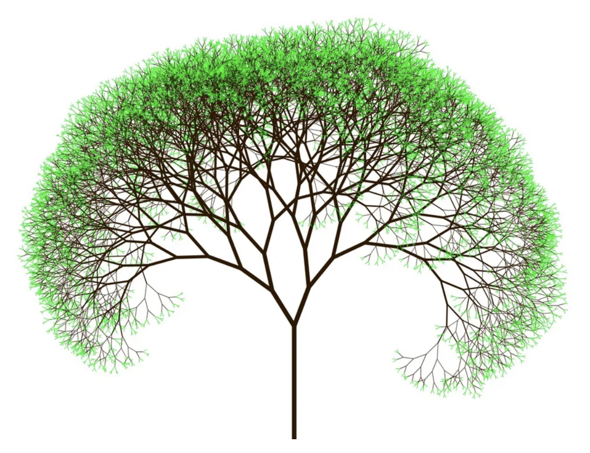
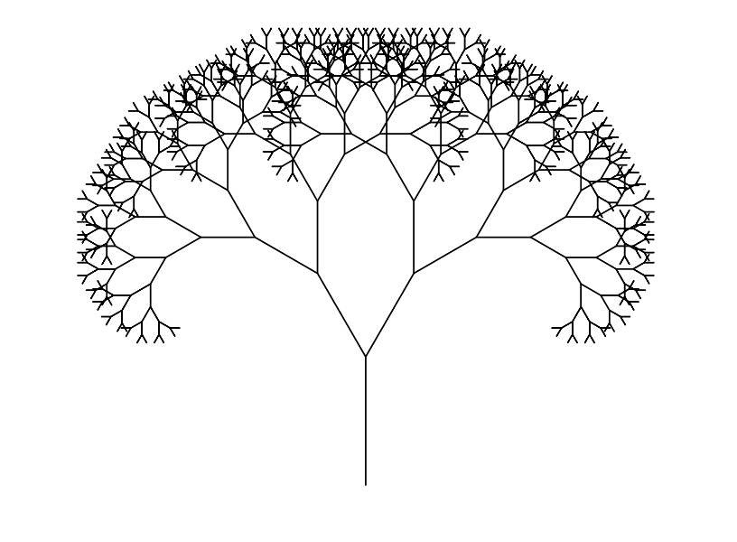
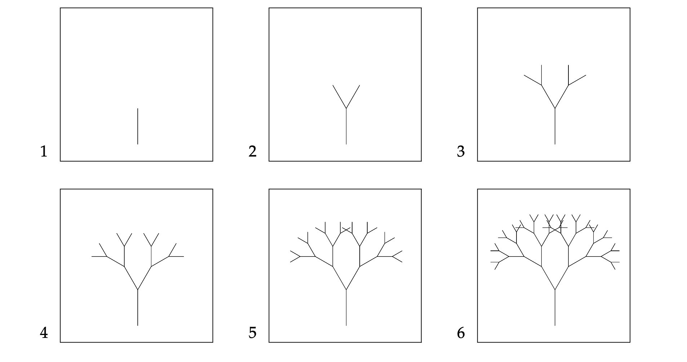

# Aplicació: Arbres fractals



Aquesta lliçó mostra com dibuixar arbres fractals utilitzant la tortuga de Python i recursivitat. Vegeu el problema [P50324](https://jutge.org/problems/P50324) del Jutge.


## Enunciat

Considerem que volem dibuixar arbres fractals com els d'aquesta figura:



Per dibuixar un arbre de $n\ge1$ nivells de mida $d$, cal dibuixar el seu tronc de
mida $d$, la seva branca esquerra i la seva branca dreta, ambdues com a arbres
de $n-1$ nivells i mida $\frac34 d$,  i simètriques respecte del tronc amb un
angle de $2\alpha$ graus entre elles. Un arbre de zero nivells és buit.

Per exemple, aquests són els arbres (de mida 100) amb 1, 2, 3, 4, 5 i 6 nivells
quan $\alpha=30$:



## Solució

La clau per resoldre aquest problema és definir correctament la capçalera de l'acció que dibuixarà l'arbre. Aquesta capçalera ha de tenir paràmetres per les informacions següents:

- El nombre de nivells (`n`).
- La mida de l'arbre (`d`).
- L'angle entre les branques (`a`).

Podria doncs ser així:

```python
def arbre(n: int, d: float, a: float) -> None:
    """
    Dibuixa un arbre fractal d'n nivells, mida d i angle a,
    deixant la tortuga al punt original amb l'orientació original.
    """
```

Reflectirem la definició recursiva dels arbres fractals en una implementació recursiva d'aquesta acció:

- Quan el nombre de nivells és 0, no cal fer res.

- Quan el nombre de nivells és estrictament positiu:

    1. Primer cal dibuixar el tronc de l'arbre de la mida adequada seguint l'orientació de la tortuga.

    2. Després, cal girar cap a la dreta i pintar el subarbre corresponent a la  branca dreta, tot invocant recursivament l'acció `arbre`.

    3. A continuació, cal girar cap a l'esquerra i pintar el subarbre corresponent a la branca esquerra, tot invocant recursivament l'acció `arbre` un segon cop.

    4. Finalment, per tal que les operacions s'encadenin sense problemes, cal que després de pintar cada arbre o subarbre, la tortuga retorni al punt de sortida i orientació original. Per tant, abans d'acabar cal reorientar la tortuga i refer el pas 1 cap enrera.

El codi corresponent, amb els passos anotats, és el següent.

```python
def arbre(n: int, d: float, a: float) -> None:
    """
    Dibuixa un arbre fractal d'n nivells, mida d i angle a,
    deixant la tortuga al punt original amb l'orientació original.
    """

    if n == 0:  # cas base
        pass    # no cal fer res
    else:       # cas recursiu
        # Pas i: dibuixar el tronc
        turtle.forward(d)
        # Pas ii: dibuixar (recursivament) la branca dreta
        turtle.right(a)
        arbre(n - 1, d * 3 / 4, a)
        # Pas iii: dibuixar (recursivament) la branca esquerra
        turtle.left(2 * a)
        arbre(n - 1, d * 3 / 4, a)
        # Pas iv: tornar al punt de sortida
        turtle.right(a)
        turtle.backward(d)
```

La instrucció `pass` de Python serveix per indicar que no s'ha de fer res. A vegades cal utilitzar-la perquè no es pot deixar un cos buit en Python. Sovint, però, és millor alterar el codi per evitar-la.


## Programa complet

Aquest és el programa complet, amb el condicional simplificat, els comentaris eliminats, i una crida inicial al programa principal:

```python
import turtle
import yogi


def arbre(n: int, d: float, a: float) -> None:
    """
    Dibuixa un arbre fractal d'n nivells, mida d i angle a,
    deixant la tortuga al punt original amb l'orientació original.
    """

    if n > 0:
        turtle.forward(d)
        turtle.right(a)
        arbre(n - 1, d * 3 / 4, a)
        turtle.left(2 * a)
        arbre(n - 1, d * 3 / 4, a)
        turtle.right(a)
        turtle.backward(d)


def main():
    turtle.speed(4)  # perquè la tortuga es mogui poc a poc (poseu 0 per moure's ràpid)
    turtle.left(90)  # perquè l'arbre creixi cap amunt
    arbre(yogi.read(int), yogi.read(float), yogi.read(float))
    turtle.done()


main()
```

<Autors autors="jpetit"/>
