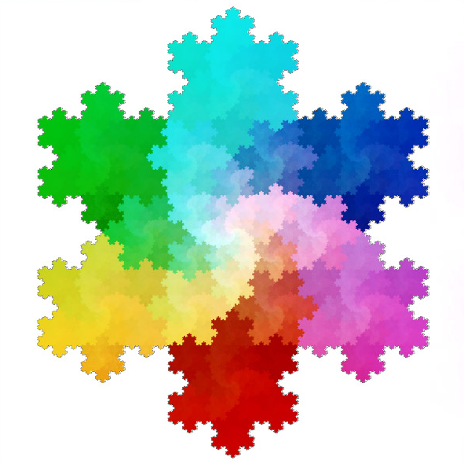
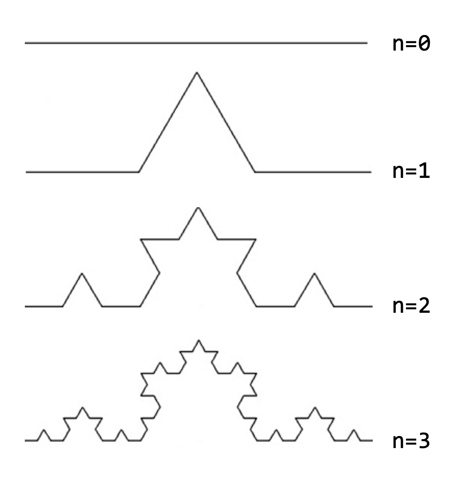
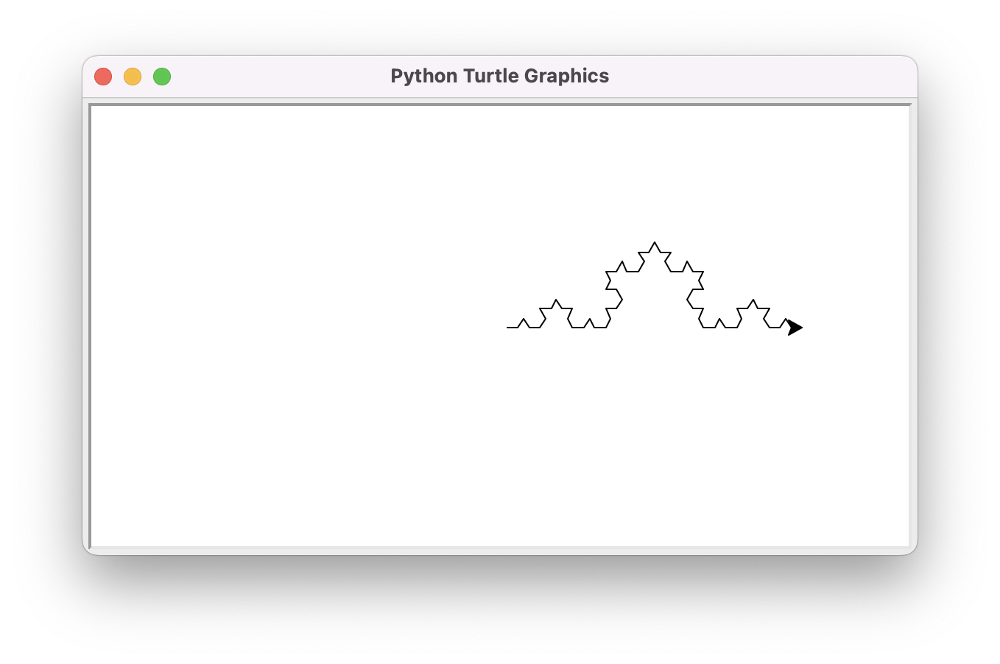
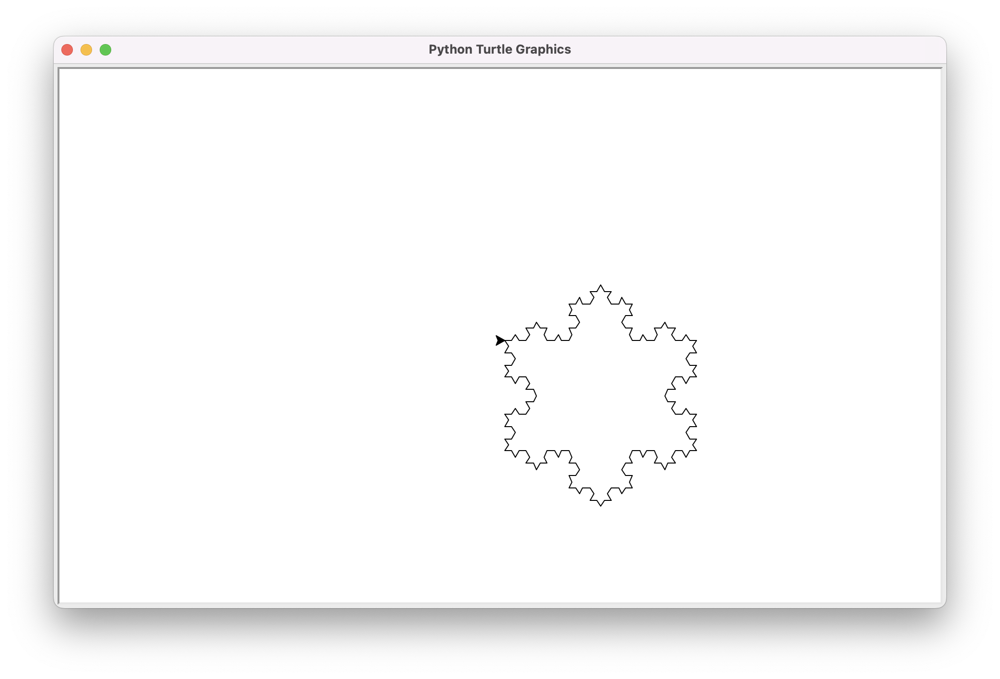

# Aplicació: Fractal de Koch



Una **fractal** és un objecte matemàtic de gran complexitat definit per algorismes simples. Moltes fractals tenen propietats d'autosemblança, on les seves parts tenen la mateixa forma o estructura que el tot. Aquesta lliçó presenta l'ús de la recursivitat per poder generar una fractal de Koch a través de l'ordinador utilitzant la tortuga de Python.

## La corba de Koch

La **corba de Koch** és un conjunt geomètric descrit pel matemàtic Helge von Koch al 1904. Es tracta d'una de les primeres corbes fractals que es varen definir.

Per construir una corba de Koch se segueix un procés iteratiu, començant des d'un segment de línia recta, de la manera següent:

1. Es divideix el segment en tres parts de longitud igual.

2. Es construeix un triangle equilàter amb base en el segment del mig del pas anterior.

3. S'elimina el segment base del triangle del pas anterior.

4. Es torna al pas 1, aplicant ara els passos a cada un dels segments que sorgeixen.

En matemàtiques, la corba de Koch és el límit de seguir el procediment anterior infinitament. Per poder-la visualitzar, ens podem limitar a emular l'algorisme descrit un determinat nombre de nivells. La figura següent mostra la corba per un nombre creixent de nivells `n` de 0 a 4:



## Dibuix de la corba de Koch

Considereu que només calgui dibuixar un nivell de la corba de Koch (figura amb n = 1). Suposant que la corba s'ha de traçar al llarg de `m` unitats horitzontals, les comandes de tortuga de Python per fer-ho són prou senzilles:

```python
turtle.forward(m / 3)
turtle.left(60)
turtle.forward(m / 3)
turtle.right(120)
turtle.forward(m / 3)
turtle.left(60)
turtle.forward(m / 3)
```

I, en el cas que el nombre de nivells a dibuixar siguin zero (figura amb n = 0), encara més:

```python
turtle.forward(m)
```

Per fer una acció recursiva que dibuixi la corba de Koch per una mida `m` i `n` nivells, podem utilitzar la capçalera següent:

```python
def corba_koch(m: float, n: int) -> None:
    """Dibuixa la corba de Koch per una mida m i n nivells."""
```

Per implementar-la, considerarem primer el seu cas base: quan el nombre de nivells a dibuixar sigui 0, només cal fer un segment de m `m`:

```python
def corba_koch(m: float, n: int) -> None:
    """Dibuixa la corba de Koch per una mida m i n nivells."""

    if nivells == 0:
        turtle.forward(m)
    else:
        ...
```

Per fer el cas recursiu, el que cal adonar-se és que la definició de la corba prescriu que hem de traçar una corba com la de la fig 1, tot substituint els segments per noves corbes del mateix tipus però d'un terç de la llargada original i un nivell menys. Això dóna lloc al procediment següent:

```python
def corba_koch(m: float, n: int) -> None:
    """Dibuixa la corba de Koch per una mida m i n nivells."""

    if n == 0:
        turtle.forward(m)
    else:
        corba_koch(m / 3, n - 1)
        turtle.left(60)
        corba_koch(m / 3, n - 1)
        turtle.right(120)
        corba_koch(m / 3, n - 1)
        turtle.left(60)
        corba_koch(m / 3, n - 1)
```

Les crides a `turtle.forward(m / 3)` del cas per a un nivell ara s'han substituit per crides recursives a `corba_koch(m / 3, n - 1)`.

La crida a `corba_koch(200, 3)` produeix aquesta figura:



## El floc de neu de Koch

Per obtenir ara la fractal coneguda com **floc de neu de Koch**, només cal encadenar tres corbes de Koch, girant 120 graus després de cadascun d'elles per tancar el triangle:

```python
def floc_koch(m: float, n: int) -> None:
    for _ in range(3):
        corba_koch(m, n)
        turtle.right(120)
```

Noteu que en el programa anterior hem utilitzat la **variable anònima** `_` per controlar el bucle. En Python, una variable anònima representa sempre una variable diferent. Cada `_` és una nova variable. S'utilitza quan el nom de la variable no és important, com en aquest cas.

Ara, `floc_koch(200, 3)` produeix aquesta figura:



## Programa complet

A continuació es dóna el programa complet:

```python
import turtle
import yogi


def corba_koch(m: float, n: int) -> None:
    """Dibuixa la corba de Koch per una mida m i n nivells."""

    if n == 0:
        turtle.forward(m)
    else:
        corba_koch(m / 3, n - 1)
        turtle.left(60)
        corba_koch(m / 3, n - 1)
        turtle.right(120)
        corba_koch(m / 3, n - 1)
        turtle.left(60)
        corba_koch(m / 3, n - 1)


def floc_koch(m: float, n: int) -> None:
    """Dibuixa el floc de neu de Koch per una mida m i n nivells."""

    for _ in range(3):
        corba_koch(m, nivells)
        turtle.right(120)


def main() -> None:
    m, n = yogi.read(float), yogi.read(int)
    turtle.speed(0)     # accelera la tortuga
    floc_koch(m, n)
    turtle.done()


main()
```

:::example
foo
:::

<Autors autors="jpetit"/>
