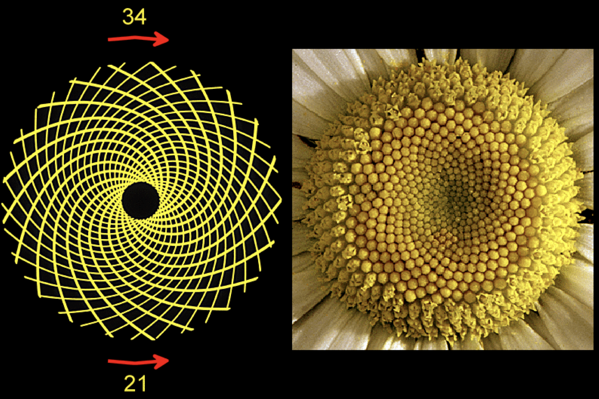

# Recursivitat


Aquesta lliçó introdueix la tècnica de la recursivitat, on una funció o una acció realitza una tasca repetitiva tot invocant-se a sí mateixa, sense necessitat d'utilitzar bucles. La recursivitat és una tècnica molt potent que es basa en reduir un problema complex en un o més problemes del mateix tipus, però més senzills. Al llarg del curs s'anirà comprovant el seu poder, aquest lliçó només en presenta una breu introducció amb exemples de complexitat creixent.


## Factorial recursiu

[Recordeu](/iteracions/factorial.html) que el factorial d'un nombre $n$, escrit $n!$, representa el nombre de permutacions d'$n$ objectes i és el producte dels primers $n$ naturals començant des d'1. Així,

$$n! = \underbrace{1 · 2 ·\ldots· n}_{\text{$n$ cops}}.$$

Ja havíem escrit una funció iterativa que calcula el factorial d'un nombre donat. Era quelcom així:

```python
def factorial_iteratiu(n: int) -> int:
    """Retorna el factorial d'un natural n."""

    f = 1
    for i in range(2, n + 1):
        f = f * i
    return f
```

Anem a explorar una altra manera de fer-ho: amb [recursivitat](recursivitat.html)!

Comencem primer per les matemàtiques:

- Ja sabem que el factorial de 0 és 1:

    $$0! = 1.$$

- Si tenim un nombre natural $n>0$, també tenim la propietat següent:

    $$n! = (n-1)! · n.$$

    La raó és que $n! = 1 · 2 ·\ldots· n = (1 · 2 ·\ldots· n-1)· n = (n-1)! · n$.


En definitiva, hem establert que

$$n! = \begin{cases} 1 & \text{si}\ n=0, \\\ (n-1)! · n & \text{altrament.}\end{cases}$$

Aquest tipus d'identitat s'anomena **recurrència**, ja que defineix cada terme de la seqüència en funció de termes anteriors. La recurrència està ben definida perquè el primer valor ($n=0$) és un cas no recursiu (**cas directe**).

El nostre objectiu és definir una funció, diguem-ne `factorial`, que, donat un natural `n`, retorni el factorial de `n`:

```python
def factorial(n: int) -> int:
    """Retorna el factorial d'un natural n."""
    ...
```


Per programar el cos d'aquesta funció, utilitzem la recurrència que hem obtingut anteriorment. Primer, establim el cas base:

```python
def factorial(n: int) -> int:
    """Retorna el factorial d'un natural n."""

    if n == 0:
        return 1
    ...
```

Comença bé! Quan $n$ val 0, cal retornar 1. Ningú pot dir que ho estem fent malament.

I si no és el cas base? Doncs llavors hi afegim el cas recursiu:

```python
def factorial(n: int) -> int:
    """Retorna el factorial d'un natural n."""

    if n == 0:
        return 1
    else:
        return factorial(n - 1) * n
```

És clar, la recurrència ens diu que quan el natural $n$ no és 0, cal retornar el factorial d'$n-1$ multiplicat per $n$. I justament hem fet això: invocar la funció `factorial` sobre el paràmetre $n - 1$ i multiplicar el resultat per $n$. Per calcular $(n - 1)!$ hem cridat a `factorial(n - 1)` perquè justament l'especificació de `factorial` diu que ens retorna el factorial del natural que se li passa com a paràmetre. I, quan $n\neq0$, $n-1$ és un natural i, per tant, complim la precondició.

Algú pot creure que la funció `factorial` no pot invocar la pròpia funció `factorial` però... perquè no? No hi ha cap raó que ho prohibeixi. De fet, quan tenim una funció que es crida a ella mateixa, diem que tenim una **funció recursiva** i la tècnica de la recursivat consisteix justament en escriure funcions o accions recursives. En aquest cas hem obtingut una solució recursiva per calcular el factorial. Aquest exemple mostra que els bucles no són estrictament necessaris: podem descriure repeticions amb recursivitat.


## Escriptura recursiva

Suposeu que voleu escriure `n` cops seguits el caràcter `c` amb una acció `escriure(n: int, c: str)`. Per exemple, `escriure(8, 'o');` hauria d'escriure ~~oooooooo~~.

Segur que sabeu implementar l'acció `escriu` iterativament (amb un bucle `while` o un bucle `for`), i segur que també sabeu fer-ho amb `c * n`, però ara serà instructiu implementar-la recursivament.

Comencem especificant la nostra acció:

```python
def escriure(n: int, c: char) -> None:
    """Escriu n ≥ 0 cops seguits c."""
```

Quan volem fer recursivitat ens cal sempre pensar en dos casos:


- **El cas base**: En el cas d'`escriure`, el cas base és quan `n` és tant simple que la solució és directa. Aquest cas és quan `n == 0`: en aquest cas no cal fer res de res!

- **El cas recursiu**: El cas recursiu és doncs quan `n > 0`, és a dir, quan cal escriure un caràcter com a mínim. Ara, ens cal pensar com podem escriure `n > 0` caràcters recursivament. Una primera manera de fer-ho, seria escriure una primer caràcter i, després, escriure els `n - 1` restants. Com que `n > 0`, `n - 1 ≥ 0` i, per tant, aquests `n - 1` caràcters `c` es poden escriure cridant a `escriure(n - 1, c)`, és a dir, fent una crida recursiva.

Això dóna lloc a la implementació següent:

```python
def escriure(n: int, c: char) { -> None:
    """Escriu n ≥ 0 cops seguits c."""

    if n > 0:
        print(c, end='')           # escriu un cop el caràcter c
        escriure(n - 1, c);        # escriu n - 1 cops el caràcter c
```

Una segona manera de tractar el cas recursiu seria primer escriure recursivament `n - 1` cops el caràcter `c` i, després, escriure un cop el caràcter `c`:

```python
def escriure(n: int, c: char) { -> None:
    """Escriu n ≥ 0 cops seguits c."""

    if n > 0:
        escriure(n - 1, c);        # escriu n - 1 cops el caràcter c
        print(c, end='')           # escriu un cop el caràcter c
```

La solució és diferent però la funcionalitat (el què fa) és la mateixa.

Hi ha més maneres d'escriure recursivament aquesta funció. La nostra tercera solució es basarà en el fet que, per escriure `n` cops `c`, també podem escriure primer la meitat dels `n` caràcters recursivament i escriure després la meitat dels `n` caràcters recursivament. Però cal anar en compte amb la paritat de `n`:

- Si `n` és parell, podem escriure `n` cops el caràcter `c` cridant dos cops a escriure `n // 2` cops el caràcter `c` recursivament.

- Si `n` és senar, podem escriure `n` cops el caràcter `c` cridant   dos cops a escriure `n // 2` cops el caràcter `c` recursivament i   escrivint addicionalment un cop el caràcter `c` (perquè a causa de la divisió entera entre 2, a la primera crida se'n perd "mig" i la segona "mig" més).

Aquesta idea dóna lloc en aquesta nova implementació:

```python
def escriure(n: int, c: char) -> None:
    """Escriu n ≥ 0 cops seguits c."""

    if n > 0:
        if n % 2 == 0:
            escriure(n // 2, c)
            escriure(n // 2, c)
        else:
            escriure(n // 2, c)
            print(c, end='')
            escriure(n // 2, c);
```

que podem compactar així:

```python
def escriure(n: int, c: char) -> None:
    """Escriu n ≥ 0 cops seguits c."""

    if n > 0:
        escriure(n // 2, c)
        if n % 2 != 0:
            print(c, end='')
        escriure(n // 2, c);
```

De fet, la escriptura condicional de `c` es pot fer  abans de la primera crida recursiva, entre la primera crida i la segona recursiva (com s'ha fet), o després de la segona crida recursiva. Tant és.


## Màxim comú divisor recursiu

[Recordeu](/iteracions/maxim-comu-divisor.html) que, donats dos nombres naturals $x$ i $y$, el seu màxim comú divisor $\text{mcd}(x, y)$ és el nombre més gran que divideix exactament tant a $x$ com a $y$. [Recordeu també](/iteracions/maxim-comu-divisor.html) que ja havíem estudiat com calcular eficientment el màxim comú divisor de dos nombres amb l'algorisme d'Euclides i com com encapsular-lo dins d'una funció:

```python
def mcd_iteratiu(x: int, y: int) -> int:
    """Retorna el màxim comú divisor de dos enters x i y, amb x ≥ 0 i y ≥ 0."""

    while y != 0:
        x, y = y, x % y
    return x
```

La solució recursiva simplement substitueix la iteració per crida recursiva:

```python
def mcd_recursiu(x: int, y: int) -> int:
    """Retorna el màxim comú divisor de dos enters x i y, amb x ≥ 0 i y ≥ 0."""

    if y != 0:
        return mcd_recursiu(y, x % y)
    else:
        return x
```


## Nombres de Fibonacci

La seqüència de Fibonacci es defineix de la forma següent:

0, 1, 1, 2, 3, 5, 8, 13, 21, 34, 55, 89, 144, 233, 377, ...

És a dir, cada element és la suma dels dos anteriors. En termes matemàtics, la
seqüència de Fibonacci es troba definida per la recurrència següent:

$$F(n) = \begin{cases} n & \text{si}\ n\le 1, \\\ F(n-1)+F(n-2) & \text{altrament.}\end{cases}$$

Aquesta seqüència se li va acudir a Leonardo de Pisa Fibonacci (1175-1250) quan estudiava els patrons reproductius dels conills i apareix sovint a la natura. Per exemple, els gira-sols tenen 21 espirals de pipes en un sentit i 34 en l’altre, i ambdós són nombres consecutius de Fibonacci. També, la majoria de plantes tenen un nombre de pètals que és un nombre de Fibonacci.

:::raw
<table>
<tr>
<td></td>
<td></td>
<td></td>
</tr>
</table>
:::

Independentment d'això, voldríem una funció que calculés l'`n`-èsim nombre de Fibonacci. Com que som al tema de recursivitat i som valents, provarem d'implementar la recurrència en Python, cosa que no ens hauria de costar gens:

```python
def fibonacci(n: int) -> int:
    """Donat un natural n, retorna l'n-èsim nombre de Fibonacci."""
    if n <= 1:
        return n
    else:
        return fibonacci(n - 1) + fibonacci(n - 2)
```

Realment, la funció no és altra cosa que una transcripció a Python de la recurrència matemàtica. Això ens dóna la seguretat de que la funció és correcta. Ara bé, aquesta implementació té un greu problema d'eficiència ja que recalcula molts càlculs que ja ha calculat prèviament. El meu ordinador triga uns 5 segons en calcular `fibonacci(36)`, no gaure brillant!

Per tal d'obtenir una solució recursiva més eficient, podem pensar en crear una funció recursiva que, donat un natural $n$, no només retorni $F(n)$ sinó que també retorni $F(n-1)$.

```python
def fibonacci_aux(n: int) -> tuple[int, int]:
    """
    Donat un natural n, retorna (F(n), F(n-1)).
    Quan n = 0, retorna (0, 0).
    """
```

La seva implementació és la següent:

```python
def fibonacci_aux(n: int) -> tuple[int, int]:
    """
    Donat un natural n, retorna (F(n), F(n-1)).
    Quan n = 0, retorna (0, 0).
    """

    if n == 0:
        return 0, 0
    elif n == 1:
        return 1, 0
    else:
        penultim, antepenultim = fibonacci_aux(n - 1)
        return penultim + antepenultim, penultim
```

 Altrament dit:

 - Quan `n` val 0, l'especificació ja diu que hem de retornar (0,0). El primer 0 és clar, perquè representa $F(0)$, el segón és irrelevant, perquè representa $F(-1)$ que no està definit.

- Quan `n` val 1, cal retornar (1, 0) que és ($F(1)$, $F(0)$).

- Quan `n` no és 0 ni 1, la funció `fibonacci_aux` crida a `fibonacci_aux` amb `n - 1` per obtenir ($F(n-1)$, $F(n-2))$. El primer
  el desa en `penultim` i el segon en `antepenultim`. Després, es retorna ($F(n)$, $F(n-1))$ a través de `penultim + antepenultim, penultim`.

Evidentment, el nostre propòsit original era escriure una funció que calculés l'`n`-èsim nombre de Fibonacci, no aquesta acció auxiliar. Però ara ja podem definir fàcilment la funció `fibonacci` posant en marxa l'acció auxiliar recursiva i quedant-nos només amb el primer nombre del parell obtingut:

```python
def fibonacci(n: int) -> int:
    """Donat un natural n, retorna l'n-èsim nombre de Fibonacci."""

    return fibonacci_aux(n)[0]
```

Si ara mesureu quan triga `fibonacci(36)` al vostre ordinador veureu que aquesta versió és *immensament* més ràpida que l'anterior.


## Escriure un nombre en una base

Considerem ara que volem escriure un nombre `n` en una determinada base `b`.  Suposarem que `b` es troba entre 2 i 10, perquè bases inferiors a 2 no tenen massa sentit i perquè les bases a partir de 10 necessiten més digits. Per exemple, escriure 9 en base 2 hauria de donar `1001` i escriure 30 en base 4 hauria de donar ´132´.

Aquesta seria la capçalera i especificació de l'acció que ho ha de dur a terme:

```python
def escriure_base(n: int, b: int) -> None:
    """Escriu n en base b. Prec: n ≥ 0 i 2 ≤ b ≤ 10."""
```

La manera de fer el canvi de base és anar dividint el nombre per la base i escriure el seu darrer digit.

!!! Dibuix

Ara bé, aquest procés iteratiu dóna el resultat en ordre invers!

Podem utilitzar la recursivitat per donar el resultat del dret:

- El cas base serà quan `n` ja només tingui un dígit en base `b`: Només cal escriure `n`.

- El cas recursiu escriu primer el nombre `n // b` en base `b` amb una crida recursiva i, després, escriu el darrer dígit de `n` en base `b`.

La implementació queda doncs així:

```python
def escriure_base(n: int, b: int) -> None:
    """Escriu n en base b. Prec: n ≥ 0 i 2 ≤ b ≤ 10."""

    if n < b:
        print(n, end='')
    else:
        escriure_base(n // b, b)
        print(n % b, end='')
```

Els `end=''` dins del `print`s són per no posar un salt de línia.

Observeu que és convenient usar un sol dígit com a cas base enlloc del zero com a cas base i no escriure a res. Altrament caldria tractar de forma especial l'escriptura del número zero.

**Exercici:** Què passaria si es canviés l'ordre de les línies dins l'`else`?


## Recursivitat i inducció matemàtica

La tècnica de la recursivitat està directament relacionada amb la **inducció matemàtica**. Les demostracions per inducció permeten demostrar que una propietat és vàlida per a tots els possibles nombres naturals només demostrant dos fets:

1. Que la propietat és certa per al nombre 0 (cas base).
2. Que quan la propietat és certa pel natural $n$ també és certa per a $n + 1$ (cas inductiu).

Per exemple, podem demostrar que $\sum_{i=0}^n i= n(n+1)/2$ per a tot natural $n$ utilitzant inducció de la forma següent:

1. *Cas base:* Quan $n = 0$, tenim que $\sum_{i=0}^n i = \sum_{i=0}^0 i = 0$ i que $n(n+1)/2 = 0(0+1)/2=0$. Per tant, la propietat és certa per a $n=0$.

2. *Cas inductiu:* Considerem un natural qualsevol $n = 0$. Agafem com a hipòtesi d'inducció que $\sum_{i=0}^n i= n(n+1)/2$.

    Voldríem veure doncs que $\sum_{i=0}^{n+1} i= (n+1)(n+1+1)/2$.

    I, en efecte,  $\sum_{i=0}^{n+1} i = \underbrace{\sum_{i=0}^{n} i} + (n+1) =  \underbrace{n(n+1)/2} + 2(n+1)/2 = (n+1)(n+1+1)/2$.

    Les claus inferiors senyalen el punt on s'ha aplicat la hipòtesi d'inducció.

De la mateixa manera, podem demostrar que la funció recursiva `factorial` funciona correctament per a tota entrada natural `n`. Recordeu la seva definició:

```python
def factorial(n: int) -> int:
    if n == 0:
        return 1
    else:
        return factorial(n - 1) * n
```

Demostrem-ho:

1. *Cas base:* Quan $n = 0$, és clar que `factorial(0)` retorna 1, perquè la condició del `if` és certa. Per tant, la funció `factorial` funciona correctament per $n = 0$ ja que retorna 1, que és el factorial de 0.

2. *Cas inductiu:* Considerem un natural qualsevol $n = 0$. Agafem com a hipòtesi d'inducció que la funció `factorial` funciona correctament per aquest $n$.

    Volem doncs veure que la funció `factorial` també funciona correctament per $n+1$.

    I, en efecte, com que $n$ és un natural, la invocació de `factorial(n + 1)` serà amb un valor de $n + 1$ que no és zero. Per tant, la funció anirà per l'`else` i retornarà `factorial(n) * (n + 1)`. Com que, per hipòtesi d'inducció, la funció `factorial` funciona correctament per `n`, la invocació de `factorial(n)` retornarà $n!$. I, per tant, la invocació de `factorial(n + 1)` retornarà $n!*(n+1)$, és a dir, $(n+1)!$. Per tant, la funció `factorial` funciona correctament per $n+1$.

El principi d'inducció ens permet doncs concloure que la funció `factorial` funciona correctament per a tota la infinitat de naturals.


<Autors autors="jpetit roura"/>
