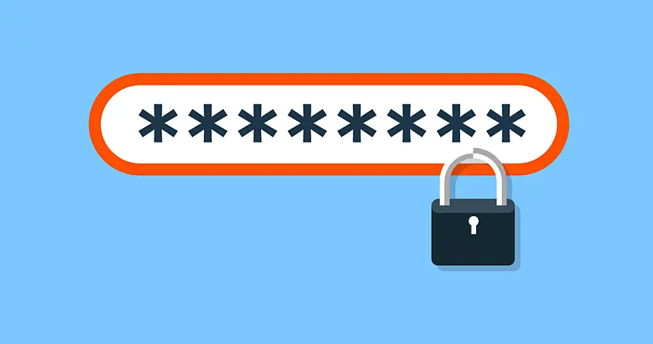

# Contrasenyes

## Títol

Evidentment, les vostres contrasenyes han de ser secretes. Només
vosaltres heu de conèixer les vostres contrasenyes. No les heu de revelar a
ningú, ni deixar que ningú les conegui. Canvieu immediatament les
contrasenyes inicials que us hagin enviat per correu electrònic o les que es
puguin predir utilitzant dades personals.

Igualment, és obvi que heu de tenir mecanismes per recordar les vostres
contrasenyes. En molts exàmens de laboratori, caldrà que us identifiqueu amb
el vostre usuari i contrasenya (per exemple, al Jutge, al Racó o a Atenea).
Un examen no és el millor moment per adonar-te que no recordes la teva
contrasenya...

Una contrasenya segura hauria de ser mínimament llarga, els experts aconsellen
un mínim de 12 caràcters. A més, enlloc de pensar la contrasenya com una paraula
(*password*), es recomana que es pensi com una frase (*passphrase*). Eviteu utilitzar
paraules al diccionari, utilitzeu combinacions de minúscules i majúscules i també
de dígits i símbols. No trieu alguna [contrasenya usual](https://en.wikipedia.org/wiki/List_of_the_most_common_passwords).

Per tal de contenir qualsevol bretxa de seguretat, és molt important que
utilitzeu una contrasenya diferent per a cada compte que tingueu. Si el vostre
servei ho facilita, utilitzeu un sistema d'autentificació de doble factor.

És clar que les contrasenyes no s'han de guardar en llocs obvis(fitxer a
l'ordinador, a l'agenda, sota el teclat...), ni dur-les mai apuntades al
moneder, a la cartera o a la bossa. Ara bé, recordar moltes contrasenyes
diferents acaba sent un mal de cap. Per això, els experts en seguretat
recomanen utilitzar *gestors de contrasenyes*. Alguns serveis com ara
[Lastpass](https://lastpass.com) o[1Password]
(https://1password.com/) permeten desar les vostres contrasenyes de forma
segura i encriptada al núvol, protegint-les a través d'una *contrasenya
mestre*. Si aquests serveis privats no us fan el pes, podeu utilitzar
solucions de codi obert com ara [KeePassXC](https://keepassxc.org/). El
principal problema dels gestors de contrasenyes és que posen tots els ous al
mateix cistell, i aquest cistell és un pot de mel pels hàckers.

Personalment, utilitzo un gestor de contrasenyes, em sembla la solució menys
dolenta. Aquest gestor està protegit per (espero) una contrasenya ben bona.
Per a la immensa majoria de comptes, tinc contrasenyes úniques generades
aleatòriament que soc incapaç de recordar i manego a través del gestor. Per a
uns pocs comptes que utilizo cada dia, tinc una passphrase relativament
llarga per a cadascun d'ells que recordo de memòria.

## Enllaços recomanats

- [Choosing Secure Passwords](https://www.schneier.com/blog/archives/2014/03/choosing_secure_1.html)
de Bruce Schneier (criptògraf especialista en seguretat informàtica).

- [Password Do's and Don'ts](https://krebsonsecurity.com/password-dos-and-donts/)
de Brian Krebs (periodísta especialitzat en cibercrims).

<Autors autors="jpetit"/> 

