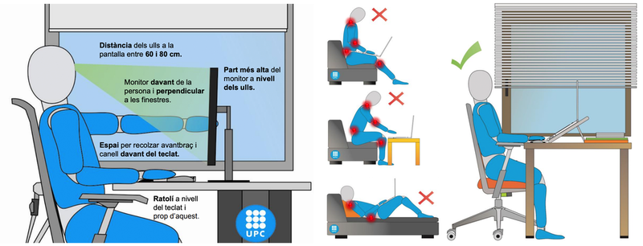

# Ergonomia

Aquesta lliçó remet a informació sobre ergonomia que qualsevol professional de les tecnologies de la informació i la comunicació hauria de conèixer per tal de treballar davant de l'ordinador de forma segura sense posar la seva salut en perill.

L'ús continuat de l'ordinador o els hàbits inadequats de treball amb l'ordinador poden tenir efectes detrimentals a la salut, en especial fatiga visual i trastorns musculoesquelètics. Eviteu aquests problemes de salut a curt i llarg termini, adoptant mesures de seguretat que millorin l'ergonomia del vostre lloc d'estudi i posicions de treball adequades.

La web de Prevenció de Riscos Laborals de la UPC us ofereix recomanacions específiques:

- [Recomanacions pel treball amb equips amb pantalla de visualització de dades](https://www.upc.edu/prevencio/ca/ergonomia/arxius/recomanacions-ergonomiques/re-004-01.pdf).

- [Recomanacions pel treball amb ordinadors portàtils](https://www.upc.edu/prevencio/ca/ergonomia/arxius/recomanacions-ergonomiques/re-004-02.pdf).

- [Formulari d'autoavaluació](https://www.upc.edu/prevencio/ca/ergonomia/arxius/Formulari%20autoavaluacio.xls)
per identificar les condicions de seguretat que són millorables a casa vostra quan treballeu amb un ordinador.

Aquests són uns altres enllaços recomanats:

 - [Ergonomia](https://www.upc.edu/prevencio/ca/ergonomia) del Servei de Prevenció de Riscos Laborals de la UPC.
 
 - [Ergonomic Tips for Computer Users](https://www.ehs.pitt.edu/workplace/ergonomics/computer-users) de la University of Pittsburgh.

<Autors autors="jpetit"/> 

