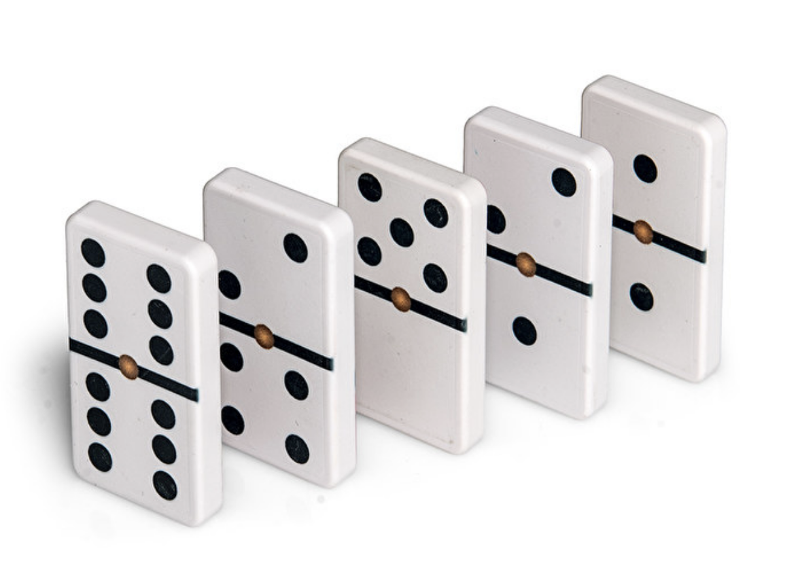

# Aplicació: Trens de dòminos



Aquesta lliçó mostra com processar una seqüència de dades que representa una successió de fitxes de dòmino per tal de comptar quants errors té i per determinar si conté o no algun error. La diferència conceptual entre les dues solucions és la diferència entre fer un *recorregut* o fer una *cerca*.


## Descripció del problema

La Marta està jugant soleta amb les fitxes de dòmino del seu germà gran, l'Arnau.
De fitxes en té moltes, i en pot tenir de repetides.
A ella li agrada fer "trens" llargs,
de forma que els números de les fitxes adjacents encaixin.
Per exemple, ara ha fet el tren correcte <big>🁀🀼🁑🁒🁘🁍🀷</big>.
Però, a vegades, la Marta comet errors.
Per exemple, el tren <big>🁃🁂🁈🁃🁅🁠</big> en té dos:
la primera i la segona fitxa no encaixen,
i la quarta i la cinquena tampoc.

L'Arnau vol fer un programa que compti el nombre d'errors d'un tren donat.
L'entrada consistirà en una seqüència de parells de nombres (entre el 0 i el 6)
que representen les fitxes del tren.
Per exemple, el tren <big>🁀🀼🁑🁒🁘🁍🀷</big>
es representa amb ~~2 1 1 4 4 4 4 5 5 4 4 0 0 6~~.
Aquí, suposarem que tots els trens tenen almenys una fitxa.
Per exemple, la seqüència ~~3 2~~
representa el tren amb una sola fitxa (i, per tant, correcte) <big>🁈</big>.


## Interludi

Abans de presentar la solució, fixeu-vos com amb la descripció del problema
hem convertit una informació mundana sobre fitxes de dòmino
en una simple seqüència d'enters.
En Informàtica, és molt freqüent haver de codificar la informació del món real
com a dades d'un cert tipus (aquí, nombres enters).
De fet, és la digitalització de tot tipus d'informacions
(com are mapes, cançons, imatges i pel·licules de cinema...)
la que ha conduït a la revolució digital.


## Plantejament de la solució

Sabem que la seqüència d'entrada
representa un tren compost de fitxes.
Per exemple, ~~2 3 3 4 5 4~~ representa <big>🁂🁊🁘</big>.
Com resolem aquest problema?
Quan tenim el primer nombre de cada fitxa (excepte la primera),
el que ens cal tenir també és el segon nombre de la fitxa anterior,
per poder comprovar si són iguals o no.
Per tant, separarem els elements de l'entrada d'aquesta manera:
~~2 | 3 3 | 4 5 | 4~~.
El primer i el darrer element de la seqüència quedaran desaparellats,
però poc ens importa, perquè mai no poden implicar errors.
Cada parell (és a dir, ~~3 3~~ i ~~4 5~~)
representa els extrems en contacte de dues fitxes adjacents.
Si les dos nombres són iguals, és que els extrems encaixen;
altrament, és que la Marta ha comès un error.

Per tant, el problema es redueix a oblidar el primer nombre (i, al final, també el darrer)
i recórrer la resta dels elements de la seqüència d'entrada de dos en dos, comptant
com a errors aquells que tenen els dos nombres diferents.


## Implementacions

D'acord amb la idea anterior, podem escriure el programa següent:

```python
errors = 0
primer = read(int)
dret = read(int)
esquerre = scan(int)
while esquerre is not None:
    if dret != esquerre:
        errors = errors + 1
    dret = read(int)
    esquerre = scan(int)
print(errors)
```

- La variable `errors` conté el nombre d'errors trobats fins al moment.
Aquesta variable s'inicialitza a zero,
perquè en començar encara no s'ha trobat cap error.

- La variable `primer` representa el nombre esquerre de la primera fitxa del tren.
No ens importa, però cal que el llegim per poder passar al següent nombre.
D'alguna forma, ens el "saltem".

- Les variables `dret` i `esquerre` guardaran el valor dret d'una fitxa i després, potser, el valor esquerra de la fitxa següent.

- Per anar-les llegint fins al final, primer es llegeix el costat dret de la fitxa actual amb `read`. Es pot usar `read` perquè segur que existirà aquest element a la seqüència. Després, s'intenta llegir el costat esquerre de la següent fitxa amb `scan`. Cal usar `scan` perquè potser ja s'acaven les fitxers.

- El bucle itera mentre hi ha fitxes, és a dir, mentre `esquerre` no és `None`. A dincs, si `dret` i `esquerre` no són iguals, és que les fitxes no encaixen i cal incrementar el comptador `errors`. Llavors es prepara la següent interació llegit nous valors de `dret` i `esquerre`.

- En sortir del bucle, quan no queden més fitxes,
tan sols cal escriure el nombre total d'errors trobats.

- Fixeu-vos que el bucle acaba quan ja no es pot llegir l'enter corresponent al costat esquerre d'una fitxa.

El programa ja està prou bé, però aquí el completem alhora que el simplifiquem una mica:

```python
from yogi import read, scan

def main():
    errors = 0
    read(int)
    dret, esquerre = read(int), scan(int)
    while esquerre is not None:
        if dret != esquerre:
            errors = errors + 1
        dret, esquerre = read(int), scan(int)
    print(errors)

main()
```

- Com que la variable `primer` no és mai utilitzada, fem que el resultat retornat per primer `read(int)` es perdi. Python permet no recollir el resultat d'una funció, però aquesta és igualment invocada.

- A més, les dues assignacions per llegir `dret` i `esquerre` ara s'han posat amb una sola assignació. Python crida les funcions d'esquerra a dreta, per tant l'efecte és el mateix però el programa queda una mica més curt sense perdre llegibilitat.

I encara en podem fer una altra versió, usant `tokens`:

```python
from yogi import read, tokens

def main():
    errors = 0
    read(int)
    dret = read(int)
    for esquerre in tokens():
        if dret != esquerre:
            errors = errors + 1
        dret = read(int)
    print(errors)

main()
```

- Ara el bucle itera mentre `tokens` pot llegir la part esquerra de la següent fitxa. Llavors, ja només cal llegir la seva part dreta al final del cos del bucle.


## Un problema similar

Suposem que ara volem resoldre un problema molt semblant,
en el qual l'entrada és idèntica,
però només volem saber si el tren conté algun error o no.
És a dir, ara el programa no haurà d'escriure el nombre total d'errors,
sinó o bé `correcte` o bé `incorrecte`.

Aquest programa (obviem el `main`), adaptat de la segona solució, òbviament funcionaria:

```python
errors = 0
read(int)
dret, esquerre = read(int), scan(int)
while esquerre is not None:
    if dret != esquerre:
        errors = errors + 1
    dret, esquerre = read(int), scan(int)

if errors == 0:
    print('correcte')
else:
    print('incorrecte')
```

Però, és una bona solució?
Depèn.
Si sabem que les seqüències d'entrada que rebrà el programa seran sempre curtes,
aquest codi ja està prou bé.
Tanmateix, si l'entrada pot ser molt llarga,
aquest codi no és prou eficient.
Per exemple, considereu un tren amb un milió de fitxes com ara
~~0 1 1 2 3 4 4 4 4 4 4 4 4 4 4 4 4 4 ...~~
Com que la segona i la tercera fitxes no encaixen,
després de només dues iteracions del `for`
ja sabem que el tren és incorrecte.
Amb tot, el programa fa quasi mig milió d'iteracions més
per llegir fins al final dades que són irrellevants,
en lloc d'aturar-se i escriure el resultat: `incorrecte`.

Aquest codi implementa la millora mencionada tot substituint el comptador
`errors` per un boolèa `correcte` que permet tallar la condició del bucle:

```python
correcte = True
read(int)
dret, esquerre = read(int), scan(int)
while correcte and esquerre is not None:
    if dret != esquerre:
        correcte = False
    dret, esquerre = read(int), scan(int)

if correcte:
    print('correcte')
else:
    print('incorrecte')
```


## Recorreguts i cerques

Hem vist doncs que per calcular el nombre d'errors totals en un tren cal recórrer tots els elements de la seqüència de valors que el descriuen. Això és clar: hom no podria comptar tots els errors sense llegir tots els valors: què passaria si la part no llegida contingués alguns errors? Aquest tipus d'algorismes que llegeixen tots els elements de l'entrada des del principi fins al final s'anomenen **algorisme de recorregut**.

En canvi, hem vist que per determinar si hi ha o no algun error en un tren, ens podem aturar a partir del moment que detectem l'error, podent ignorar la resta dels elements de la seqüència. De fet, continuar llegint elements seria una pèrdua de temps. Aquest tipus d'algorismes que llegeixen els elements de l'entrada fins que troben que es dóna alguna condició (i fins al final si no es dóna mai) s'anomenen **algorisme de cerca**.

És important que, per a un problema de seqüències determinat, sigueu capaços d'identificar si és un problema de cerca o de recorregut.


<Autors autors="jpetit roura"/>
