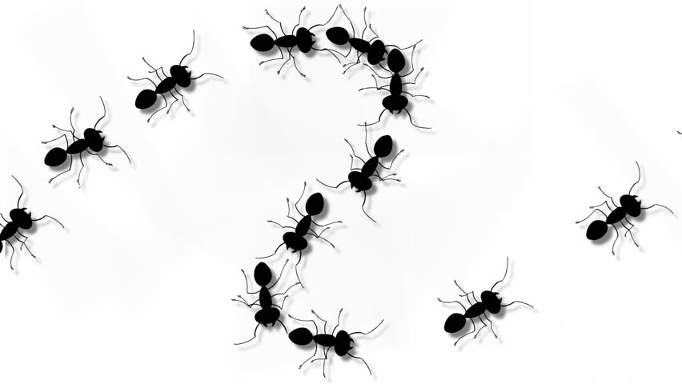

# Finestres



Aquesta lliçó mostra nous exemples de tractament de seqüències de dades utilitzant la tècnica de la finestra que permet tractar diversor elements consecutius d'una seqüència amb encavalcaments.

# Comptar parells de paraules consecutides repetides

Considerem el problema de comptar quants parells de paraules consecutives repetides hi ha en un una seqüència de paraules. Per exemple, si la entrada és

```text
vela piga noia noia bossa poma poma poma noia bossa caixa bossa
```

hi ha tres parells de paraules consecutives repetides: `noia noia`, un cop `poma poma` i un altre cop `poma poma`. Les repeticions de `bossa` no són rellevants perquè no són paraules consecutives.

És clar que per resoldre aquest problema no en tenim prou amb analitzar cada paraula de la seqüència individualment: cal anar comparant parelles de paraules. Però a més, cal fer-ho de manera que aquestes parelles s'encabalquin: Si les paraules són $p_1$, $p_2$, $p_3$, ... $p_n$, cal comparar $p_1$ amb $p_2$, $p_2$ amb $p_3$, $p_3$ amb $p_4$, ... No es pot passar de comparar $p_1$ amb $p_2$ a comparar $p_3$ amb $p_4$ perquè ens deixaríem de comptabilitzar una possible repetició. A més, cal anar en compte amb el cas on hi ha poques paraules (potser una o cap).

La forma de resoldre aquest tipus de problemes és recórrer la seqüència amb un parell de variables, diguem-ne `a` i `b`, de forma que `a` i `b` sempre representin dues paraules consecutives. Quan calgui avançar les variables, el nou valor de `a` ha de ser `b`, i el nou valor de `b` ha de ser el resultat d'una operació de lectura. Així quedaran encavalcades i només caldrà mirar si són iguals o no.

Aquest codi implementa la idea:

```python
r = 0               # nombre de paraules consecutives repetides llegides
a = scan(str)       # part esquerra de la finestra
if a != None:
    b = scan(str)   # aprt dreta de la finestra
    while b != None:
        if a == b:
            r = r + 1
        a, b = b, scan(str)     # desplaçament de la finestra cap a la dreta
print(r)
```

El comptador de paraules consecutives repetides és `r`. Les variables de text `a` i `b` sempre representen dues paraules consecutives. Quan `a` i `b` són iguals, és clar que cal incrementar `r`. La manera de llegir és la següent:

-   Primer s'intenta llegir la primera paraula en `a`. Si no hi ha primera paraula, no cal fer res més.

-   Després, s'intenta llegir la segona paraula en `b`.

-   Mentre la paraula `b` existeixi, `a` i `b` ja seran dues paraules consecutives i es podran comparar. Un cop comparades, `a` ha de ser `b` i `b` ha de ser una nova paraula. L'assignació `a, b = b, scan(str)` realitza aquestes dues assignacions, reflectint l'actualitazació de les variables ben concisament.

La **tècnica de la finestra** consisteix doncs en tenir diverses variables que inspeccionin elements consecutius de la seqüència amb encavalcaments. En aquest cas hem utilitzat una finestra de dos elements.

La tècnica de la finestra tambés es pot usar amb `tokens`, però potser no queda tant explícita? Aquí va:

```python
r = 0
a = scan(str)
if a != None:
    for b in tokens(str):
        if a == b:
            r = r + 1
        a = b
print(r)
```

# Comptar nombre de pics

Considerem ara el problema de comptar el nombre de pics en una seqüència de nombres. Un pic és un element de la seqüència que és estrictament més grans que els seus dos elements veïns. Suposem que hi ha almenys dos elements a la seqüència.

Per exemple, la seqüència ~~5 2 4 7 6 2 2~~ té un pic al 7.

Aquest problema es pot resoldre amb la tècnica de la finestre, aquest cop amb tres elements:

```python
pics = 0
a, b, c = read(float), read(float), scan(float)
while c != None:
    if a < b > c:
        pics = pics + 1
    a, b, c = b, c, scan(float)
print(pics)
```

**Exercici:** Modifiqueu el programa anterior per controlar adeqüadament seqüències amb només un o cap element.

I si enlloc de comptar quants pics hi ha només calgués saber si n'hi ha algun, es podria aturar el bucle tant bon punt es detecti el primer pic:

```python
hi_ha_pics = False
a, b, c = read(float), read(float), scan(float)
while not hi_ha_pics and c != None:
    if a < b > c:
        pics = True
    a, b, c = b, c, scan(float)
print(pics)
```

<Autors autors="jpetit"/>
