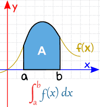
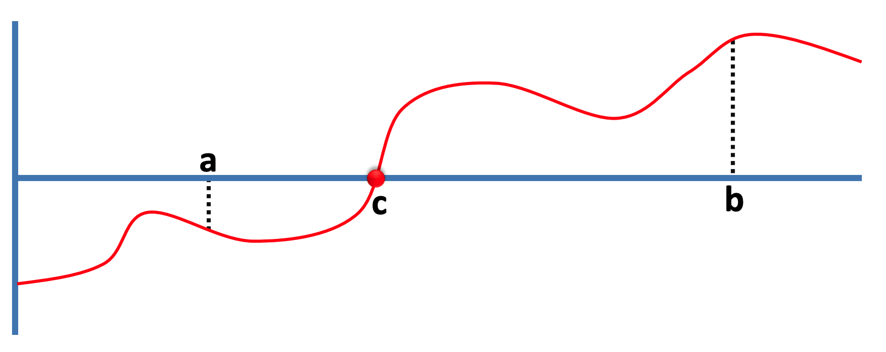
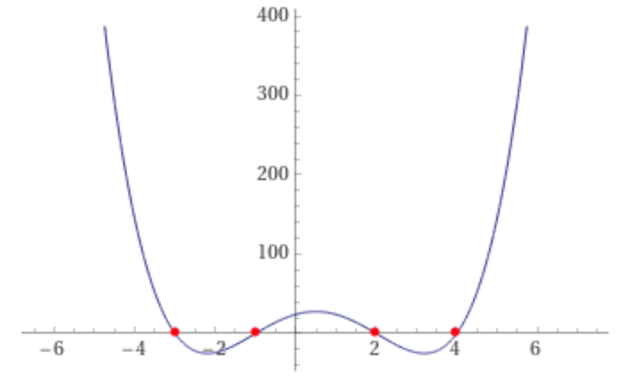
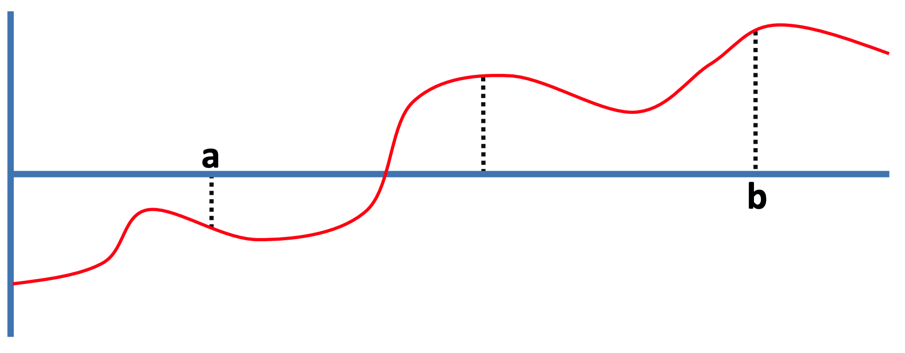
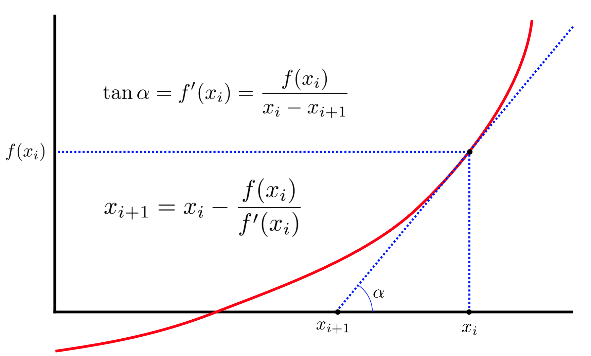
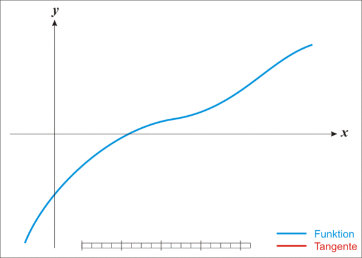
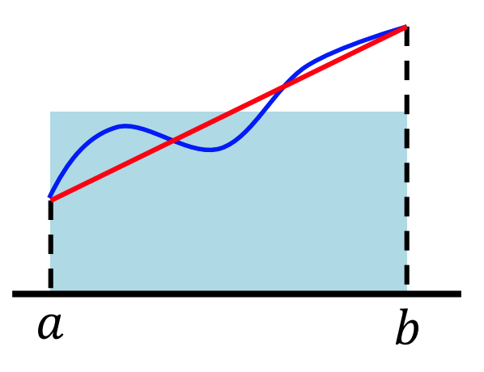
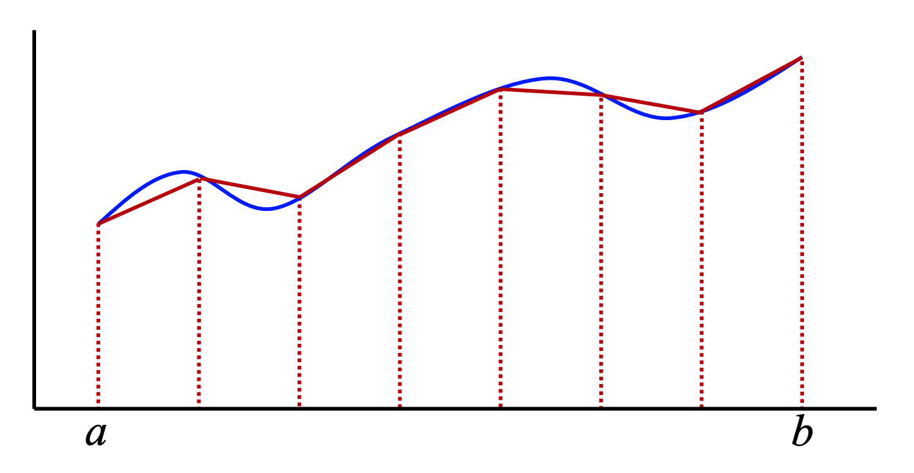
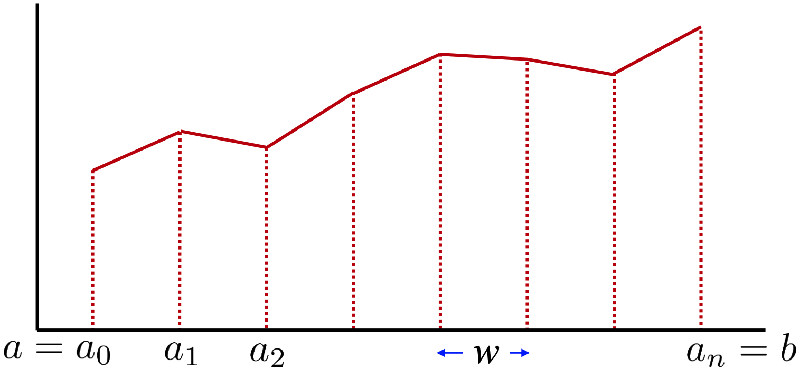

# Computacions aproximades



En aquest lliçó es presenten alguns algorismes per calcular solucions aproximades quan no es poden trobar solucions exactes. En particular es veuen aquestes tècniques:

- cerca binària per trobar zeros de funcions,
- mètode Newton-Raphson per aproximar funcions, i
- mètode dels trapezoides per calcular integrals definides.

De passada, es veu què són els paràmetres per defecte i com les funcions en Python poden rebre altres funcions com a paràmetres per poder-les usar dins del seu cos.


## Arrel d'una funció

Una **arrel d'una funció** (o un **zero d'una funció**) $f$ és un element $x$ del domini d'aquesta funció tal que $f(x) = 0$.

El **teorema de Bolzano** afirma que per a qualsevol funció continua $f$ en l'interval $[a,b]$ tal que $f(a)f(b) < 0$, $f$ té una arrel $c\in[a,b]$. Altrament dit, que tota funció continua ha de passar per zero si abans és negativa i després positiva (o del revés).



Considerem doncs el problema de, donada una funció continua $f$ sobre un interval $[a,b]$ tal que $f(a)f(b) < 0$, determinar una arrel aproximada $c$ de $f$. Aquí, el terme *arrel aproximada* vol dir que, per una precisió $\varepsilon$ també donada, hi ha una arrel de $f$ en $[c, c+\varepsilon]$. Aquesta aproximació és necessària perquè els valors amb coma flotant dels computadors ja són per ells sols aproximacions dels nombres reals.

Per resoldre aquest problema volem doncs implementar la funció següent:

```python
def arrel(f: Callable[[float], float], a: float, b: float, epsilon: float = 1e-12) -> float:
    """
    Retorna un valor c ∈ [a,b] tal que f té una arrel en [c, c + epsilon].
    Prec: f és una funció continua sobre $[a,b]$ tal que f(a)·f(b) < 0.
    """
```

El primer paràmetre d'`arrel` és una funció `f`. En efecte, en Python les funcions en poden passar com a paràmetres d'altres funcions. Per a fer-ho, simplement cal donar el seu nom (sense parèntesis). El tipus de les funcions es dóna a través del constructor de tipus `Callable` que cal importar del mòdul `typing`. `Callable` rep dos paràmetres entre claudàtors: el primer és una llista dels tipus dels paràmetres d'entrada de la funció, el segon és el tipus del resultat de la funció. Com que volem que `f` sigui una funció dels reals en els reals, usem el tipus `Callable[[float], float]`.

El darrer de paràmetre d'`arrel` és el real `epsilon`. Aquest paràmetre rep un valor per defecte de `1e-12`. Això vol dir que la funció `arrel` es pot invocar sense donar el quart paràmetre. Quan no es doni, valdrà `1e-12`. Si es dóna el quart paràmetre, s'usarà el valor del paràmetre real, és clar.

Per exemple, el polinomi $p(x) = (x+1)(x-2)(x+3)(x-4)$ té la forma següent i quatre arrels:



Per tant, podríem trobar l'arrel 2 de $p$ entre 0 i 3 fent això:

```python
def p(x: float) -> float:
    return (x + 1) * (x - 2) * (x + 3) * (x - 4)

print(arrel(p, 0, 3))
```

L'estratègia que triarem és semblant a la cerca binària: Anirem reduint l'interval $[a,b]$ a la meitat, comprovant si el valor de $f$ al mig de l'interval és positiu o negatiu fins que l'amplada de l'interval sigui menor o igual que $\varepsilon$.

Per exemple, a la figura d'abaix, com que la meitat esquerra és positiva per un costat i negativa per l'altra, com que és positiva al mig, descartarem la meitat dreta.



La implementació d'aquest algorisme no és difícil:

```python
def arrel(f: Callable[[float], float], a: float, b: float, epsilon: float = 1e-12) -> float:
    """
    Retorna un valor c ∈ [a,b] tal que f té una arrel en [c, c + epsilon].
    Prec: f és una funció continua sobre $[a,b]$ tal que f(a)·f(b) < 0.
    """

     while b - a > epsilon:     # invariant: [a,b] sempre conté una arrel de f.
        m = (a + b) / 2
        if f(a) * f(m) <= 0:
            b = m
        else:
            a = m
    return a
```

Provem-ho:

- L'execució d'`arrel(p, 0, 3)` retorna `1.9999999999995453`, un valor tal com cal.

- L'execució d'`arrel(p, 0, 3, 0.1)` retorna `1.96875`, un resultat també correcte, però que posa de manifest la manca de precisió (desitjada) al triar un $\varepsilon$ bastant gran.

- L'execució d'`arrel(p, -2, 5)` retorna `-1.0000000000002274`. La naturalesa de la cerca ha fet que es busqués l'arrel -1, però 2 i 4 també serien resultats correctes.


## Mètode de Newton-Raphson

A continuació presentem un altre mètode per trobar arrels de funcions. En aquest cas considerem el **mètode de Newton-Raphson**, que permet trobar successives aproximacions de les arrels d'una funció diferenciable.

**Nota:** Les condicions per la convergència d'aquest mètode no són trivials i no es tenen en compte aquí.

Sigui $f$ una funció diferenciable i $f'$ la seva derivada. Comencem amb un valor inicial $x_0$ qualsevol com a aproximació d'una arrel de $f$. Llavors

$$
x_1 = x_0 - \dfrac{f(x_0)}{f'(x_0)}
$$

hauria de ser una millor aproximació que $x_0$. La figura següent en dóna una interpretació gràfica:



Aquest procés es pot repetir amb

$$
x_{i+1} = x_i - \dfrac{f(x_i)}{f'(x_i)}
$$

tantes vegades com calgui fins que es trobi un valor prou precís. Aquesta animació extreta de [Wikipedia](https://en.wikipedia.org/wiki/Newton%27s_method) ho il·lustra:




Ara podem usar el mètode de Newton-Raphson per calcular arrels quadrades de nombres reals positius (sense fer servir `math.sqrt`, és clar): Com que volem calcular $x = \sqrt a$, caldrà que trobem el zero de la funció $f(x) = x^2 - a$. A més, sabem que la derivada de $f$ és $f'(x)=2x$. Per tant, la recurrència que ens apareix és

$$
x_{i+1} = x_i - \dfrac{x_i^2-a}{2x_i} = \frac12\left(x_i+\dfrac{a}{x_i}\right)
$$

Amb les idees que hem donat, podem ara escriure una funció per aproximar arrels quadrades:

```python
def arrel_quadrada(a: float, epsilon: float = 1e-12) -> float:
    """
    Retorna un valor x tal que |x²-a| < epsilon.
    Precondició: a ≥ 0.
    """

    x = 1.0  # tria inicial qualsevol
    while abs(x*x - a) >= epsilon:
        x = (x + a/x) / 2
    return x
```

Aquesta taula dóna les diferents aproximacions trobades per calcular l'arrel quadrada de `1000000`:

|Aproximacions successives|
|---:|
|`     1.0000000000000`|
|`500000.5000000000000`|
|`250001.2499990000000`|
|`125002.6249895000005`|
|` 62505.3124107521300`|
|` 31260.6555254452800`|
|` 15646.3223089532200`|
|`  7855.1175458973520`|
|`  3991.2115441616475`|
|`  2120.8810160681790`|
|`  1296.1915927068785`|
|`  1033.8412392442035`|
|`  1000.5538710539447`|
|`  1000.0001533016629`|
|`  1000.0000000000118`|
|`  1000.0000000000000`|

Com podeu veure molt poques iteracions són necessàries per trobar el resultat amb molta precisió.

**Exercici:**  Suposeu que teniu un microprocessador que no té cap circuit per fer divisions: només es poden fer servir sumes, restes i productes. Com podríeu calcular $1/a$ (per $a\neq0$) utilitzant el mètode de Newton-Raphson?


## Aproximació d'integrals definides

Suposem ara que volem aproximar una integral definida $\int_a^b f(x) dx$.

El **mètode trapezoidal** aproxima l'integral amb un trapezoide:



Llavors,
$$
\int_a^b f(x) dx \thickapprox (b -a)\left(\dfrac{f(a)+f(b)}2 \right).
$$

Evidentment, el mètode és una mica barroer, però es pot millorar l'aproximació si s'usen molts intervals:



En particular, si es consideren $n$ intervals, d'amplada $w=(b-a)/n$ cadascun,



es pot veure que

$$
\int\_a^b f(x) dx \thickapprox
   \sum^{n-1}_{i=0} w \dfrac{ f(a\_i) + f(a\_{i+1})}2
$$

i, per tant,

$$
\int\_a^b f(x) dx \thickapprox
    \dfrac{w}{2} \left( f(a) + f(b) +2 \sum^{n-1}_{i=1} f(a\_i) \right).
$$

A partir d'aquí no costa gens construir una funció que aproximi integrals definides usant intervals:

```python
def integral(f: Callable[[float], float], a: float, b: float, n: int) -> float:
    """
    Retorna una aproximació de l'integral definida de f entre a i b usant n intervals.
    Precondició: a ≤ b, n > 0.
    """

    w = (b – a) / n
    s = sum(f(a + i * w) for i in range(1, n))
    return (f(a) + f(b) + 2 * s) * w / 2
```


<Autors autors="jpetit jordic"/>
