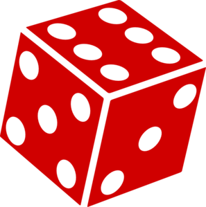
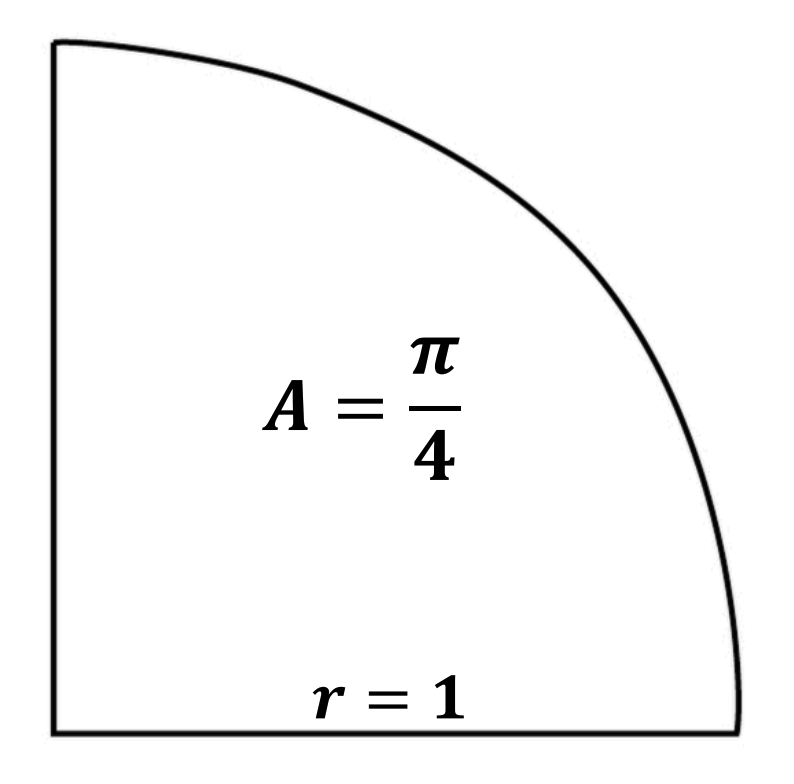
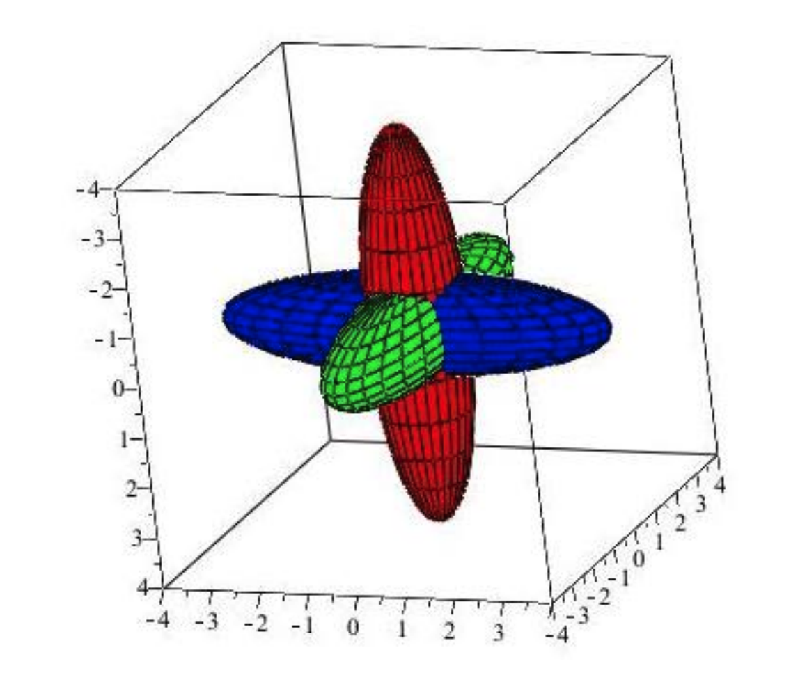
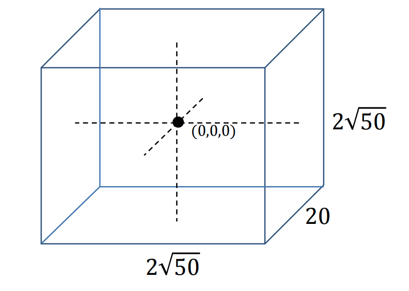
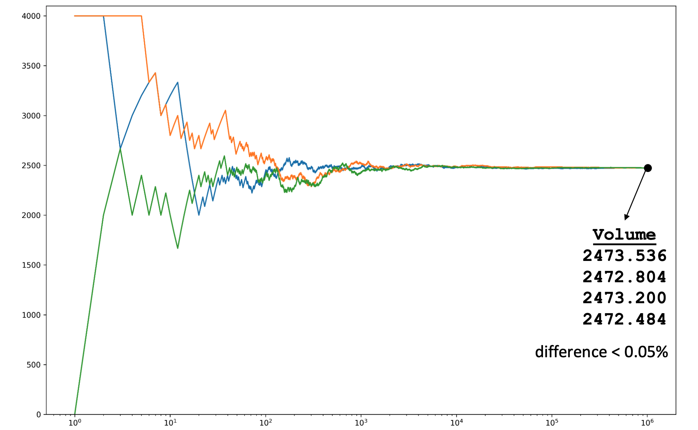

# Mètodes Montecarlo



Aquesta lliçó presenta el mètode de Montecarlo, un mètode probabilista per aproximar expressions matemàtiques complexes que, altrament, serien costoses d'avaluar amb exactitud. El nom mètode fa referència al Casino de Montecarlo (al Principat de Mònaco), ja que els nombres aleatoris són a la base del mètode. Els exemples desenvolupats són l'aproximació de $\pi$ i l'aproximació del volum de la intersecció de dos el·lipsoides.


## Generació de nombres aleatoris

Recordeu ([../funcions/us-funcions.md]) que el mòdul estàndard `random` proporciona funcions relacionades amb la generació de nombres aleatoris. En particular, la funció `randint` retorna un nombre a l'atzar entre dos de donats, la funció `random` retorna reals a l'atzar uniformement distribuïts entre 0 i 1, i la funció `uniform` retorna reals a l'atzar uniformement distribuïts entre els dos paràmetres donats:

```python
>>> import random
# probablement us sortiran valors diferents!
>>> [random.randint(1, 6) for _ in range(12)]
[1, 3, 6, 3, 6, 5, 4, 5, 4, 2, 1, 2]
>>> random.random()
0.91020758023523933
>>> random.uniform(0, 1/3)
0.15364034594325036
```

Els nombres generats per `random`, però, no són veritables nombres aleatoris. Són nombres **pseudo-aleatoris** generats per algorismes deterministes que exhibeixen unes propietats semblants als nombres aleatoris però no són nombres aleatoris perquè podríem saber perfectament quin seria el següent nombre generat. El procés de generació de nombres pseudo-aleatoris comença amb una llavor que, a cada crida, és alterada segons una fórmula fixa. Quan els programes en Python comencen, aquesta llavor es genera a partir de l'hora del sistema. Per això sempre obtenim seqüències de nombres pseudo-aleatoris diferents. Però la llavor es pot fixar amb l'acció `seed`, cosa que te utilitat pel desenvolupament i depuració de programes, ja que assegura la reproductibilitat de les seqüències aleatòries:

```python
>>> random.seed(1234)
# un cop fixada la llavor, sempre sortiran els mateixos valors
>>> [random.randint(1, 6) for _ in range(10)]
[4, 1, 1, 1, 5, 1, 6, 6, 1, 1]
```


## Aproximació de π

En aquesta secció presentem un mètode Montecarlo per aproximar el valor de $\pi$.

Recordeu que l'àrea d'un cercle de radi $r$ és $\pi r^2$. Per tant, l'àrea d'un cercle de radi 1 és $\pi$. I, per tant, l'àrea d'un quadrant de cercle és $\pi/4$:



Per altra banda, considereu que agafeu un punt a l'atzar en el quadrat unitari. La probabilitat que aquest punt estigui dins del quadrant de cercle de radi 1 centrat a l'origen és $\pi/4$ perquè aquesta és la fracció de l'àrea del quadrant de cercle dividida per l'àrea del quadrat unitari.

Si repetim aquest experiment aleatori $n$ vegades, podem comptar quants punts $d_n$ triats a l'atzar en el quadrat cauen dins del quadrant. Llavors, per la llei dels grans nombres, per a valors més i més grans de $n$, el valor de $d_n / n$ hauria de tendir a $\pi/4$.  La següent animació extreta de [Wikipedia](https://en.wikipedia.org/wiki/Monte_Carlo_method) ho il·lustra:


Per tant, podem obtenir una aproximació de $\pi/4$ simulant l'experiment anterior: Agafar $n$ punts a l'atzar dins del quadrat unitari, comptar quants d'ells cauen dins del quadrant de cercle i retornar el seu nombre partit per $n$. Per acabar l'algorisme ens queden dos detalls:

- Per agafar un punt aleatori dins del quadrat unitari, n'hi ha prou en triar a l'atzar les seves dues coordenades $x$ i $y$ uniformement a l'atzar entre 0 i 1.

- Per saber si un punt $(x,y)$ és dins del quadrant, cal veure si la seva distància a l'origen $\sqrt{x^2+y^2}$ és menor o igual que 1, que és equivalent a mirar si $x^2+y^2 \le 1$, estalviant una arrel quadrada relativament costosa de calcular.

Amb això, podem escriure doncs una funció que aproximi $\pi$ usant $n$ llançaments de punts:

```python
import random


def aprox_pi(n: int) -> float:
    """Retorna una aproximació de π via mètode Montecarlo usant n punts aleatoris."""

    d = 0  # comptador de punts dins del quadrant de cercle
    for _ in range(n):
        x, y = random.random(), random.random()
        if x * x + y * y <= 1:
            d += 1
    return d / n * 4
```

El producte per 4 al `return` final és perquè $d/n $ aproxima $\pi/4$ però la funció ha d'aproximar $\pi$.

La taula següent mostra la millora en l'aproximació de $\pi$ a mesura que creix en nombre de punts $n$:

|punts|aproximació|
|---:|:----|
|`10`|`2.8`|
|`100`|`3.16`|
|`1000`|`3.136`|
|`10000`|`3.142`|
|`100000`|`3.14256`|
|`1000000`|`3.142656`|
|`10000000`|`3.141960`|
|`100000000`|`3.1415734`|

Com a referència, $\pi = 3.14159265358979...$. El mètode funciona, però no és gaire ràpid.


## Aproximació del volum de dos el·lipsoides

El mètode Monte Carlo es pot utilitzar amb èxit per calcular aproximacions de les interseccions de diferents cossos. Per exemple, hom podria estar interessat en conèixer el volum de la intersecció d'aquests tres cossos:



A continuació, anem a aplicar el mètode Monte Carlo per aproximar el volum de dos el·lipsoides. Concretament, es vol estimar el volum de la regió 3D definida pels punts $(x,y,z)\in\mathbb{R}^3$ tals que $x^2+y^2+2z^2\le 100$ i $3x^2+y^2+z\le 150$.

Per començar, calculem els valors màxim possibles de $x$, $y$ i $z$ dels punts que es troben en la intersecció: 

- Com que $x^2 ≤ 100$ i $3x^2 ≤ 150$, cal que $x^2\le 50$. 

- Igualment, com que $y^2 ≤ 100$ i $y^2 ≤ 150$, cal que $y^2\le 100$.

- I, com que $2z^2 ≤ 100$ i $z^2 ≤ 150$, cal que $z^2\le 50$.

Per tant, els punts que es troben a l'intersecció dels dos cossos s'han de trobar dins del cuboide següent:



I, evidentment, el cuboide té volum $2\sqrt{50} · 20 · 2\sqrt{50} = 4000$.

Per tant, si $P$ és la probabilitat de que un punt triat a l'atzar en el cuboide es trobi dins de la intersecció dels dos cossos, el volum d'aquesta intersecció és $4000P$. La manera de trobat $P$ és, de nou, generar molts punts i comptar quants d'ells cauen dins de la intersecció:

```python
import math
import random

def volume_intersection(n: int) -> float:
    """Retorna una aproximació del volum referit al text via mètode Montecarlo usant n mostres."""

    sqrt50 = math.sqrt(50)
    dins = 0
    for _ in range(n):
        # generar un punt a l'atzar dins del cuboid
        x, y, z = random.uniform(0, sqrt50), random.uniform(0, 10), random.uniform(0, sqrt50)
        # mirar si el punt és dins la intersecció
        x2, y2, z2 = x * x, y * y, z * z
        if x2 + y2 + 2 * z2 <= 100 and 3 * x2 + y2 + z2 <= 150:
            dins += 1
    p = dins / n  # probabilitat de ser dins la intersecció
    return 4000 * p
```

La gràfica següent mostra com evoluciona l'aproximació dels volums al llarg de tres execucions de l'algorisme anterior amb diferents llavors.




## Sumari

El mètode de Montecarlo s'usa per aproximar expressions matemàtiques complexes que, altrament, serien molt difícils d'avaluar amb exactitud. Aquest és un mètode probabilista que funciona generant nombres a l'atzar, d'aquí el seu nom, relacionat amb els famosos casinos. El mètode té nombroses aplicacions en matemàtiques, física, electrònica, química, finances, simulació, jocs, ciència de dades, gràfics per computador... El mètode sempre posa de manifest un compromís entre la precisió del resultat i el nombre de mostres (i, per tant, el temps d'execució).


("jordi<Autors autors="jpetit"/> 

