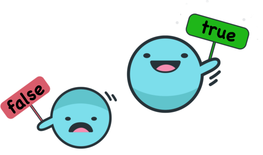

# El tipus booleà



En aquesta llicó es presenta el tipus Booleà, quin és el seu ús, quins valors poden tenir els booleans i quines operacions se'ls pot aplicar. Al final, també considerem algunes qüestions d'estíl.


## Concepte

Segurament, les preguntes més senzilles de contestar són les que només
admeten dues respostes: *sí* o *no* (és clar que les preguntes que
només tenen una resposta encara són més senzilles, però no són gens
interessants). Per exemple, la resposta de *"La Terra és un planeta?"*
és *sí*, i la resposta de *"Les balenes són peixos?"* és "*no*" (són
mamífers!). Per a la pregunta *"L'Anna està embarassada?"*, no sabem
quina és la resposta, però en un moment donat serà *sí* o serà *no*, no pot ser *"una mica"*.  En canvi, una pregunta com *"Quina hora és?"* no té com a resposta *sí* o *no*.

Igualment, les afirmacions poden ser certes o Falses. Per exemple, l'afirmació *"Les pomes són fruites."* és certa, però l'afirmació *"París és la capital d'Andorra."* és falsa. A més, les afirmacions es poden combinar en afirmacions compostes com ara *"Les pomes són fruites o París és la capital d'Andorra."*.

En programació, és útil disposar de valors que indiquin
si la resposta a una pregunta és *sí* o *no*,
i poder combinar aquests valors amb operadors lògics.
Per això, s'utilitza l'**Àlgebra de Boole**
[$\small[\mathbb{W}]$](https://ca.wikipedia.org/wiki/%C3%80lgebra_de_Boole).
En l'Algebra de Boole només hi ha dos valors, **fals** i **cert**,
que es poden combinar amb operadors de negació (**no**),
de disjunció (**o**) i de conjunció (**i**).


## Valors i operacions

En Python, els valors lògics es representen amb el tipus `bool` (de booleans). Els valors fals i cert es representen amb els literals `False` i `True`. Vigileu la majúcula.

Hi ha una operació unària (sobre un sol booleà):

- la **negació**, amb l'operador `not`.

També hi ha dues operacions binàries (és a dir, amb dos operands) fonamentals:

- la **disjunció**, amb l'operador `or` i
- la **conjunció**, amb l'operador `and`.

Les taules de veritat següents mostren, per a cada operació,
el resultat de cada possible combinació dels seus operands.

**Taula de veritat de la negació:**

| `a`        | `not a`    |
| ---------- | ---------- |
|  `False`   |  `True`    |
|  `True`    |  `False`   |

**Taula de veritat de la disjunció:**

| `a`  | `b`  | `a or b` |
| ---- | ---- | --------- |
|  `False`   |  `False`   | `False` |
|  `False`   |  `True`    | `True`  |
|  `True`    |  `False`   | `True`  |
|  `True`    |  `True`    | `True`  |

**Taula de veritat de la conjunció:**

| `a`  | `b`  | `a and b` |
| ---- | ---- | --------- |
|  `False`   |  `False`   | `False` |
|  `False`   |  `True`    | `False` |
|  `True`    |  `False`   | `False` |
|  `True`    |  `True`    | `True`  |


Així, la disjunció de dos booleans només és falsa si ambdós són falsos, i la conjunció de dos booleans només és certa si ambdós són certs. I, és clar, negar un booleà vol dir triar l'altre.

També es pot comprovar si dos booleans són iguals o si són diferents amb els operadors `==` i `!=`. S'utilitzen molt rarament.


## Usos

Les condicions de les instruccions condicionals i iteratives sempre són booleanes. Per exemple, quan s'escriu

```python
if temperatura <= 0: ...  # gela
```

l'expressió `temperatura <= 0` és de tipus booleà.
En efecte, tal com ja hem explicat, els operadors relacionals (`==`, `!=`, `<=`, `>=`, `<` i `>`)
retornen un valor booleà.
Això s'aprecia més clarament quan s'uneixen diverses condicions:

```python
if temperatura <= 0 and llum == 0: ...  # gela i és fosc
```

A més, si cal podem emmagatzemar condicions
en variables de tipus booleà.
Per exemple, amb

```python
gela = temperatura <= 0;
```

es crea una nova variable booleana anomenada `gela`,
amb valor `True` o `False` segons si valor de `temperatura` és negatiu o zero o bé estrictament positiu.
Podeu comprovar que el tipus de gela és booleà avaluant `type(gela)` a l'intèrpret.
Igualment, es pot crear una variable booleana
per guardar si és fosc o no,
i es poden combinar entre elles:

```python
gela = temperatura <= 0
es_fosc = llum == 0
if gela and es_fosc:
    ...
```

I, evidentment, també es poden crear més variables booleanes fent ús dels seus operadors:

```python
gela = temperatura <= 0
es_fosc = llum == 0
anar_amb_compte = gela and es_fosc
```

## Lleis de De Morgan

Les lleis de De Morgan son un parell de transformacions lògiques
que són essencials en informàtica.
Escrita en Python, la primera llei estableix que `not (a or b)`
és equivalent a `(not a) and (not b)`.
La segona llei diu que `not (a and b)` és
equivalent a `(not a) or (not b)`. La demostració d'ambdues lleis és
ben senzilla utilitzant taules de veritat.

Així, podem veure que el contrari de *"gela i és fosc"*
és *"no gela o no és fosc"*.
Compte: no és pas *"no gela i no és fosc"*,
el qual és un error molt freqüent.

Per tant, quan tenim un bucle com ara

```python
while gela and es_fosc: ...
```

sabem que sortirem del bucle quan almenys una de les variables
`gela` i `es_fosc` sigui falsa.


## Estil

Habitualment, comparar un booleà directament amb `True` o amb `False`  es
considera mal estil. Per exemple, si `trobat` és un booleà, el fragment

```python
if trobat == True: ...
```

es millor rescriure'l aixi:

```python
if trobat: ...
```

Similarment,

```python
if trobat == False: ...
```

és pitjor estil que

```python
if not trobat: ...
```

També, és confús usar identificadors negats
per a les variables booleanes.
Per exemple, és molt més senzill entendre la condició `gela` que `not no_gela`.

Utilitzar condicionals per inicialitzar booleans revela ser un *noob* de la programació sense coneixement dels booleans. Us hauríeu d'acostumar a no escriure res com

```python
if temperatura <= 0:         # 💩
    gela = True
else:
    gela = False
```

i, en canvi, escriure-ho amb bon estil, així:

```python
gela = temperatura <= 0      # 💜
```

Finalment, si voleu evitar la còlera dels déus de la programació,
no escriviu mai bestieses com ara `fals = True` 🤣.


<Autors autors="jpetit roura"/>
