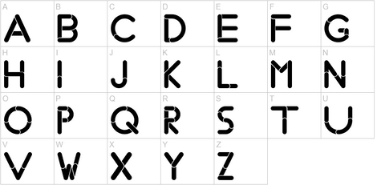

# Aplicació: Classificació de caràcters




Aquesta lliçó mostra una possible solució per a l'exercici
[P42042](https://jutge.org/problems/P42042) (Classificació de caràcters 1) del
Jutge.


## Exercici P42042

L'exercici [P42042](https://jutge.org/problems/P42042)
demana d'escriure un programa que llegeixi una lletra i que indiqui si és
una majúscula, si és una minúscula, si és una vocal, i si és una consonant.

Aquesta és una possible solució:

```python
from yogi import read

lletra = read(str)

majuscula = lletra >= 'A' and lletra <= 'Z'

vocal = lletra == 'a' or lletra == 'e' or lletra == 'i' or lletra == 'o' or lletra == 'u' or lletra == 'A' or lletra == 'E' or lletra == 'I' or lletra == 'O' or lletra == 'U'

if majuscula: 
    print("majuscula")
else:
    print("minuscula")

if vocal: 
    print("vocal")
else 
    print("consonant")
```

Primer, llegim la lletra de l'entrada en una variable `lletra` de tipus text.
Com que, segons l'enunciat, és una lletra (majúscula o minúscula), no cal comprovar-ho.

A continuació, desem en una variable booleana `majuscula`
si `lletra` és o no una lletra majúscula,
comprovant que `lletra` es trobi entre la `'A'` i la `'Z'`.

Després, desem en una variable booleana `vocal` si `lletra` és o no una vocal.
Per mirar-ho, comprovem si `lletra` és una de les cinc
possibles vocals, tan en majúscula com en minúscula.
Com que la línia quedava molt llarga, s'ha separat en dues línies.

Finalment, usem els dos booleans per escriure per pantalla els missatges adequats.

Una possible manera de simplificar el programa és fer ús de l'operador `in` de Python, que aplicat a dos textos retorna un booleà que diu si el primer text és o no dins del segon. Llavors, la determinació de si `lletra` és vocal es podria fer amb

```
vocal = lletra in 'AEIOUaeiou'
```

<Autors autors="jpetit"/> 

