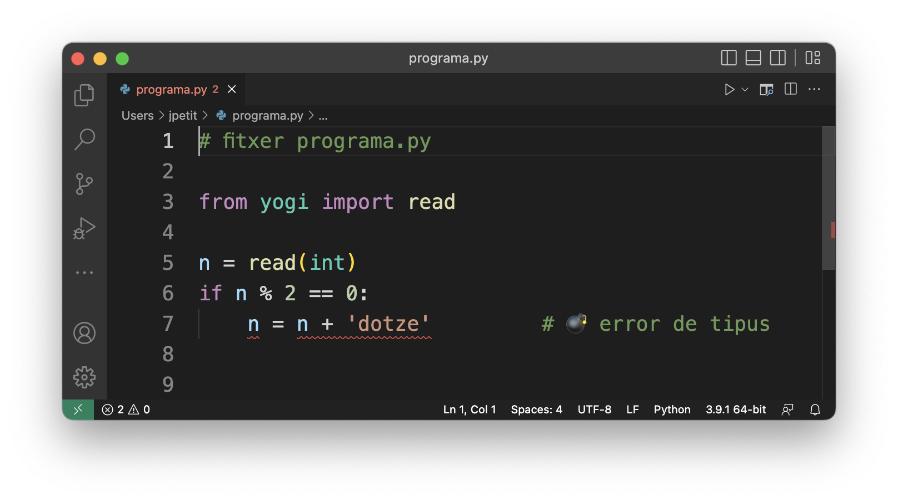
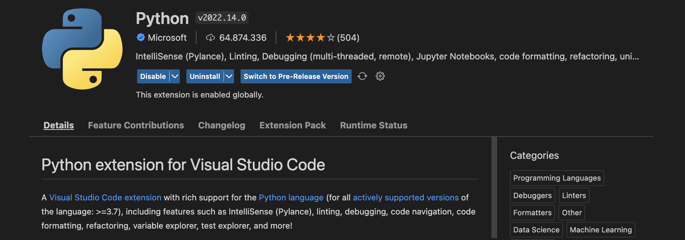
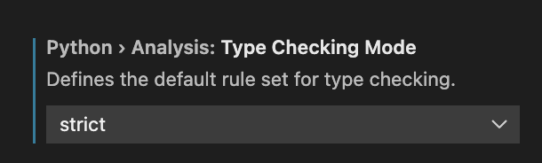

# Comprovació de tipus


Aquesta lliçó introdueix el concepte de comprovació dinàmica i estàtica de tipus i presenta dues possibles eines per realitzar comprovació estàtica de tipus als programes en Python. 


## Comprovació dinàmica i estàtica de tipus 

Com ja hem explicat, tots els llenguatges de programació tenen un **sistema de tipus** que indica quines operacions es poden aplicar a les dades en funció dels seus tipus. En Python, aquestes comprovacions de tipus es duen a terme en temps d'execució, és a dir, quan el programa s'executa. Per això, es diu que Python és un llenguatge amb **comprovació dinàmica de tipus**. 

Aquest tipus de tipatge assegura que si un programa intentés executar una instrucció amb un error de tipus, la seva execució seria abortada per l'intèpret. Per exemple, en el programa següent

```python
# fitxer programa.py

from yogi import read 

n = read(int)
if n % 2 == 0:
    n = n + 'dotze'         # 💣 error de tipus
```

l'error de tipus de la darrera línia interrompria l'execució del programa amb un error ~~TypeError: unsupported operand type(s) for +: 'int' and 'str'~~ quan el valor llegit de `n` fos parell. 

Clarament, això és positiu perquè els errors (que podrien conduir a resultats erronis) no són ignorats. Tanmateix, els errors en els programes no són detectats fins que aquests no són executats. Si el desenvolupador del programa anterior sempre ha provat el programa amb valors senars de `n`, potser no és conscient de l'existència d'aquest error. Seran els usuaris finals qui s'el trobaran (fet no gaire professional).

Per això, molts altres llenguatges de programació (com ara C++) realitzen una **comprovació estàtica de tipus** on les regles de tipus es comproven abans d'executar el programa. Amb comprovació estàtica de tipus, el sistema pot indicar al desenvolupador l'error de la darrera línia del programa anterior abans de distribuïr-lo als seus usuaris. 

Com podeu entendre, la comprovació estàtica de tipus proporciona programes més segurs (però és cert que també limita les coses que pot fer el programador). Per tant, malgrat que Python sigui un llenguatges de programació amb comprovació dinàmica de tipus, és bo utilitzar eines que també realitzin comprovació estàtica de tipus.

Existeix moltes eines per fer comprovació estàtica de tipus de programes en Python. A continuació en presentem dues. Feu servir aquestes o algunes de similars.


## mypy

mypy és una eina per detectar possible errors de tipus en un programa en Python. Funciona des del terminal, on se li diu el programa que cal comprovar i emet una llista de diagnòstics.

Per usar mypy, cal primer instal·lar-lo amb `pip`:

```bash
pip3 install mypy       # o potser pip, o pip 3.10 o... segons el vostre sistema
```

Un cop instal·lat, només cal invocar `mypy` amb el nom de fitxer de codi font en Python que es vol comprovar (suposant que ja sou al mateix directori on està desat). Per exemple, per provar el programa anterior cal escriure

```bash
mypy programa.py
```

La sortida seria una llista d'errors com la següent:

```text
programa.py:7: error: Unsupported operand types for + ("int" and "str")
Found 1 error in 1 file (checked 1 source file)
```

A partir d'aquesta informació, el programador hauria d'arreglar l'error de tipus a la línia 7.


## Pylance

Pylance és una extenció de Visual Studio Code que ofereix una comprovació estàtica de tipus on els diagnòstics es mostren en temps real en la finestra de l'editor de text, de forma semblant als processadors de textos quan mostren errors sintàctics o ortogràfics. Si passeu el ratolí per la zona remarcada, us donarà més informació. Aquí ho teniu:



Per tal de poder utilitzar Pylance en Visual Studio Code, instal·leu-hi un plugin anomenat *Python extension for Visual Studio Code* que instal·la Pylance i altres utilitats que agraïreu. (De fet, el primer cop que creeu un fitxer en Python, Visual Studio Code ja us suggereix que instal·leu aquesta eina.)



Un cop instal·lat el plugin, recordeu anar a la configuració i posar `Strict` a `Type Checking Mode` de PyLance:



👆 Recordeu fer això!


## Comprovació estàtica de tipus a Jutge.org

Si resoleu problemes en Python a Jutge.org, podeu utilitzar el "compilador" MyPy quan envieu la vostra solució. Amb aquest compilador, Jutge.org comprova primer que el vostre programa no tingui errors amb `mypy`. Si en té, us donarà un veredicte "Compilation error" juntament amb els diagnòstics corresponents. Si no en té, executarà el programa amb l'intèrpret de Python com de costum.

> Avís pels estudiants d'AP1, AP2 i AP3: Als exàmens, haureu d'usar per força el compilador MyPy.


## Sumari

Per si mateix, Python només detecta errors de tipus en temps d'execució. Per tal d'escriure programes més segurs, és vital utilitzar eines automàtiques que detectin errors de tipus abans d'executar els programes. `mypy` i Pylance són dues opcions que hauríeu d'utilitzar per prevenir aquest tipus d'errors.


<Autors autors="jpetit"/> 

