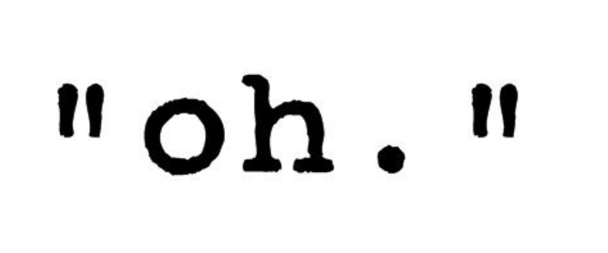

# El tipus text



En aquesta llicó es descriu el tipus text. En particular es veu com s'escriuen els literals de tipus text, quins valors poden tenir els texts i algunes de les operacions se'ls pot aplicar. Finalment, es dóna una petita aplicació que involucra textos.

## Textos

El tipus dels textos en Python s'escriu `str` (de l'anglès _string_). Els textos són seqüències de zero o més caràcters. Hi ha qui els anomena _cadenes de caràcters_, però jo trobo que _text_ és molt més clar.

## Literals

La manera d'escriure els textos en Python escribint els seus caràcters l'un rera l'altre entre cometes, simples o dobles. Per exemple, `'Jordi'` i `"Jordi"` representen el mateix text. El text `''` és el text buit, i té llargada zero. En canvi, el text `' '` és un text de llargada 1 que només conté el caràcter espai (que no es veu). Fixeu-vos que `666` és un enter que representa el nombre 666, en canvi, `'666'` és un text amb 3 caràcters que són el dígit 6.

## Caràcters

En Python, els textos estan formats per caràcters en Unicode. **Unicode** és un estàndard internacional de codificació de caràcters per a suports informàtics. Permet emmagatzemar qualsevol mena d'escriptura que es faci servir actualment, moltes formes d'escriptura (des dels alfabets llatins fins a l'escritura xinesa) i símbols com ara els símbols matemàtics, lingüístics, i algunes emoticones. Així, `'I 🧡 E = mc² 😛!'` és un text vàlid en Python.

També existeixen uns caràcters especials anomenats **caràcters de control** que representen accions especials al escriure. Per exemple `'\n'` és el salt de línia, `'\a'` és el so d'una campaneta i `'\t'` un tabulador. Ls barra del revés introdueix doncs un caràcter especial, per escriure una barra, cal posar-ne dues: `'\\'`.

## Operacions

Recordeu que l'operador `+` permet concatenar dos textos i que l'operador `*` permet repetir un text un determinat nombre de cops. Per exemple, `'Black' + 'field'` dóna `'Blackfield'` i `'19' * 3` dóna `'191919'`.

Els textos també es poden comparar amb els operadors relacionals. L'ordre depèn de la configuració dels sistema operatiu però, a grans trets, per a lozalitzacions occidentals, l'ordre subjacent és l'ordre alfabètic (el del diccionari). !!! Potser cal explicar més?

Els textos tenen moltes altres operacions, algunes de les quals veurem més endavant. Una que ja pot ser útil és la funció `len`, que retorna la llargada (nombre de caràcters) d'un text. Per exemple, `len('I 💜 you')` val 7.

## Texts amb format

ELs texts també presenten una variant anomenada **text amb format** (_f-string_). Els textos amb format poden incloure al seu interior expressions que són avaluades i convertides en text, possiblement aplicant alguna transformació per millorar-ne el seu format.

Aquest és un senzill exemple:

```python
>>> nom = 'James'
>>> cognom = 'Bond'
>>> f'El meu nom és {cognom}, {nom} {cognom}'
'El meu nom és Bond, James Bond'
```

I aquest un altre amb variables i expressions reals:

```python
>>> a = 3.199
>>> b = 2.236
>>> a + b
5.4350000000000005
>>> f'La suma de {a} i {b} és {a+b}'
'La suma de 3.199 i 2.236 és 5.4350000000000005'
```

Com es veu, els textos amb format tenen el prefix `f` davant de les cometes i, al seu anterior, les expressions tancades entre claus són avaluades i inserides en el text que les envolta. Això s'anomenada **substitució de variables** o **interpolació de textos**.

A més, les expressions poden anar precedides de dos punts (`:`) i una **especificació de format**. Les especificacions de format permeten controlar amb quants dígits s'escriuen els nombres, com s'alineen els textos, quins caràcters s'usen per omplir... A l'exemple anterior, els nombres han quedat basant lletjos, en una aplicació monetària o per crear unes taules seria millor que tots els valors tinguéssin dos dígits decimals. Això es pot aconseguir amb el format `.02f`:

```python
>>> a = 3.199
>>> b = 2.236
>>> a + b
5.4350000000000005
>>> f'La suma de {a:.02f} i {b:.02f} és {a+b:.02f}'
'La suma de 3.20 i 2.24 és 5.44'
```

Aquí, la `f` vol dir que cal formatar un nombre real (_float_). El `.02` vol dir fer-ho amb dos decimals darrera de la coma, posant zeros si cal.

Tenim documentació extensa sobre els formats a https://docs.python.org/3/tutorial/inputoutput.html#tut-f-strings. No cal pas recordar-ho de memòria. Millor que quan us calgui recorreu en aquests breus exemples de les possibilitats existents:

```python
>>> x = 123.419
>>> f'{x:.2f}'  # dos dígits darrera la coma decimal
'123.42'
>>> f'{x:08.2f}' # dos dígits darrera la coma decimal, 8 caràcters en total, zeros a l'esquerra
'00123.42'
>>> f'{x: 8.2f}' # dos dígits darrera la coma decimal, 8 caràcters en total, espais a l'esquerra
'  123.42'
```

```python
>>> s = 'Python'
>>> f'{s:>20}'              # alineació per la dreta
'              Python'
>>> f'{s:<20}'              # alineació per l'esquerra
'Python              '
>>> f'{s:^20}'              # centratge
'       Python       '
>>> f'{s:*>20}'             # alineació per la dreta omplint amb asterics
'**************Python'
```

```python
>>> n = 123
>>> f'{n:>20}'              # alineació per la dreta
'                 123'
>>> f'{n:<20}'              # alineació per l'esquerra'
'123                 '
>>> f'{n:0>20}'
'00000000000000000123'      # alineació per la dreta omplint amb zeros
```

```python
>>> x = 3
>>> f'{x = }, {2 * x = }'  # xivatos
'x = 3, 2 * x = 6'
```

## Texts multilínia

En algunes circumstàncies, és convenient escriure un text que contingui múltiples línies. En Python això es pot fer utilitzant tres cometes (dobles o simples):

```python
poema = '''
La ginesta altre vegada,
la ginesta amb tanta olor,
és la meva enamorada
que ve al temps de la calor.
Per a fer-li una abraçada
he pujat dalt del serrat:
de la primera besada
m'ha deixat tot perfumat.

            — Joan Maragall
'''
```

Dins dels textos multilínia, els espais i salts de línia es desen tal com s'han escrit.

També es pòden usar formats amb els textos multilínia:

```python
nom = 'Joan Vila Capdetort'
email = 'jvila@atzucac.cat'
saldo = 0.0
contrasenya = random.randint(11111111, 99999999)
departament = "Departament d'atenció al client"

missatge = f'''
Benvolgut {nom},

Estem contents que s'hagi registrat a la nostra web.
El seu nom d'usuari és {email} i la seva contrasenya
és {contrasenya}. Quan entri per primer cop a la zona de clients
haurà de triar una nova contrasenya.

El seu saldo actual és de {saldo:.02f}€.

Atentament,
    {departament}
'''
```

Els texts multilínia també s'utilitzen per a documentar algunes parts del codi amb *docstring*s, ho veurem més endavant.

<Autors autors="jpetit"/>
