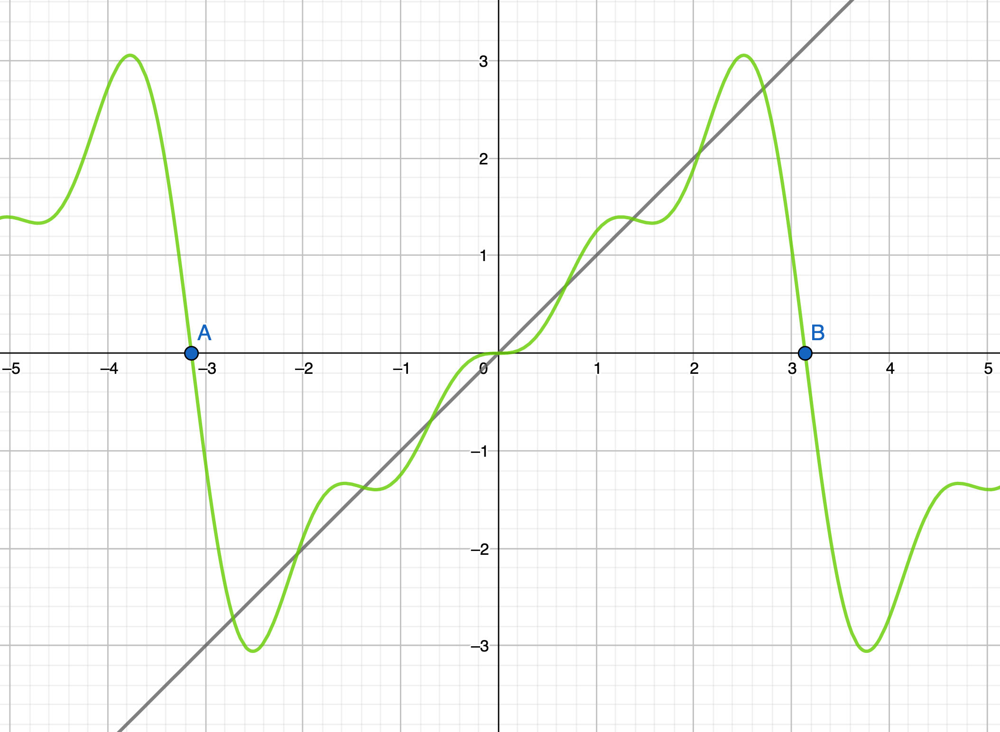

# Fourier

## Complex numbers

### Classification of Numbers

When creating `Symbol`s with SymPy we often have the need to specify certain properties of some variables. It is important to do so because it can simplify computations and save time. We can do that in `SymPy` by adding properties to the declaration of the symbols:

```python
>>> x, y = symbols('x y', real=True)
>>> n = symbols('n', integer=True, negative=False)
>>> z = symbols('z', real=False)
```

### Working with complex numbers in Python

There is an [introduction on complex numbers in python](../algebra/index.html#complex-numbers) section available in the Algebra page of this documentation.

To get the **real part** of a complex number `z` we can use `sympy.re(z)` or `numpy.real(z)`.

To get the **imaginary part** of a complex number `z` we can use `sympy.im(z)` or `numpy.imag(z)`.

To get the **modulus** of a complex number `z` we can use `sympy.Abs(z)` or `numpy.abs(z)`.

To get the **angle** of a complex number `z` we can use `sympy.arg(z)` or `numpy.arg(z)`.

To get the **conjugate** of a complex number `z` we can use `sympy.conjugate(z)` or `numpy.conjugate(z)`.

There are other special functions such as `numpy.real_if_close(z, tolerance)` which transforms complex numbers into real numbers removing the imaginary part if they are close enough to zero.

> 💡 You can find an example of drawing a complex function in the [Plotting section](plotting.html#complex-function)

## Fourier Series

SymPy has a class to represent Fourier cos/sin series called `FourierSeries`

To **compute** a fourier series the function `fourier_series(f)` is used.
Once you have the `FourierSeries` object, you can **get the first n terms** using the function `truncate`.
You can also **get the coefficients** `an` and `bn` as properties of the object.

> 📝 Example:
>
> Find the first 4 terms of the fourier series of the function $f(t) = t$ between $-\pi$ and $\pi$ and the coefficients $a_n$ and $b_n$ of the series.
>
> ```python
> >>> t = symbols('t')
> >>> f = t
> >>> FS = fourier_series(f, (t, -pi, pi))
> >>> FS.truncate(4)
> 2*sin(t) - sin(2*t) + 2*sin(3*t)/3 - sin(4*t)/2
> >>> FS.a0
> 0
> >>> FS.an
> [0,0,0,0,…]
> >>> FS.bn
> [2*sin(t),-sin(2*t),2*sin(3*t)/3,-sin(4*t)/2,…]
> ```
>
> Solution:
>
> 
>
> ⚠️ The properties an and bn are the sequences of the product of the coefficient and the sin/cos corresponding function. To actually get the an and bn coefficients one must divide each element of the sequence by sin(nt) or cos(nt).

## Fourier Transform
We can compute fourier transforms using the SymPy function `fourier_transform`:

> 📝 Example:
>
> Compute the fourier transform $\hat{f}(\xi)$ of the function $f(x) = e^{-|t|}$
>
> ```python
> >>> t, xi = symbols('t xi')
> >>> f = exp(-abs(t))
> >>> fourier_transform(f, t, xi)
> 2/(4*pi**2*xi**2 + 1)
> ```
>
> Solution:
>
> $\hat{f}(\xi) = \frac{2}{4\pi^2\xi^2+1}$

## Generalized functions

### Dirac Delta

SymPy has a class for the Dirac Delta function called `DiracDelta`. It can be used as a normal function and fulfills all its properties:

```
>>> DiracDelta(1)
0
>>> DiracDelta(-pi)
0
>>> t = symbols('t')
>>> diff(DiracDelta, t)
1
>>> f = Function('f')
>>> integrate(f(t)*DiracDelta(t), (t, -oo, oo))
f(0)
>>> diff(Heaviside(t), t)
DiracDelta(t)
...
```

> 💡 Heaviside is a SymPy class to represent the [Heaviside step function](https://en.wikipedia.org/wiki/Heaviside_step_function)

## External links

-   [Fourier Series](https://docs.sympy.org/latest/modules/series/fourier.html)
-   [Integral Transforms](https://docs.sympy.org/1.0/modules/integrals/integrals.html#module-sympy.integrals.tramsforms)
-   [Tutorial: Fourier Transforms (scipy.fftpack)](https://docs.scipy.org/doc/scipy-1.1.0/reference/tutorial/fftpack.html)
-   [Reference: Fourier Transforms (scipy.fftpack)](https://docs.scipy.org/doc/scipy-1.1.0/reference/fftpack.html#module-scipy.fftpack)
-   [Signal processing](https://docs.scipy.org/doc/scipy/reference/signal.html)

<Autors autors="raul"/>
