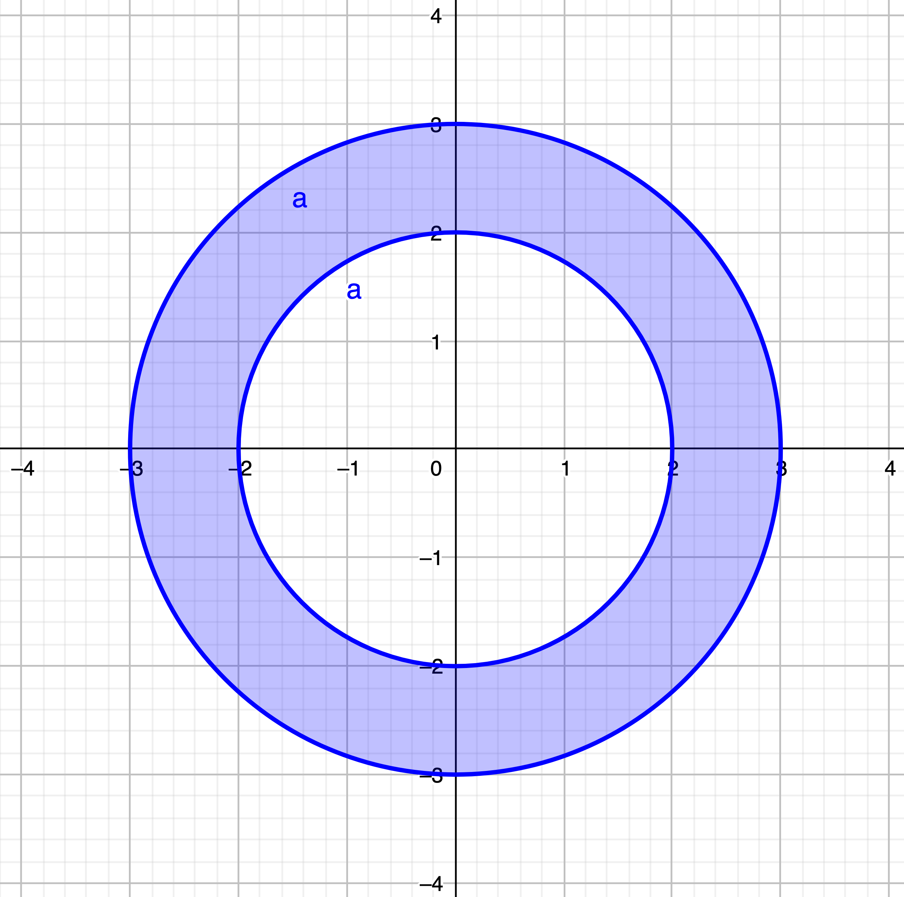

# Integration

## One-variable integration

The function from SymPy that we'll be using for integration is `integrate`. It's a very powerful function that can perform many of the common integrals.

### Primitives

A **primitive of a function** $F(x)=\int f(x)dx$ can be computed with:

```python
F = integrate(f, x)
```

### Definite integrals

A **definite integral of a function** $A = \int_{a}^{b} f(x)dx$ can be computed by adding the upper and lower limits with the variable of integration.

```python
A = integrate(f, (x, a, b))
```

### Improper integrals

**Improper integrals** $\int\_{a}^{\infty}f(x)dx = \lim\_{b \to \infty} \int_{a}^{b}f(x)dx$ can be performed just by using th SymPy `oo` object (infinity) in one or both of the integration limits.

```python
A1 = integrate(f, (x, a, oo))
A2 = integrate(f, (x, -oo, b))
A3 = integrate(f, (x, -oo, oo))
```

## Iterated integrals
As the `integrate` function returns SymPy functions (or just numbers), they can be called recurively.

For example, a double integration like $A = \int\_{a}^{b} dy \int\_{c}^{d} f(x)dx$ can be computed calling two times the `integrate` function.

```python
A = integrate(integrate(f, (y, c, d)), (x, a, b))
```

> 📝 Example:
>
> Integrate the function $f(x,y) = x^2 - xy + y^3$ over the domain $D= \left\lbrace (x,y)\in\mathbb{R}^2:1\leq x\leq 2,-2x\leq y\leq x^2 \right\rbrace$
>
> ```python
> >>> x, y = symbols('x y')
> >>> f = x**2 - x*y + y**3
> >>> integrate(integrate(f, (y, -2*x, x**2)), (x, 1, 2))
> 5.3444444444
> ```

This method can be used for integrals in any number of dimensions.

> 💡 Sometimes you will find useful to be able to see the integration domain. Check out the [Plotting page](plotting.html#integration-domain) to see a full example of it.

## Numeric integration
We can also compute integrations using numeric methods with the subpackage `integration` from `SciPy`. `SciPy` is a python package for scientific computation. To use it, we will import it just like any other package:

```
from scipy import integration
```

To perform **double integrals** we will use the function `integration.dblquad()`. It takes as parameters the function to integrate and the boundaries, and returns the computed value and an estimation of the absolute error.

> 📝 Example:
>
> Compute the defined integral: $$$ \int\_{y=0}^{\frac{1}{2}} \int_{x=0}^{1-2y} xydxdy $$$
>
> ```python
> >>> f(x, y):
> >>>   return x*y
> >>> g(y):
> >>>   return 0
> >>> h(y):
> >>>   return 1 - 2*y
> >>> integration.dblquad(f, 0, 0.5, g, h)
> (0.010416666666666668, 1.1564823173178715e-16)
> ```

\_ \_

> ⚠️ Warning: The boundaries type must be `float` or `callable objects` (basically functions).

\_ \_

> 💡 All the parameters of the previous example passed as functions can also be passed as `lambda functions`. Here is how it could be done in a single line:
>
> ```python
> dblquad(lambda x, y: x*y, 0, 0.5, lambda x: 0, lambda x: 1-2*x)
> ```
>
> For more information about lambda functions check out this [w3school page](https://www.w3schools.com/python/python_lambda.asp)

To compute **triple integrals** we can use the function `integration.tplquad()`. It works exactly in the same way as the previous function but it takes two extra parameters for the two extra boundaries.

## Change of variables

The `Matrix` class has a method called `jacobian` to compute the jacobian of a matrix. It takes a list of variables as a parameter.

```python
x1, x2, ... xn = symbols('x1 x2 ... xn')
M = Matrix( ... )
M.jacobian([x1, x2, ... xn])
```

> 📝 Example:
>
> Compute the integral of the function $\sqrt{x^2+y^2}$ over the annulus $D = \left\lbrace (x,y)\in\mathbb{R}^2 : 4 \leq x^2 + y^2 \leq 9 \right \rbrace$
>
> <center>
>   
> </center>
> ```python
> >>> r, alpha = symbols('x y r alpha')
> >>> x = r*cos(alpha)
> >>> y = r*sin(alpha)
> >>> f = sqrt(x**2 + y**2)
> >>> J = Matrix([x, y]).jacobian([r, alpha])
> >>> integrate(integrate(f*abs(J.det()), (alpha, 0, 2*pi)), (r, 2, 3))
> 38*pi/3
> ```
> 👁️ Note: (`cos`, `sin`, `sqrt` and `pi` are functions and objects from the SymPy package)

## External links

<!--
- [Python](https://www.python.org)
- [Anaconda Distribution](https://www.anaconda.com)
- [Scipy](https://www.scipy.org)
- [Scipy Getting Started](https://www.scipy.org/getting-started.html)
- [Scipy Lecture Notes](http://scipy-lectures.org/index.html)
-->

-   [Integration and ODEs (scipy.integrate)](https://docs.scipy.org/doc/scipy/reference/integrate.html)
-   [Symbolic Integrals](https://docs.sympy.org/latest/modules/integrals/integrals.html)

<Autors autors="raul"/>
