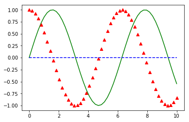
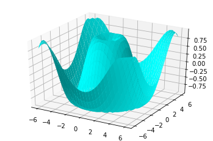
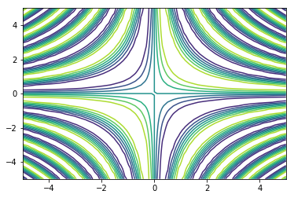
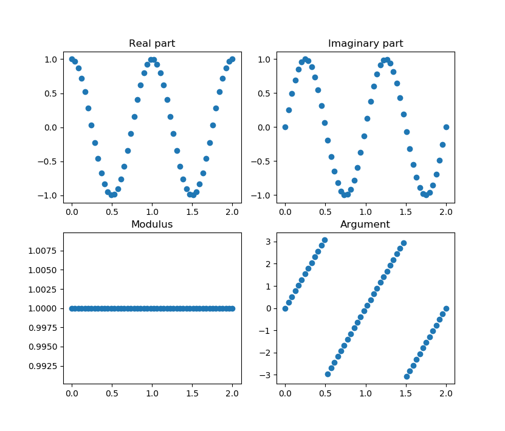
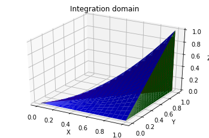
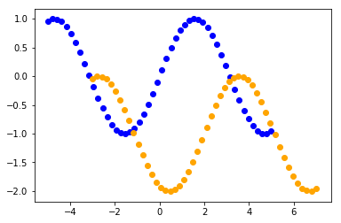

# Plotting

Sometimes it's useful to be able to see the image of functions or geometric objects to get a better understanding of certain problems. In order to do so, we will be using a package named `matplotlib`. There is a brief introduction of it in the [Mathematics section of the cookbook](../maths.html#visualization).

In this document we will use the following packages:

```python
import numpy as np
import matplotlib.pyplot as plt
from mpl_toolkits.mplot3d import Axes3D
```

## 2D plotting

To plot functions we will need to create two lists, one with the `x` values and the other with the corresponding `y` values. To do so, we can use the `NumPy` function `linspace()`. This function takes as a parameters $x_0$, $x_f$ and $n$, and returns an array of $n$ equally spaced points between $x_0$ and $x_f$.

Then we will also use the function `plot()` from `matplotlib.pyplot`, which takes as arguments the `x` and `y` list and then attributes such as: `color`, `linestyle`, `linewidth`, `marker`, etc. The full list of attributes can be found in the [official documentation](https://matplotlib.org/3.1.0/api/_as_gen/matplotlib.pyplot.plot.html)

```python
x = np.linspace(0, 10, 50)
y1 = np.sin(x)
y2 = np.cos(x)
y3 = [0]*50

plt.figure()
plt.plot(x, y1, color='green')
plt.plot(x, y2, color='red', linewidth=0, marker="^")
plt.plot(x, y3, color='blue', linestyle='--')
plt.show()
```

Result:



## 3D plotting

To plot 3 variable functions we will need three 2D arrays for the `x`, `y` and `z` values.

This time, we will be using the function `meshgrid()`. This function takes as parameters two arrays (x and y) and returns two 2D arrays which form a rectangular grid together. Then we can compute the Z values using the new arrays. Finally we can use the function `plot_surface()` to draw the function as a surface.

> 💡 There are many other interesting functions to get different plots: `scatter()` for plotting only the set of points, `contour()` for the level curves, etc. You can find more details in the [official documentation](https://matplotlib.org/3.1.1/api/_as_gen/mpl_toolkits.mplot3d.axes3d.Axes3D.html)

```python
def f(x, y):
    return np.sin(np.sqrt(x ** 2 + y ** 2))

fig = plt.figure()
x = np.linspace(-6, 6, 30)
y = np.linspace(-6, 6, 30)
X, Y = np.meshgrid(x, y)
Z = f(X, Y)
ax = plt.axes(projection='3d')
ax.plot_surface(X, Y, Z, color="cyan")
```

Result:



## Examples

### Level curves

Plot the level curves of the function $f(x,y) = \sin(xy)$:

```python
x = np.linspace(-5, 5, 50)
y = np.linspace(-5, 5, 50)
X, Y = np.meshgrid(x, y)
Z = np.sin(X*Y)

plt.figure()
plt.contour(X, Y, Z)
```

Result:



### Complex function

Plot the real part, the imaginary part, the modulus and the argument of the function $f(x) = e^{2 \pi i t}$

```python
t = np.linspace(-5, 5, 100)
f = np.exp(2*np.pi*1j*t)
fig, axs = plt.subplots(2, 2)
f_r = np.real(f)
f_i = np.imag(f)
f_mod = np.abs(f)
f_arg = np.angle(f)
axs[0,0].scatter(t, f_r)
axs[0,0].set_title("Real part")
axs[0,1].scatter(t, f_i)
axs[0,1].set_title("Imaginary part")
axs[1,0].scatter(t, f_mod)
axs[1,0].set_title("Modulus")
axs[1,1].scatter(t, f_arg)
axs[1,1].set_title("Argument")
```

Result:



### Integration domain

Compute the integral of the function $ f (x, y, z) = x\,y^2\,z^3 $ over the region limited by the surface $z = x\,y$ and the planes $y = x$, $x = 1$, $z = 0$.

Drawing the domain:

```python
n_grid=20

fig = plt.figure()
ax = plt.axes(projection='3d')

# Z = X*Y
x = np.linspace(0, 1, n_grid)
y = np.zeros( (n_grid, n_grid) )
z = np.zeros( (n_grid, n_grid) )
for i in range(n_grid):
  y[:,i] = np.linspace(0, x[i], n_grid)
  for j in range(n_grid):
    z[j,i] = x[j]*y[j,i]
x, x = np.meshgrid(x, x)
ax.plot_surface(x, y, z,color='blue')

# X = 1
x = np.linspace(1, 1, n_grid)
y = np.linspace(0,1,n_grid)
z = np.zeros( (n_grid, n_grid) )
for i in range(n_grid):
  z[i,:] = np.linspace(0, x[i]*y[i], n_grid)
xx, yy = np.meshgrid(x, y)
ax.plot_surface(xx, yy, z,color='green')

# X = Y
x = np.linspace(0, 1, n_grid)
y = np.zeros( (n_grid, n_grid) )
z = np.zeros( (n_grid, n_grid) )
for i in range(n_grid):
  y[i,:] = x[i]
  for j in range(n_grid):
    z[i,j] = x[j]*y[j,i]
x, x = np.meshgrid(x ,x)
ax.plot_surface(x, y, z,color='red')


ax.set_xlabel('X')
ax.set_ylabel('Y')
ax.set_zlabel('Z')
ax.set_title('Integration domain');
plt.show()
```

Result:



### Affinity Image

What does the affinity with matrix $ M = \begin{pmatrix} 1 & 0 & 2 \\\ 0 & 1 & -1 \\\ 0 & 0 & 1 \end{pmatrix} $ do?

```python
M = sp.Matrix([
    [1, 0,  2],
    [0, 1, -1],
    [0, 0,  1]
])

# We will use the function f(x) = sin(x) to see the effect
x = np.linspace(-5, 5, 50)
y = np.sin(x)

# We will need an auxiliary matrix to multiply the points with the affinity matrix
aux = sp.Matrix([1]*50)
aux = aux.col_insert(0, sp.Matrix(y))
aux = aux.col_insert(0, sp.Matrix(x))

aux2 = M*aux.T

fig = plt.figure()
ax = plt.axis()

plt.scatter(x, y)
plt.scatter(aux2[0,:], aux2[1,:])

plt.show()
```

Result:



Conclusion: It's a **translation**

## External links

-   [Pyplot tutorial](https://matplotlib.org/tutorials/introductory/pyplot.html)
-   [mplot3d tutorial](https://matplotlib.org/mpl_toolkits/mplot3d/tutorial.html)
-   [Matplotlib Gallery](https://matplotlib.org/gallery/index.html)

<Autors autors="raul"/>
