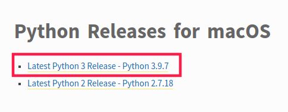

# Installation

The aim of this section is to install Python 3 and an interactive editor (Jupyter notebook) on the system. Some helpful links can be found at the end.

1. [Python version](#python-versions)
2. [Checking the version](#checking-the-version)
3. [Installing on...](#installing-on)
    - [Linux](#linux)
    - [macOS](#macos)
    - [Windows](#windows)
4. [Installing packages](#installing-packages)
5. [Useful links](#useful-links)

## Python versions

Python is an interpreted, high-level, general-purpose programming language that was conceived in the late 1980s and is now gaining immense popularity given its appeal of simplicity.

There exist two main Python versions, Python 2 and Python 3. The latter contains language enhancements, whereas the former is already deprecated from January 2020; so this cookbook will use Python 3 syntax.

Here we recommend you to install Python with version 3.8.8 (or higher).

## Checking the version

By default, Python is already installed on several systems, as in Linux distributions (e.g., **Ubuntu 20.04.3 LTS**); but it probably won't be Python 3. By checking the Python version we can decide if it is already installed on the system or if the installed one is the correct one.

1. Open your terminal:

    - For Linux, open it by <kbd>Ctrl</kbd> + <kbd>Alt</kbd> + <kbd>T</kbd> .
    - For macOS, press <kbd>⌘Cmd</kbd> + <kbd>Space</kbd> , then type `Terminal` and finally press <kbd>Enter</kbd>.
    - For Windows, press <kbd>⊞Win</kbd> then type `PowerShell` and finally press <kbd>Enter</kbd>.

2. Try the following command lines:

    ```bash
    python --version
    python3 --version
    python3.8 --version
    python3.9 --version
    ```

3. At least one of the previous commands should work if you have Python installed. If the output is like the one below (with an equal or higher version), then you may want to skip the installation process and continue from [installing useful packages](#installing-packages). If the version is `Python 2.x` or none of commands is found, then you may want to start from [installing Python](#installing-on).


## Installing on...

### Linux

If the list of the previous section is empty or does not have any entry as the ones shown above, let's install Python by typing the following commands on the terminal:

```bash
sudo apt-get update
sudo apt-get install python3.8 python3-pip
```

-   The process may ask you for the password. Type it and press <kbd>Enter</kbd>.
-   It may also ask you if you want to continue because additional disk space will be used for the operation. Type `y` and press <kbd>Enter</kbd> if you have enough space.

After installation, you can reopen the terminal and execute `python` or `python3` to write Python in a interacting way.

### macOS

If no Python or an inadequate version of Python is installed on your system, then follow these steps to install the official installer:

1. Open [Downloads](https://www.python.org/downloads/mac-osx/).
2. Click the link with the newest Python 3 version (`Latest Python 3 Realease - Python 3.x.x`).

 

3. Scroll to the bottom and click _macOS 64-bit Intel installer_ to start the download.

 

4. After the download, double-click the file and an installing window should appear.
5. Follow the installer indications. Remember that, mostly, the default location of the installation is needed not to be modified.
6. Click _Close_ after it finished.
7. Check your Python version as shown [here](#checking-the-version).

### Windows

It is possible to install Python directly from Microsoft Store

1. Open Microsoft Store and search `Python`.
2. Choose the newest (i.e. the highest) version available, taking into account that:
    - Its creator is _Python Software Foundation_.
    - It's free.
3. Install Python as a normal software by clicking on `Get` and `Install on my devices`.
4. Check your Python version as shown in [here](#checking-the-version).

## Installing packages

We can install some useful packages with `pip3` or `pip` command. These are some recommendations:

-   `scipy`, `numpy`, `sympy`: for mathematics, science and engineering.
-   `matplotlib`: to create static, animated and interactive visualizations.
-   `jupyter`: core for jupyter notebook (a notebook that let users combine code, computational output and text).
-   `scikit-image`: a collection of algorithms for image processing.
-   `easyinput`: to make the input easier.

You can install all of them by following the command using [terminal](#checking-the-version)

```bash
pip3 install numpy scipy sympy matplotlib jupyter scikit-image easyinput
```

or

```bash
pip install numpy scipy sympy matplotlib jupyter scikit-image easyinput
```

## Installing Jupyter Notebook

You may wonder what is the Jupyter Notebook mentioned at the description of the package `jupyter`.

It is basically a browser-based (so you can open it as a web) programming environment (you can imagine it as a simple editor with some extra functions) containing an ordered list of cells. These cells can contain code, text, mathematical expressions, media (videos or plots):


In order to install it, only installing the package `jupyter` is needed (it also can be installed through Anaconda, a data tool for Python). As we already installed the package, we can run it from terminal with the command:

```
jupyter notebook
```

and after waiting for a while (< 1 min), it will automatically open a browser window. You can explore it and create new files.


.

## Useful links

In addition, you can find more detailed tutorials in these webs:

-   https://realpython.com/installing-python/ (last visit 24-09-2021)
-   https://www.python.org/downloads/ (last visit 24-09-2021)

<Autors autors="adell yikai"/>
