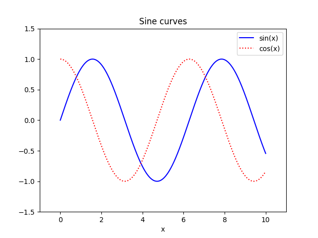

# Mathematics

In this section the two main modules for numerical Python (`numpy`) and visualization (`matplotlib`) are overviewed.

## Numerical Python

Consider 2 vectors (implemented as lists), $a$ and $b$ that we would like to add. With the [`zip()`](https://docs.python.org/3/library/functions.html#zip) function we can iterate two lists simultaneuously and hence obtain $a+b$:

```python
>>> a = [1, 2, 3, 4]
>>> b = [9, 8, 7, 6]
>>> [sum(item) for item in zip(a, b)]
[10, 10, 10, 10]
```

Let's analyse the time it takes to add two lists with with one million elements:

```python
from random import randint

a = [randint(0, 100) for i in range(1000000)]
b = [randint(0, 100) for i in range(1000000)]
%time c = [sum(item) for item in zip(a, b)]
```

```
CPU times: user 141 ms, sys: 0 ns, total: 141 ms
Wall time: 141 ms
```

Let's execute this same task with [NumPy](http://www.numpy.org/), the fundamental package for scientific computing,

```python
import numpy as np

a = np.random.randint(0, 100, size=1000000)
b = np.random.randint(0, 100, size=1000000)
%time c = a + b
```

which makes stand out its performance

```
CPU times: user 3.62 ms, sys: 0 ns, total: 3.62 ms
Wall time: 3.64 ms
```

NumPy contains a powerful $n$-dimensional array structure, which allows efficient storage, manipulation and element-wise operations of vectors, matrices and higher-dimensional datasets. Moreover, it provides readable and efficient syntax. NumPy also supports many linear algebra capabilities such as

```python
>>> A = np.array([[1,2,3], [4,5,6], [7,8,9]])
>>> A
array([[1, 2, 3],
       [4, 5, 6],
       [7, 8, 9]])
>>> A[:, 0]
array([1, 4, 7])
>>> A[0:2, 1:3]
array([[2, 3],
       [5, 6]])
>>> A.T
array([[1, 4, 7],
       [2, 5, 8],
       [3, 6, 9]])
>>> np.linalg.matrix_rank(A)
2
>>> np.linalg.eigvals(A)
array([ 1.61168440e+01, -1.11684397e+00, -1.30367773e-15])
# Note that due to precision errors, the last eigenvalue is 0.
>>> B = np.array([[1,1,1], [1,2,1], [0,1,2]])
>>> np.dot(A, B)
array([[ 3,  8,  9],
       [ 9, 20, 21],
       [15, 32, 33]])
```

## Visualization

[Matplotlib](https://matplotlib.org/) is one of the most popular scientific visualization packages. Its documentation offers [many examples](https://matplotlib.org/tutorials/introductory/sample_plots.html#sphx-glr-tutorials-introductory-sample-plots-py) which we encourage you to take a look at. For instance, find below a representation of $\sin(x)$ and $\cos(x)$ for $x \in [0, 10]$:

```python
import matplotlib.pyplot as plt
import numpy as np

x = np.linspace(0, 10, 1000)
# x is an array of 1000 evenly spaced numbers over the interval [0, 10]

plt.plot(x, np.sin(x), '-b', label='sin(x)')
plt.plot(x, np.cos(x), ':r', label='cos(x)')

plt.title('Sine curves')
plt.xlabel('x')
plt.xlim(-1, 11)
plt.legend()
plt.ylim(-1.5, 1.5)
```

⚡ **Note:** If you are working with Jupyter notebooks you need to execute the command `%matplotlib notebook` for interactive plots or `%matplotlib inline` for static images of your plot.

<center>
    
</center>

&nbsp;

The following example is an illustration on displaying data downloaded from the Internet.
The [National Oceanic and Atmospheric Administration](https://www.ncdc.noaa.gov/) is an American scientific agency that focuses on supplying environmental information. For instance, this piece of code downloads a `json` file with surface temperature anomalies with respect to the 20th century average.

```python
import json
import urllib.request

response = urllib.request.urlopen('https://www.ncdc.noaa.gov/cag/global/time-series/globe/land_ocean/1/12/1880-2018.json')
temperatures = json.load(response)
```

If we now take a look at the content of `temperatures` we will obtain the following dictionary:

```json
{
    "description": {
        "title": "Global Land and Ocean Temperature Anomalies, December",
        "units": "Degrees Celsius",
        "base_period": "1901-2000",
        "missing": -999
    },
    "data": {
        "1881": "-0.06",
        "1882": "-0.18",
        "1883": "-0.09",
        "1884": "-0.16",
        /* ... */
        "2015": "1.13",
        "2016": "0.81",
        "2017": "0.82",
        "2018": "0.86"
    }
}
```

In order to plot a histogram we can use the `bar()` function from `matplotlib.pyplot` module:

```python
import matplotlib.pyplot as plt

# Convert temperature from string to float
data = {k : float(v) for k, v in temperatures['data'].items()}

# Convert years and anomalies into a list
years = list(data.keys())
anomalies = list(data.values())

# Commands to plot the histogram
plt.title('Global Land and Ocean Temperature Anomalies')
plt.ylabel('Anomaly (ºC)')
# Plot a bar for each year
bars = plt.bar(range(len(years)), anomalies, color='green')
# Add a marker every 10 years
plt.xticks(range(0, len(years), 10), years[::10], rotation=90)
# Change color for 'hot' years
for i, bar in enumerate(bars):
    if anomalies[i] > 0:
        bar.set_color('red')

plt.show()
```

You can download the full program [here](/programes/histogram-temperatures.py) and the output is the following:


<Autors autors="adell"/>
