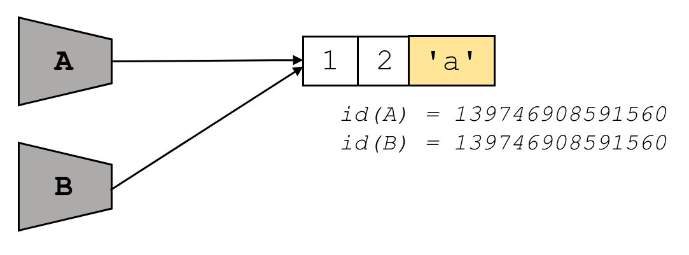

# Names and values

Python is a very approachable programming language and it often works as you would expect. Be that as it may, you can encounter surprising behaviour. This is the case for variables. In this lesson we will discuss its underlying mechanisms inspired by [Ned Batchelder's presentation at PyCon 2015](https://nedbatchelder.com/text/names1.html), which we strongly encourage you to watch.

<!-- A Python assignment statement associates a symbolic name on the left-hand side with a value or object on the right-hand side. Hence, we say that **names refer to values**. -->

If you come from C-based programming languages, variables are best thought of as containers. For example, when you write

```c++
string a = "hello";
```

you are defining a _memory bucket_ named `a` and putting the string `'hello'` into it.

In Python, however, it's a different story. A variable is best thought of a **name that points to some value** or object. Hence, there is no need to declare the type of a variable or require it to always point to information of the same type. In this sense, Python is said to be dynamically-typed so we can do something like this:

```python
a = 'python'    # a is a string
a = 6           # now a is an integer
a = [6, 7, 8]   # now a is a list
a = 'six'       # now a is a string again
```

Moreover, a value can have many names. Let's take a look at the following example:

```python
A = [1, 2]
B = A
Z = [1, 2]
```

An important fact is that **assignment never copies data**. On one hand, `A` and `B` refer to the exact same list. Neither `A` nor `B` is the _real name_, both have the same status. On the other hand, `Z` refers to another independent list. The diagram below might be helpful to illustrate it.

<center>
    
</center>

Python offers the [`id()`](https://docs.python.org/3/library/functions.html#id) function which returns the _identity_ of an object and it is guaranteed to be unique among all objects. Along these lines, the [`is`](https://docs.python.org/3/library/operator.html) operator returns `True` if the identity of two names is the same.

```python
print(A is B) # True
print(A is Z) # False
```

In a different manner, the [`==`](https://docs.python.org/3/library/operator.html) operator checks for equality.

```python
print(A == B) # True
print(A == Z) # True
```

At this point we have one list, referred to by two names and the following piece of code can lead to a big surprise.

```python
A = [1, 2]
B = A
A.append('a')
print(B) # B: [1, 2, 'a']
```

What has just happened? If we **mutate** an object through one of its names, the change will be **visible on all other names**.

<center>
    
</center>

This characteristic is only intrisic to **mutable objects** such as lists or dictionaries. Per contra, immutable objects such as numbers, strings or tuples cannot change in-place once they are created. All you can do is make new objects from old objects so we don't have to worry about it.

```python
A = "Hello"
B = A
A += " World"
print(B) # B: Hello
```

In this way, if we **reassign** one name to a different object, it is done **independently** so all other names are not affected.

```python
A = [1, 2]
B = A
A = [1, 2, 'a']
print(B) # B: [1, 2]
```

<center>
    
</center>

Another key aspect is that **lists contain references to its elements** and not copies. For instance:

```python
A = [1, 2]
B = [A, A]
print(B) # B: [[1, 2], [1, 2]]

B[0][0] = 7
print(A) # A: [7, 2]
print(B) # B: [[7, 2], [7, 2]]
```

We observe the same behaviour in this case where `append()` modifies the list in-place.

```python
A = [1, 2]
B = [A, A]
print(B) # B: [[1, 2], [1, 2]]

B[0].append('a')
print(A) # A: [1, 2, 'a']
print(B) # B: [[1, 2, 'a'], [1, 2, 'a']]
```

In order to get a sense of what is happening in this program find below a visualization made with [Python Tutor](http://pythontutor.com/). This online tool allows you to enter your own code and it will animate its behaviour line by line.

<iframe width="100%" height="350" frameborder="0" src="https://pythontutor.com/iframe-embed.html#code=A%20%3D%20%5B1,%202%5D%0AB%20%3D%20%5BA,%20A%5D%0Aprint%28B%29%0A%0AB%5B0%5D.append%28'a'%29%0Aprint%28A%29%0Aprint%28B%29&codeDivHeight=400&codeDivWidth=350&cumulative=false&curInstr=6&heapPrimitives=nevernest&origin=opt-frontend.js&py=3&rawInputLstJSON=%5B%5D&textReferences=false"> </iframe>

What if we just wanted to modify `B[0]` and avoid the domino effect on both `B[1]` and `A`? We could assign two different copies of `A` by means of `list(A)`.

```python
A = [1, 2]
B = [list(A), list(A)]
print(B) # B: [[1, 2], [1, 2]]

B[0].append('a')
print(A) # A: [1, 2]
print(B) # B: [[1, 2, 'a'], [1, 2]]
```

Let's visualize it so as to wrap our head around it.

<iframe width="100%" height="400" frameborder="0" src="https://pythontutor.com/iframe-embed.html#code=A%20%3D%20%5B1,%202%5D%0AB%20%3D%20%5Blist%28A%29,%20list%28A%29%5D%0Aprint%28B%29%0A%0AB%5B0%5D.append%28'a'%29%0Aprint%28A%29%0Aprint%28B%29&codeDivHeight=400&codeDivWidth=350&cumulative=false&curInstr=6&heapPrimitives=nevernest&origin=opt-frontend.js&py=3&rawInputLstJSON=%5B%5D&textReferences=false"> </iframe>

What if we replaced `append()` with `+`? In this case, the `+` operator doesn't change the list in-place but it returns a new list. Therefore, we obtain the same result as before but note that the assignment process is different.

```python
A = [1, 2]
B = [A, A]
print(B) # B: [[1, 2], [1, 2]]

B[0] = B[0] + ['a']
print(A) # A: [1, 2]
print(B) # B: [[1, 2, 'a'], [1, 2]]
```

Again, a visualization comes in handy.

<iframe width="100%" height="400" frameborder="0" src="https://pythontutor.com/iframe-embed.html#code=A%20%3D%20%5B1,%202%5D%0AB%20%3D%20%5BA,%20A%5D%0Aprint%28B%29%0A%0AB%5B0%5D%20%3D%20B%5B0%5D%20%2B%20%5B'a'%5D%0Aprint%28A%29%0Aprint%28B%29&codeDivHeight=400&codeDivWidth=350&cumulative=false&curInstr=6&heapPrimitives=nevernest&origin=opt-frontend.js&py=3&rawInputLstJSON=%5B%5D&textReferences=false"> </iframe>

<Autors autors="adell"/>
