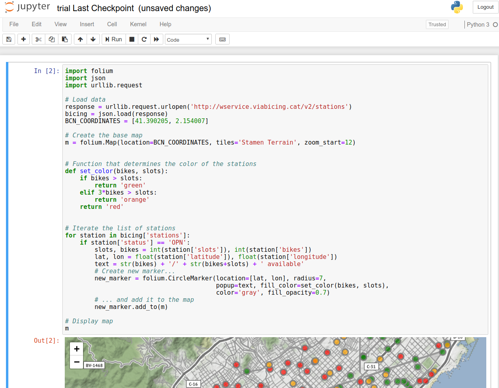
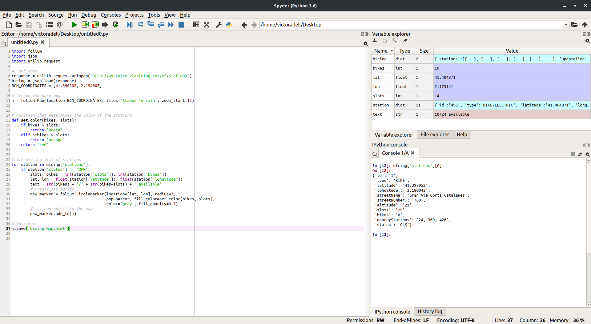

# Setting-up

The aim of this section is to set up the environment needed to start working with Python.

## Python versions

Python is an interpreted, high-level, general-purpose programming language that was conceived in the late 1980s and is now gaining immense popularity given its appeal of simplicity.

There exist two main Python versions, Python 2 and Python 3. The latter contains language enhancements and is about to become the standard, so this _cookbook_ will use the newer Python 3 syntax.

## Installing Python with Anaconda

Anaconda is a free and open-source Python distribution. It paves the way for getting started with Python since it automatically installs the most frequently used packages in Data Science and some useful applications that we will outline below. It is available for Windows, macOS and Linux so we just need to follow the installation procedure for the newest version of Python available, 3.7 as of today.

You can install Anaconda [from this link](https://www.anaconda.com/distribution/#download-section).

Anaconda comes with a desktop graphical user interface called _Navigator_ where you will find an overview of your applications and packages.


## Using Python with Anaconda

At this point you should have Anaconda installed and be all set to start writing Python code:

-   **The Python interpreter**

    The most basic way to execute Python is line by line within the Python interpreter. It can be started by typing `python` on the terminal (or Anaconda Prompt if you are on Windows):

    ```text
    $ python
    Python 3.7
    [GCC 8.2.0] on linux
    Type "help", "copyright", "credits" or "license" for more information.
    >>> x = 6
    >>> x * 4
    24
    ```

    It is very convenient to experiment with small snippets of Python or short sequences of operations.

    You can leave the interpreter typing `exit()` or pressing the
    <kbd>control</kbd> + <kbd>d</kbd> keys (<kbd>control</kbd> + <kbd>z</kbd>
    on Windows).

-   **Text editor**

    For more complicated programs the interpreter is impractical and we need to edit some source files.
    You can edit your script with the text editor of your choice.
    Python scripts use the `.py` extension by convention. For example, say we have the following `first.py` file:

    ```python
    # Inside first.py
    print('Running first.py')
    print('Hello World!')
    x = 6 * 4
    print('We have obtained', x)
    ```

    To run it you have to type `python first.py` on the terminal:

    ```shell
    $ python first.py
    Running first.py
    Hello World!
    We have obtained 24
    ```

```

- **Jupyter notebook**

    The Jupyter notebook is a useful hybrid between the last two methods. It is a format organised in cells that allows to mix exectutable code, text (in *Markdown* style) and figures. It is web-based and we can start it by means of the Anaconda Navigator or typing `jupyter notebook` on the terminal.

    


- **Spyder**

    Finally, Spyder is an IDE for scientific computing. Some of its features include an editor, a Python console and the ability to explore variables. You will find it in the Anaconda Navigator as well as typing `spyder` on the terminal.

    


<Autors autors="adell"/>
```
