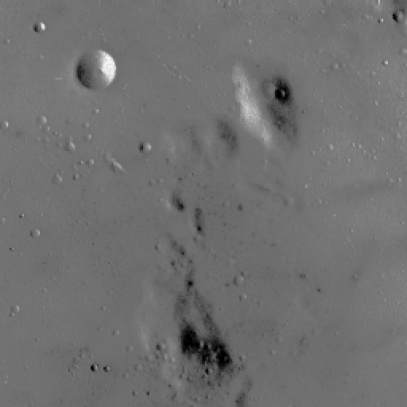
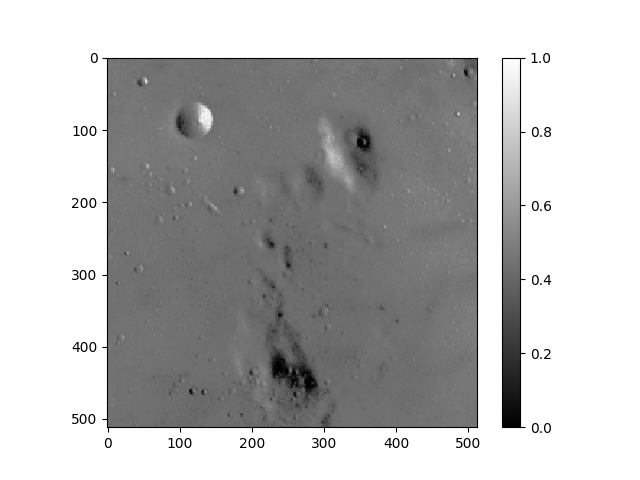
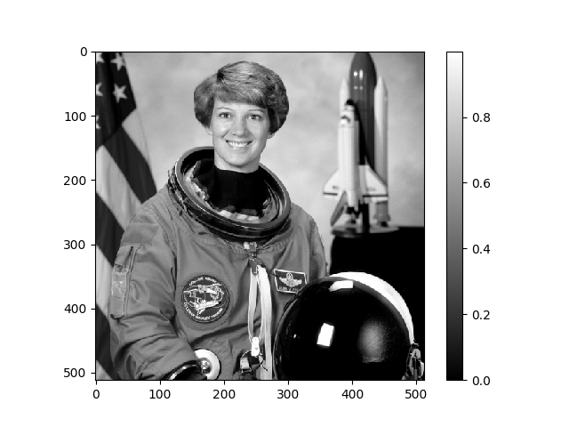

# Playing and Recording Audio Files

The [**`scipy.io.wavfile`**](https://docs.scipy.org/doc/scipy/reference/tutorial/io.html#module-scipy.io.wavfile) library allows us to deal with `WAV` files. For instance, given the following recording of the note _Do_,

<audio controls>
  <source src=".//upc-python-cookbook/signal-processing/do.wav" type="audio/wav">
Your browser does not support the audio element.
</audio>

<br>

we can load it into Python as follows:

```python
>>> from scipy.io import wavfile
>>> fs, data = wavfile.read('do.wav')
>>> fs
4000
>>> data.shape
(8000,)
>>> data
array([   0,    0,   -1, ...,  -43, -149, -209], dtype=int16)
```

The [`wavfile.read()`](https://docs.scipy.org/doc/scipy/reference/generated/scipy.io.wavfile.read.html) function returns both the sampling frequency of the `.wav` file ($$4000 Hz$$ in this case) and a `numpy` array representing the data read with length 8000 which implies that the recording lasts $$2s$$.

The fact that the array only has one dimension means that `'do.wav'` was a mono sound signal. In the case that it was recorded as a stereo sound signal it the shape of `data` would have been `(8000, 2)`.

Finally, in order to play or record audio, we can use the **`PyAudio`** package which can be installed by means of `conda install pyaudio`. The main features outlined in its [documentation](https://people.csail.mit.edu/hubert/pyaudio/docs/) are the following:

-   To use PyAudio, first instantiate PyAudio using `pyaudio.PyAudio()`, which sets up the portaudio system.

-   To record or play audio, open a stream on the desired device with the desired audio parameters using `pyaudio.PyAudio.open()`. This sets up a `pyaudio.Stream` to play or record audio.

-   Play audio by writing audio data to the stream using `pyaudio.Stream.write()`, or read audio data from the stream using `pyaudio.Stream.read()`.

Provided with this set of tools we can define the following function that allows us to play a `numpy` array of `dtype=int16`:

 <!-- which provides Python bindings for [`PortAudio`](http://www.portaudio.com/), the cross-platform audio I/O library. -->

```python
import numpy as np
from scipy.io import wavfile
import pyaudio

def sound(array, fs=8000):
    p = pyaudio.PyAudio()
    stream = p.open(format=pyaudio.paInt16, channels=len(array.shape), rate=fs, output=True)
    stream.write(array.tobytes())
    stream.stop_stream()
    stream.close()
    p.terminate()
```

When it comes to recording, the function below comes in handy:

```python
def record(duration=3, fs=8000):
    nsamples = duration*fs
    p = pyaudio.PyAudio()
    stream = p.open(format=pyaudio.paInt16, channels=1, rate=fs, input=True,
                    frames_per_buffer=nsamples)
    buffer = stream.read(nsamples)
    array = np.frombuffer(buffer, dtype='int16')
    stream.stop_stream()
    stream.close()
    p.terminate()
    return array
```

Hence, we are now able to do something like this:

```python
>>> sound(data, fs=4000) # The do note was recorded using a lower sampling frequency of 4000
>>> my_recording = record() # Say something wise
>>> sound(my_recording)
```

# Reading and Visualizing Images

In order to illustrate the discussion of image processing, we have downloaded some classic images for signal processing from the [`scikit-image` repository](https://scikit-image.org/docs/stable/auto_examples/) and saved them in our Python working directory. Indeed, along [**`scikit-image`**](https://scikit-image.org/), the main library that we will use is [**`matplotlib`**](https://matplotlib.org/).

<!--
- [Moon](/upc-python-cookbook/signal-processing/moon.png)
- [Cameraman](/upc-python-cookbook/signal-processing/camera.png)
- [Astronaut](/upc-python-cookbook/signal-processing/astronaut.png)
-->

| Moon          | Cameraman       | Astronaut          |
| ------------- | --------------- | ------------------ |
|  |  |  |

<!-- Moreover, the main libraries that we will use are [**`matplotlib`**](https://matplotlib.org/) and [**`scikit-image`**](https://scikit-image.org/). -->

<!-- > Matplotlib is a multi-platform data visualization library built on NumPy arrays and designed to work with the broader SciPy stack.

> As we discussed, the Scipy module is already packed with an extensive list of scientific codes. For that reason, the scikits modules were originally established as a way to try out candidates that could eventually make it into the already stuffed Scipy module, but it turns out that many of these modules became so successful in their own right that they will probably never be integrated into Scipy proper. Some examples include sklearn for machine learning and scikit-image for image processing. -->

Provided with the function [`plt.imread()`](https://matplotlib.org/3.1.1/api/_as_gen/matplotlib.pyplot.imread.html) we obtain a numpy array of dimensions `(512, 512)` that represents our `'moon.png'`. image in the range of values $$[0, 1]$$. Given that it is two-dimensional, it represents a grayscale image.

```python
>>> moon = plt.imread('moon.png')
>>> type(moon)
numpy.ndarray
>>> moon.shape
(512, 512)
>>> moon
array([[0.45490196, 0.45490196, 0.47843137, ..., 0.3647059 , 0.3764706 ,
        0.3764706 ],
       [0.45490196, 0.45490196, 0.47843137, ..., 0.3647059 , 0.3764706 ,
        0.3764706 ],
       [0.45490196, 0.45490196, 0.47843137, ..., 0.3647059 , 0.3764706 ,
        0.3764706 ],
       ...,
       [0.42745098, 0.42745098, 0.4392157 , ..., 0.45882353, 0.45490196,
        0.45490196],
       [0.44705883, 0.44705883, 0.44313726, ..., 0.4627451 , 0.4627451 ,
        0.4627451 ],
       [0.44705883, 0.44705883, 0.44313726, ..., 0.4627451 , 0.4627451 ,
        0.4627451 ]], dtype=float32)
```

It is relevant to mention that `matplotlib` can only read the `PNG` format natively. Provided with a dependency on `pillow` (which comes installed with Anaconda), we can work with other formats such as `JPG` or `BMP`.

In order to visualize the image that we have just loaded we use `plt.imshow()`:

```python
>>> plt.imshow(moon, cmap='gray')
>>> plt.colorbar()
>>> plt.show()
```

<center>
    
</center>

In order to convert an RGB image to grayscale we can use the [`rgb2gray()`](https://scikit-image.org/docs/dev/api/skimage.color.html#skimage.color.rgb2gray) function from the `skimage.color` module which calculates the value of each pixel as the weighted sum of the corresponding red, green and blue pixels as:

```
Y = 0.2125 R + 0.7154 G + 0.0721 B
```

Taking the astronaut image as an example:

```python
>>> from skimage.color import rgb2gray
>>> astronaut = plt.imread('astronaut.png')
>>> astronaut.shape
(512, 512, 3)
>>> astronaut_grayscale = rgb2gray(astronaut)
>>> astronaut_grayscale.shape
(512, 512)
```

<center>
    
</center>

<Autors autors="adell"/>
