# Convolution

Let $y[n]$ represent the discrete time signal that results when $$x[n]$$ is convolved with $$h[n]$$. Its value at time $$n$$ is computed as:

\begin{equation}
\begin{aligned}
y[n] = x[n] \* h[n] &= \sum_k x[k]h[n-k] = \sum_k h[k]x[n-k] = \\\
&= \dots + h[2]x[n-2] + h[1]x[n-1] + h[0]x[n] + h[-1]x[n+1] + h[-2]x[n+2] + \dots
\end{aligned}
\end{equation}

For all the examples below we will consider that the signal $$x[n]$$ is finite of length $$N$$ and the filter $$h[n]$$ is finite of length $$M$$. We will use the [`convolve()`](https://docs.scipy.org/doc/scipy/reference/generated/scipy.signal.convolve.html) function from the [`scipy.signal`](https://docs.scipy.org/doc/scipy/reference/signal.html) library which features three different modes that we will further discuss in the table below. Note that the blue-shaded boxes indicate the alignment point between x and the flipped filter h for the computation of the first (i.e. index 0) and last samples of y.

<table>
  <col width="50">
  <col width="1000">
  <col width="400">
  <tr>
    <th>Mode</th>
    <th>Visual Representation</th>
    <th>Explanation</th>
  </tr>
  <tr>
    <td>**`full`**</td>
    <td> 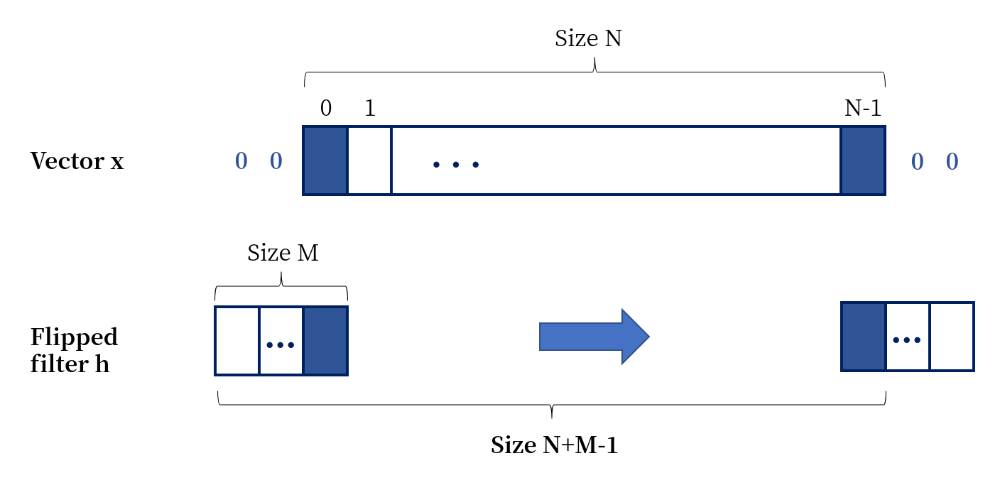</td>
    <td> It is the default option of the function and corresponds to the mathematical definition of convolution.  <br/> <br/> Therefore, a zero-padding is needed  <br/> <br/> The resulting array has length $$N+M-1$$. </td>
  </tr>
  <tr>
    <td>**`valid`**</td>
    <td>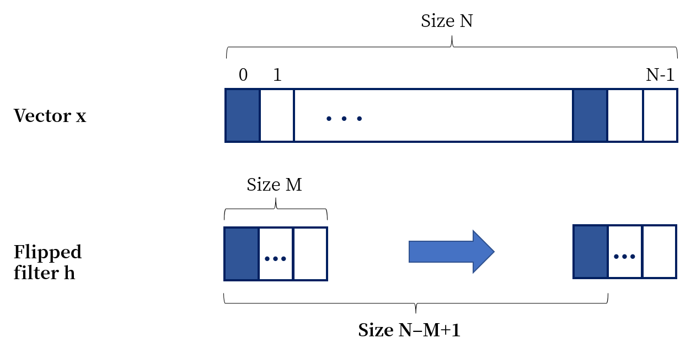</td>
    <td>  The output consists only of those elements that do not rely on the zero-padding. <br/> <br/> The length of the resulting array is decreased by $$M-1$$ with respect to the original signal. </td>
  </tr>
  <tr>
    <td>**`same`**</td>
    <td>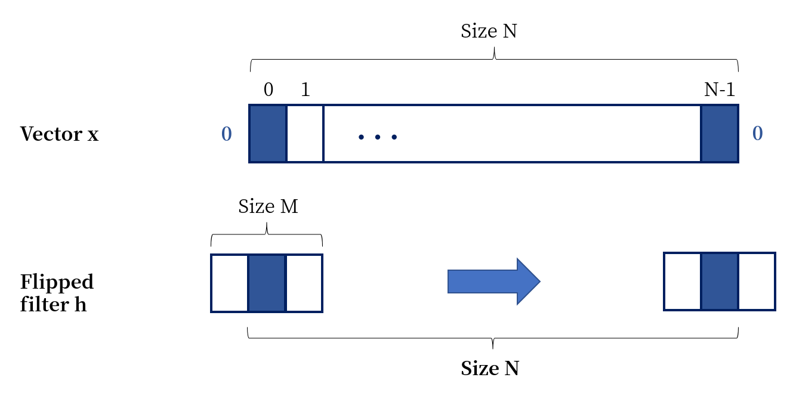</td>
    <td> The filter has its initial position centered around the first element of the signal. <br/> <br/> Hence, the output is the same size $$N$$ as the input signal. </td>
  </tr>
</table>

In order to illustrate the concept of convolution we will take the discrete-time sinusoid of frequency `F0 = 0.005`,

\begin{equation}
x[n] = 10 + 2\cos(2\pi 0.005 n)
\end{equation}

and we will add white gaussian noise of $$\sigma^2 = 1$$ to the pure signal.

```python
import numpy as np
import matplotlib.pyplot as plt

F0 = 0.005
L = 1000
n = np.arange(L)
pure = 10 + 2*np.cos(2*np.pi*F0*n)

noise = np.random.normal(0, 1, pure.shape)
noisy = pure + noise

plt.title(r'Discrete-time sinusoid of $F_0$=0.005')
plt.plot(noisy, '-b', linewidth=0.5, label='Noisy signal')
plt.plot(pure, '--r', linewidth=4, label='Original signal')
plt.xlabel('n')
plt.legend(loc='upper right')
plt.axis('tight')
```

<center>
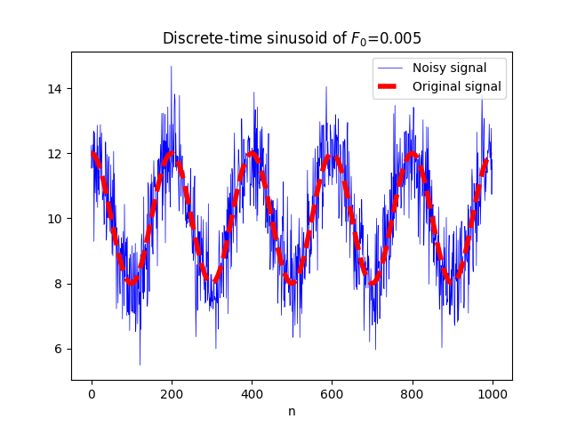
</center>

To smooth out these fluctuations and highlight the trend of the signal, we are interested in performing a moving average which is the unweighted mean of $M$ samples. Hence, we will consider the filter

\begin{equation}
h[n] = \bigg[\underbrace{\frac{1}{M}, \frac{1}{M}, \dots, \frac{1}{M}}_{M}\bigg]
\end{equation}

to convolve it with the `noisy` signal, taking $$M=67$$:

```python
from scipy.signal import convolve

M = 67
h = np.repeat(1/M, M)
y = convolve(noisy, h, mode='full')

plt.figure()
plt.plot(y, '-b', linewidth=1, label='Convolved signal')
plt.plot(pure, '--r', linewidth=1, label='Original signal')
plt.xlabel('n')
plt.legend(loc='lower left')
plt.axis('tight')
```

<center>
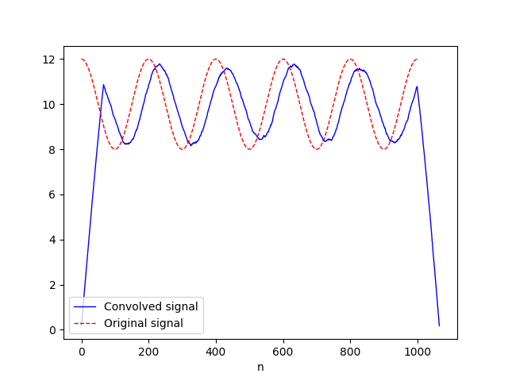
</center>

The length of the output array is $$1066=1000+67-1$$. Since we have used `mode='full'`, the output at a given position corresponds to the average of the input at the same time instant with the $$M-1$$ previous samples. Hence, `y[0]` has been computed using exactly $$66$$ values that are part of the zero padding, and

\begin{equation}
\begin{aligned}
y[0] &= \frac{x[0]}{M},\\\
y[1] &= \frac{1}{M}\bigg(x[0] + x[1]\bigg) \\\
&\\ \\ \vdots
\end{aligned}
\end{equation}

Comparing the shapes of both input and ouput, we observe that the output is delayed with respect to the input (a phase shift has ocurred).

If we now change the `mode` to `'same'`,

```python
y = convolve(noisy, h, mode='same')
```

the length of the output array is equal to the length of the input array:

<center>
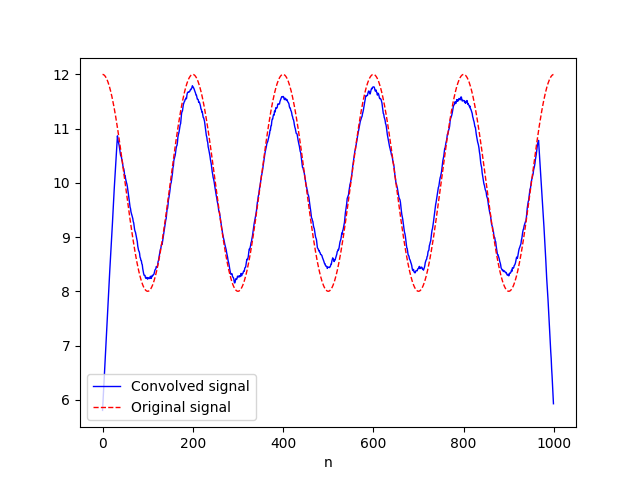
</center>

The first thing we notice is that the original signal and the output of the convolution look aligned. However, both the first and last values are largely underestimated. Since we have used `mode='same'`, the output for a given position corresponds to the average of the previous $$33$$ samples, itself and the next $$33$$. Hence, `y[0]` has been computed using exactly $$33$$ values that are part of the zero padding.

We can also use `mode='valid'`. In such a case, the output array will have length $$934 = 1000 - 67 + 1$$. The first computed sample in this case, i.e. `y[0]`, will be equal to the 66th sample when `mode='full'` is used, and to the 33rd sample when `mode='same'` is used.

<!-- ***

If we now change the `mode` to `'valid'`,

```python
y = convolve(noisy, h, mode='valid')
```

The lenght of the output array turns out to be $$934 = 1000 - 67 + 1$$ and we observe that a phase shift has occurred:

<center>
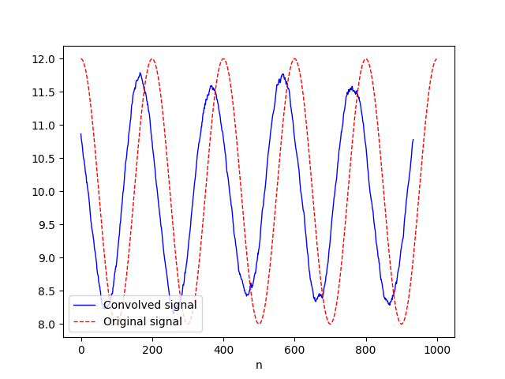
</center>

Indeed, the output for a given position now corresponds to the average of itself and the next $$66$$ samples. Therefore, in order to have the same plot as before we need to change the starting position of the array `y`:

```python
y = convolve(noisy, h, mode='valid')
start = (m - 1)/2 # Filters usually have an odd length
new_pos = np.arange(start, start + len(y))

plt.figure()
plt.plot(new_pos, y, '-b', linewidth=1, label='Convolved signal')
plt.plot(pure, '--r', linewidth=1, label='Original signal')
plt.xlabel('n')
plt.legend(loc='lower left')
plt.axis('tight')
```


<center>
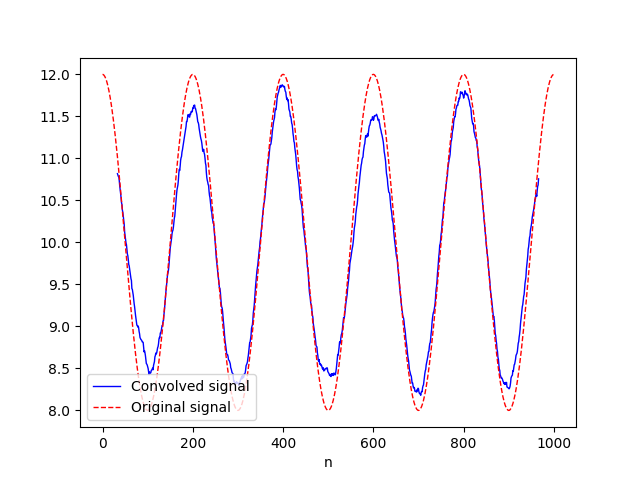
</center> -->

Finally, if instead of taking the averaging filter we consider `h = [-1, 1]`, we actually remove the expected value of the signal and end up having white noise:

<center>

</center>

This figure has been obtained with `mode='valid'` and the length of the output array is $$999 = 1000 - 2 + 1$$.

## Convolution in 2 dimensions

Analogous to one-dimensional convolutions, we have the [`convolve2d()`](https://docs.scipy.org/doc/scipy/reference/generated/scipy.signal.convolve2d.html) function for the two-dimensional case. If we take for example the image of this circuit

<center>
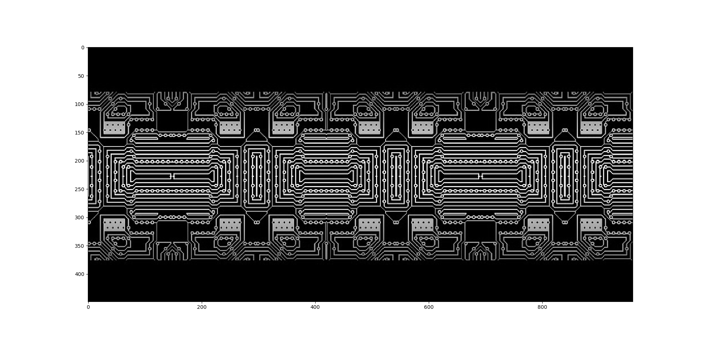
<!-- Image downloaded from Pixabay -->
</center>

and aspire to detect the horizontal contours of the image, we can use the following filter,

$$
h[m, n] = \begin{pmatrix}
1 & 1 & 1 \\\
0 & 0 & 0 \\\
-1 & -1 & -1
\end{pmatrix}
$$

also known as the Prewitt filter. If we want the ouput image to have the same dimensions as the input image we will use the convolution with `mode='same'`. In such a case, a dark border may appear if we use zero padding (although for images other types of padding are also common). If we use `mode='valid'` the resulting image will have smaller dimensions.

```python
from scipy.signal import convolve2d

circuit = plt.imread('circuit.png')

hor = np.array([[1,1,1],
                [0,0,0],
                [-1,-1,-1]])
circuit_hor = convolve2d(circuit, hor, mode='valid')

plt.figure()
plt.imshow(circuit_hor, cmap='gray')
plt.show()
```

<center>
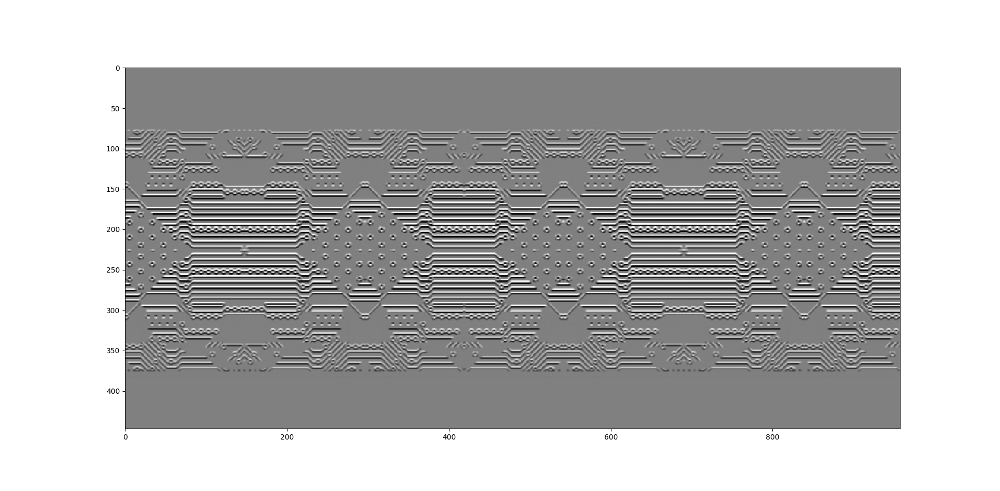
</center>

Given that we have used `mode='valid'`, we can indeed check that the shape of the circuit has been reduced by $$M-1 = 2$$ in each dimension:

```python
>>> circuit.shape
(449, 960)
>>> circuit_hor.shape
(447, 958)
```

Just like before, if we compute the horizontal gradient of the image we will detect vertical contours. The effect of this filter

<!-- Mention it is high pass -->

$$
h[m, n] = \begin{pmatrix}
1 & 0 & -1 \\\
1 & 0 & -1 \\\
1 & 0 & -1
\end{pmatrix}
$$

on the circuit is displayed below:

<center>
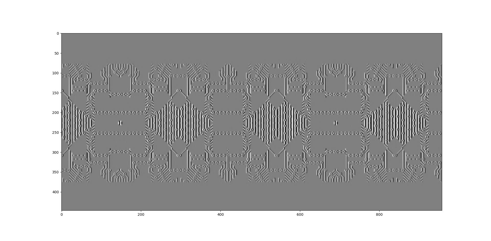
</center>

Finally, the averaging filter

$$
h[m, n] = \begin{pmatrix}
\frac{1}{9} & \frac{1}{9} & \frac{1}{9} \\\
\frac{1}{9} & \frac{1}{9} & \frac{1}{9} \\\
\frac{1}{9} & \frac{1}{9} & \frac{1}{9}
\end{pmatrix},
$$

which can be expressed as `np.ones((3, 3))/9`, has the effect of blurring the image.

<center>
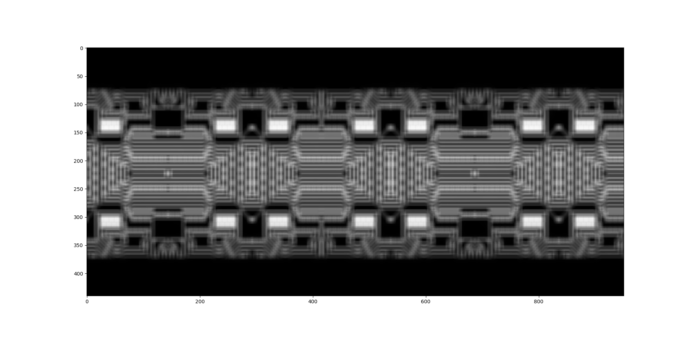
</center>

<Autors autors="adell"/>

<!-- Table formats -->

<!-- - ### **`mode = full`**

<center>
    
</center>


- ### **`mode = valid`**

<center>
    
</center>

- ### **`mode = same`**

<center>
    
</center> -->

<!-- | Mode | Visual Representation | Explanation |
|-|-|-|
|**`full`** |  |  a |
|**`valid`**|  | It |
|**`same`**|  | It | -->
