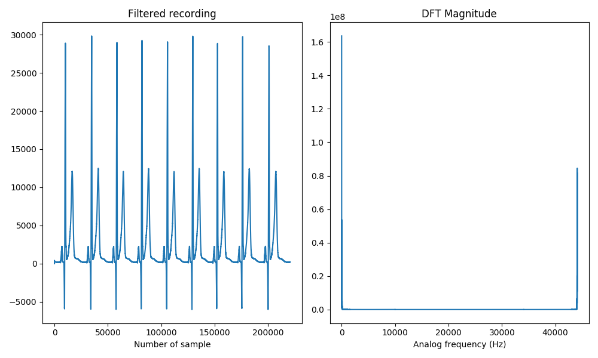

# Filtering

With the purpose of illustrating filtering in Python, we will take the following discrete signal that comes from sampling an electrocardiogram with a sampling frequency of $$f\_s = 44100 Hz = 44.1 kHz$$. Hence, it contains the whole audible band that spans from $$20Hz$$ to $$20kHz$$ approximately.

<audio controls>
<source src="././ecg_noisy.wav" type="audio/wav">
Your browser does not support the audio element.
</audio>

<br>

An interfering tone is clearly audible and we will load the audio file into Python to unveil its frequency:

```python
import numpy as np
import matplotlib.pyplot as plt
from scipy.fftpack import fft
from scipy.io import wavfile

fs, x = wavfile.read('ecg_noisy.wav')
N = 2**16
X = fft(x, N)

plt.subplot(1, 2, 1)
plt.title('Noisy recording')
plt.plot(x)
plt.xlabel('Number of sample')

plt.subplot(1, 2, 2)
plt.title('DFT Magnitude')
plt.plot(np.arange(N)/N * fs, np.abs(X))
plt.xlabel('Analog frequency (Hz)')
```

⚡ **Note:** Once the WAV file is read, you can try to play it by means of the `sound(x, fs)` function defined in the [Audio and Image section](./audio-image.html).

<center>

</center>

The discrete Fourier transform reveals that the interfering tone occurs at an analog frequency of $$10kHz$$. Our goal now consists on separating it from the original noisy sequence `x` that we have read. Therefore, we will review the necessary background in filtering.

The description of a system by a finite differences equation allows expressing the output of the system as a weighted sum of the current input and previous values of the input and output:

\begin{equation}
y[n] = \sum\_{k=0}^{Q}b_k x[n-k] - \sum\_{k=1}^{P} a_k y[n-k].
\end{equation}

<!--
FIXME: MathJax `\sum_` does not work correctly in markdown.
       Use `\sum\_` instead and escape all underscoress.
-->

By applying the $$z$$ transform on both sides,

\begin{equation}
Y(z) = \sum\_{k=0}^{Q}b_k X(z)z^{-k} - \sum\_{k=1}^{P} a_k Y(z)z^{-k},
\end{equation}

the transfer function $$H(z)$$ of the system can be obtained:

\begin{equation}
H(z) = \frac{Y(z)}{X(z)} = \frac{\sum\_{k=0}^{Q}b_k z^{-k}}{1+\sum\_{k=1}^{P} a_k z^{-k}} = \frac{b_0 + b_1z^{-1}+\dots+b_Qz^{-Q}}{1+a_1z^{-1}+\dots+a_Pz^{-P}} = \frac{a(z)}{b(z)}.
\end{equation}

Those values of $$z$$ that make zero $$H(z)$$ (i.e. the roots of the numerator) are called **zeros** of $$H(z)$$, while those that make $$H(z)$$ infinite (i.e. the roots of the denominator) are called **poles** and we will visualize them by means of this function:

```python
def plotzp(zeros, poles):
    ax = plt.subplot(1, 1, 1)
    circle = plt.Circle((0, 0), 1, color='black', fill=False)
    ax.add_artist(circle)

    plt.plot(np.real(zeros), np.imag(zeros), 'ob')
    plt.plot(np.real(poles), np.imag(poles), 'xr')

    plt.legend(['Zeros', 'Poles'], loc=2)
    plt.title('Pole / Zero Plot')
    plt.xlabel('Real')
    plt.ylabel('Imaginary')

    # For all real, causal and stable filters, the poles are inside the unit circle
    lim = max(1.2, np.max(np.absolute(zeros)) + 0.1)
    plt.xlim([-lim, lim])
    plt.ylim([-lim, lim])
    ax.set_aspect(1.0) # Make aspect ratio square
    plt.grid()
```

Point out that the transfer function $$H(z)$$ is the $$z$$ transform of the impulse response $$h[n]$$ of the system,

\begin{equation}
H(z) = TZ\\{h[n]\\} = \sum\_{n=-\infty}^{\infty}h[n]z^{-n},
\end{equation}

and by letting $$z = e^{j2\pi F}$$, the $$z$$ transform becomes the Fourier transform, $$\left.H(z)\right\vert_{z = e^{j2\pi F}}=H(e^{j2\pi F})$$, which we usually call $$H(F)$$. Ideally, the frequency response of a filter $$H(F)$$ has a constant modulus and a linear phase in the pass band and is zero outside of it,

\begin{equation}
\begin{cases}
H(F) = e^{-j2\pi Fm} &\text{in the pass band,} \\\
H(F) = 0 &\text{outside the pass band.}
\end{cases}
\end{equation}

<!-- Denoting the part to be preserved from the input as $$x[n]$$, the Fourier transform of the output of the ideal filter can be expressed as $$Y(F) = X(F)H(F) = X(F)e^{-j2\pi Fm}$$. Therefore, the output will be no more than a version, delayed $$m$$ samples of the signal of interest, $$y[n] = x[n - m]$$. -->

In practice, obtaining filters with linear phase is possible, but unfortunately it is impossible to obtain a filter with $$|H(F)|$$ constant in the band pass and $$|H(F)| = 0$$ in the attenuated band with an instantaneous transition between the pass and attenuated band, since this would require an infinite number of coefficients.

As a result, filters are designed so that their response is as close as possible to the ideal response, admitting a certain tolerance for the values of $$|H(F)|$$ (amplification) in the pass and attenuated bands. In addition, the amplification will change gradually so there will be a transition band between both bands as it is depicted in the figure below:

<center>

</center>

<br>

We will visualize the frequency response of the filters that we will design with the function below:

```python
def plotresp(freq, H):
    plt.subplot(2, 1, 1)
    plt.plot(freq, 20*np.log10(np.abs(H)))
    plt.ylabel('Gain (dB)')
    plt.grid()

    plt.subplot(2, 1, 2)
    angles = np.unwrap(np.angle(H))
    plt.plot(freq, angles)
    plt.ylabel('Angle (radians)')
    plt.xlabel('Frequency')
    plt.grid()
```

## FIR filters design

In Finite Impulse Response filters (FIR), $$P=0$$ so that the output signal at time $$n$$ is obtained as follows:

\begin{equation}
y[n] = \sum\_{k=0}^{Q}b_k x[n-k]
\end{equation}

Fixed the number of coefficients and the frequencies that delimit the pass and attenuated bands, the **Remez algorithm** computes the coefficients that minimize the maximum absolute error between the desired frequency response and the realized one the the specified bands. It is implemented in the [`remez()`](https://docs.scipy.org/doc/scipy/reference/generated/scipy.signal.remez.html#scipy.signal.remez) function from the [`scipy.signal`](https://docs.scipy.org/doc/scipy/reference/signal.html) package.

In order to design a low pass filter with 30 coefficients,

-   desired response equal to $$1$$ between $$0$$ and $$500Hz$$,
-   desired response equal to $$0$$ between $$5000Hz$$ and $$\frac{f\_s}{2}$$,

and sampling frequency $$f\_s = 44100 Hz$$ we do:

```python
>>> from scipy import signal
>>> b = signal.remez(30, [0, 500, 5000, fs/2], [1, 0], fs=fs)
>>> b
array([-0.00172254, -0.00338223, -0.00576956, -0.00811255, -0.00944994,
       -0.00853706, -0.00409004,  0.0048986 ,  0.0188202 ,  0.03719618,
        0.05858942,  0.0807264 ,  0.10083656,  0.11614978,  0.12443093,
        0.12443093,  0.11614978,  0.10083656,  0.0807264 ,  0.05858942,
        0.03719618,  0.0188202 ,  0.0048986 , -0.00409004, -0.00853706,
       -0.00944994, -0.00811255, -0.00576956, -0.00338223, -0.00172254])
```

The [`tf2zpk()`](https://docs.scipy.org/doc/scipy/reference/generated/scipy.signal.tf2zpk.html#scipy.signal.tf2zpk) returns the zeros, poles and gain (which we will ignore) from the numerator, denominator representation of a linear filter.

```python
>>> z, p, k = signal.tf2zpk(b, 1)
>>> z.shape
(29,)
>>> z
array([ 1.39229667+0.j        , -1.        +0.j        ,
       -0.97832891+0.20705687j, -0.97832891-0.20705687j, ...,
        0.26423548-0.9644582j ])
>>> p
array([], dtype=float64)
```

Given that we have specified the number of coefficients of the filter to be $$Q=30$$ and $$P=0$$ we have $$Q-1=29$$ zeros and no poles as we can plot below:

```python
>>> plotzp(z, p)
```

<center>

</center>

The [`freqz()`](https://docs.scipy.org/doc/scipy/reference/generated/scipy.signal.freqz.html#scipy.signal.freqz) function computes the frequency response of a digital filter and we can specify the sampling frequency of the digital system in the `fs` parameter. Moreover, the `worN` parameter determines the number of evenly spaced frequencies in the interval $$[0, \frac{f\_s}{2})$$ in which to compute the response:

```python
>>> w, H = signal.freqz(b, a=1, worN=2**10, fs=fs)
>>> w.shape
(1024,)
>>> w
array([0.00000000e+00, 2.15332031e+01, 4.30664062e+01, ...,
       2.19854004e+04, 2.20069336e+04, 2.20284668e+04])
>>> H.shape
(1024,)
>>> H
array([ 1.00116832e+00+0.00000000e+00j,  1.00017566e+00-4.45226303e-02j,
        9.97199596e-01-8.89565766e-02j, ...,
       -2.15450462e-05+1.60479344e-04j, -9.60849114e-06+1.07710794e-04j,
       -2.40707088e-06+5.40734832e-05j])
>>> plotresp(w, H)
```

<center>

</center>

Once we have analyzed the characteristics of the FIR filter that we have designed we can apply it to our original noisy recording `x` by means of the [`lfilter()`](https://docs.scipy.org/doc/scipy/reference/generated/scipy.signal.lfilter.html#scipy.signal.lfilter) function:

```python
y = signal.lfilter(b, a=1, x) # In a FIR filter a(z) = 1
Y = fft(y, N)

plt.subplot(1, 2, 1)
plt.title('Filtered recording')
plt.plot(y)
plt.xlabel('Number of sample')

plt.subplot(1, 2, 2)
plt.title('DFT Magnitude')
plt.plot(np.arange(N)/N * fs, np.abs(Y))
plt.xlabel('Analog frequency (Hz)')
```

<center>

</center>

We can finally save it as a WAV file, highlighting the fact that we have to **change the type** to `'int16'`,

```python
y = y.astype('int16')
wavfile.write('ecg_filtered_remez.wav', fs, y)
sound(y, fs)
```

<!-- ⚡ **Note:** mode `'int16'`. -->

and it sounds like this:

<audio controls>
<source src="././ecg_filtered_remez.wav" type="audio/wav">
Your browser does not support the audio element.
</audio>

<br>

## IIR filters design

<!-- The output of an Infinite Impulse Response (IIR) filter is calculated as

\begin{equation}
y[n] = \sum\_{k=0}^{Q}b\_k x[n-k] - \sum\_{k=1}^{P} a\_k y[n-k].
\end{equation} -->

To design Infinite Impulse Response (IIR) filters we will use the [`iirdesign()`](https://docs.scipy.org/doc/scipy/reference/generated/scipy.signal.iirdesign.html#scipy.signal.iirdesign) function from the same [`scipy.signal`](https://docs.scipy.org/doc/scipy/reference/signal.html) package as the previous ones.

In this case we will be interested in keeping the interfering tone at $$10kHz$$ so we will design a bandpass filter. The usage of the function is slightly different from the [`remez()`](https://docs.scipy.org/doc/scipy/reference/generated/scipy.signal.remez.html#scipy.signal.remez) function as shown below:

```python
>>> b, a = signal.iirdesign(wp=[9000, 11000], ws=[8000, 12000],
                            gpass=0.01, gstop=40,
                            ftype='butter', fs=fs)
>>> b.shape
(23,)
>>> a.shape
(23,)
```

We have first specified the passband `wp` between $$9kHz$$ and $$11kHz$$ and the stopband `ws` consists on frequencies either below $$8kHz$$ or above $$12kHz$$. The next parameters, `gpass` and `gstop`, indicate the maximum loss in the passband (in dB) and the minimum attenuation in the stopband (in dB) respectively. Finally, `ftype` indicates the type of approximation we want to use for the filter design, namely `'butter'`, `'cheby1'`, `'cheby2'`, `'ellip'` or `'bessel'`, and `fs` stands for the sampling frequency.

<!-- ⚡ **Note:** mode `'sos'`. -->

When analyzing the zeros and poles of our IIR filter,

```python
>>> z, p, k = signal.tf2zpk(b, a)
>>> plotzp(z, p)
```

<center>

</center>

we realise that either they are real or appear in complex conjugated pairs. Moreover, the magnitudes of all poles are smaller than $$1$$ so that the conditions for the filter to be real, causal and stable hold.

We can also check that the constraints that we have specified on the passband and stopband have been satisfied:

```python
w, H = signal.freqz(b, a, worN=2**10, fs=fs)
plotresp(w, H)
```

<center>

</center>

When we finally filter the noisy signal `x`,

```python
y = signal.lfilter(b, a, x)
Y = fft(y, N)

plt.subplot(1, 2, 1)
plt.title('Filtered recording (first 200 samples)')
plt.plot(y[200:250])
plt.xlabel('Number of sample')

plt.subplot(1, 2, 2)
plt.title('DFT Magnitude')
plt.plot(np.arange(N)/N * fs, np.abs(Y))
plt.xlabel('Analog frequency (Hz)')
```

<center>

</center>

we solely obtain the unpleasant tone:

<audio controls>
<source src="././ecg_filtered_iir.wav" type="audio/wav">
Your browser does not support the audio element.
</audio>

<Autors autors="adell"/>
