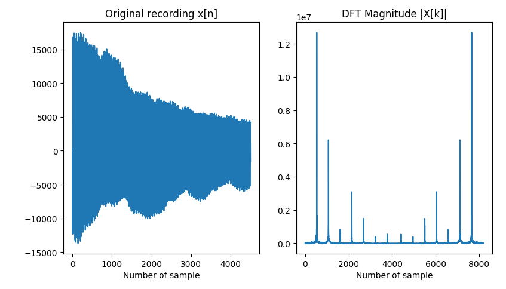
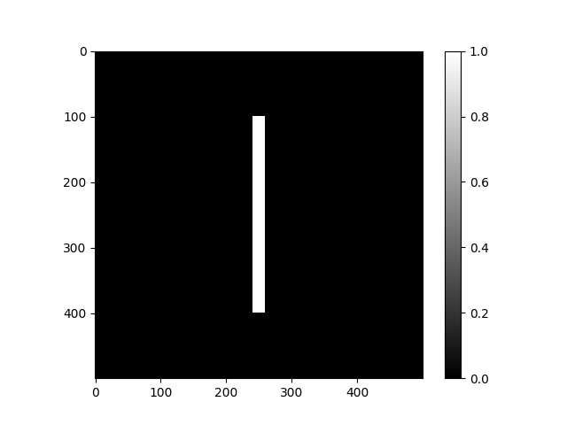
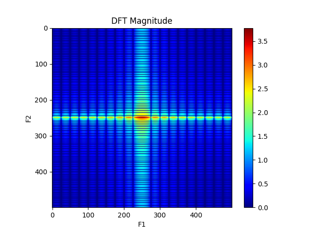
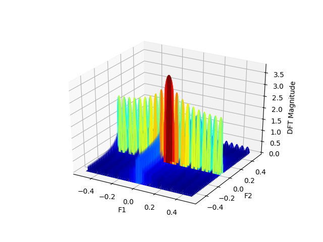
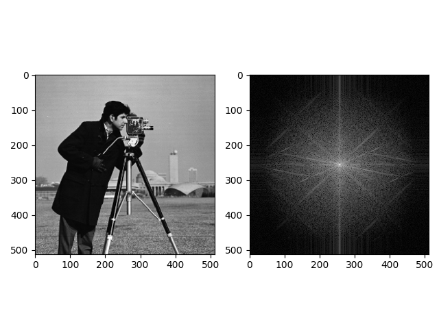
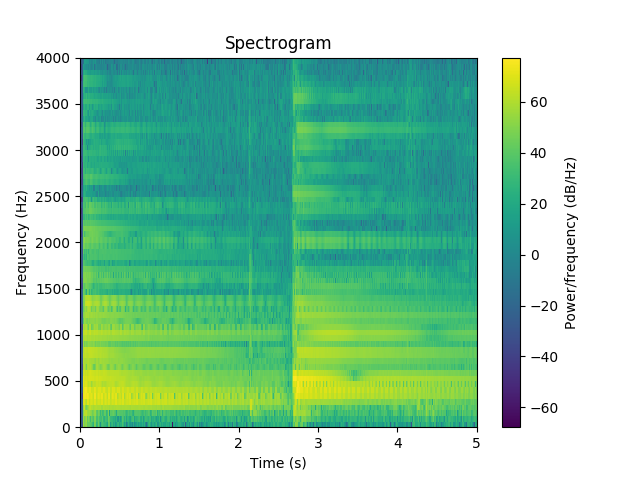
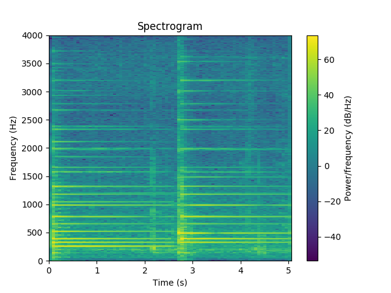

# Frequency Analysis Tools

The discrete Fourier transform (DFT) of a sequence $$x[n]$$ is defined as

\begin{equation}
X_N[k] = DFT_N\\{x[n]\\} = \sum\_{n=0}^{N-1}x[n]e^{-j2\pi \frac{k}{N}n},\ \ 0 \leq k \leq N-1
\end{equation}

which generates $$N$$ frequency samples. It is implemented in the [`fft()`](https://docs.scipy.org/doc/scipy-0.14.0/reference/generated/scipy.fftpack.fft.html) function from the [`scipy.fftpack`](https://docs.scipy.org/doc/scipy/reference/fftpack.html) package.
The length of the Fourier transform can be specified in the `n` parameter which defaults to the length of the sequence although it is usually set to a power of 2 to speed up computations.

For instance, given the following recording of the note _Do_,

<audio controls>
  <source src="./do.wav" type="audio/wav">
Your browser does not support the audio element.
</audio>

<br/>

we can compute and display its discrete Fourier transform as follows:

```python
import numpy as np
import matplotlib.pyplot as plt
from scipy.io import wavfile
from scipy.fftpack import fft, ifft

fs, x = wavfile.read('do.wav')
x = x[1500:6000]
N = 8192

X = fft(x, n=N)

plt.subplot(1, 2, 1)
plt.title('Original recording x[n]')
plt.plot(x)
plt.xlabel('Number of sample')

plt.subplot(1, 2, 2)
plt.title('DFT Magnitude |X[k]|')
plt.plot(np.abs(X))
plt.xlabel('Number of sample')
```

⚡ **Plotting with Spyder:** In order to display figures in a separate window click Tools, Preferences, Ipython Console, Graphics and under Graphics Backend select _automatic_ instead of _inline_.

⚡ **Plotting with Jupyter Notebooks:** You need to execute the command `%matplotlib notebook` for interactive plots or `%matplotlib inline` for static images of your plot.

<center>

</center>

Even though less samples can be taken, we select the central part of the original recording from sample 1500 to 6000 to avoid transients and we then compute the `fft` of `n=8192` samples. Note that `n` can be greater than the length of the analyzed segment as the function takes care of the zero padding.

From the result, its the harmonic structure is clear: we observe spectral lines equidistant in frequency. The separation between spectral lines is equal to the frequency at which the first peak appears, at around the 535th sample, which corresponds to the analogic frequency of

\begin{equation}
f_0 = F_0 \cdot f_s = \frac{535}{N}\cdot f_s = \frac{535}{8192}\cdot 4000Hz = 261.2 Hz
\end{equation}

and matches with the fundamental frequency of the _Do_ note at $$262Hz$$. Indeed, if we wish to plot the magnitude of the discrete time Fourier transform versus the analog frequency instead of the sample number we just need to do:

```python
plt.plot(np.arange(N)/N * fs, np.abs(X))
```

Note that the analog frequency corresponding the last sample of the DFT is `(N-1)/N * fs` since [`np.arange(N)`](https://docs.scipy.org/doc/numpy/reference/generated/numpy.arange.html) generates `N` samples in the interval `[0, N)`.

In order to obtain the argument of the transform we can use [`np.angle(X)`](https://docs.scipy.org/doc/numpy/reference/generated/numpy.angle.html) and we can apply the inverse discrete Fourier transform in the [`ifft()`](https://docs.scipy.org/doc/scipy-0.14.0/reference/generated/scipy.fftpack.ifft.html) function in such a way that `ifft(fft(x))` returns the analyzed segment.

## Fourier Transform in 2D

The extension to the 2-dimensional case of the discrete Fourier transform is defined as

\begin{equation}
X[k, l] = \sum\_{m=0}^{M-1} \sum\_{n=0}^{N-1} x[m,n]e^{-j2\pi \frac{k}{M}m \frac{l}{N}n},\ \ 0 \leq k \leq M-1,\ \ 0 \leq l \leq N-1
\end{equation}

and it is available in the [`fft2()`](https://docs.scipy.org/doc/scipy-0.14.0/reference/generated/scipy.fftpack.fft2.html) function from the `scipy.fftpack` package.

<!-- - **Centered representation** -->
<!-- - **Logarithmic transform** -->

Usually, we represent the magnitude with a **logarithmic transform** due to its dynamic range. Since images are generally positive signals, the highest value
of the magnitude of their transform is at $$(k,l) = (0, 0)$$. Given the DFT symmetries, the four corners of the transformed image contain the highest values of the magnitude. In order to help visualizing, the transformed image is **represented centered** at $$(M/2, N/2)$$ by means of the [`fftshift()`](https://docs.scipy.org/doc/scipy-0.14.0/reference/generated/scipy.fftpack.fftshift.html) function. Hence, the DC component, i.e. the value at $$(k,l) = (0, 0)$$ appears at the center of the transform.

For instance, for the following 2D pulse signal (or rectangular window),

```python
L = 500
x = np.zeros((L, L))
x[100:400, 240:260] = 1
```

<center>

</center>

we can represent the magnitude of its 2D DFT as follows:

```python
from scipy.fftpack import fft2, fftshift

X = fftshift(fft2(x))

plt.imshow(np.log10(1 + np.abs(X)), cmap='jet')
plt.colorbar()
plt.title('DFT Magnitude')
plt.xlabel('F1')
plt.ylabel('F2')
```

<center>

</center>

Moreover, we can visualize this figure in 3 dimensions by means of the code below:

```python
from mpl_toolkits.mplot3d import Axes3D

F1 = np.linspace(-0.5, 0.5, L)
F2 = np.linspace(-0.5, 0.5, L)
F1, F2 = np.meshgrid(F1, F2)

fig = plt.figure()
ax = fig.gca(projection='3d')
ax.plot_surface(F1, F2, np.log10(1 + np.abs(X)), cmap='jet')
ax.set_xlabel('F1')
ax.set_ylabel('F2')
ax.set_zlabel('DFT Magnitude')
```

<center>

</center>

Finally, it is worth illustrating the transform on a real image such as the cameraman:

```python
x = plt.imread('camera.png')
X = fftshift(fft2(x))

plt.subplot(1, 2, 1)
plt.imshow(x, cmap='gray')

plt.subplot(1, 2, 2)
plt.imshow(np.log10(1 + np.abs(X)), cmap='gray')
```

<center>

</center>

## Short Time Fourier Transform

The Short Time Fourier Transform (STFT) is defined to handle non-stationary signals that change their frequency properties through time. It consists on using a shifted window $$v[n]$$ of length $$L$$ that allows the local analysis of the signal through it:

\begin{equation}
X[m, F] = \sum\_{n = -\infty}^{n = \infty} x[n]v[n-mR]e^{-j2\pi Fn}
\end{equation}

In this formula,

-   $$m$$ indexes the window (frame number)

-   $$R$$ defines the distance between two consecutive windows (hop size)

These variables can be customised in the [`stft()`](https://docs.scipy.org/doc/scipy/reference/generated/scipy.signal.stft.html) function from the `scipy.signal` package by means of these parameters:

-   `npersec` defines the length $$L$$ of the window

-   `noverslap` stands for the number of points to overlap between frames, i.e. $$L-R$$, which is by default $$L/2$$

Moreover, the parameter `fs` sets the sampling frequency used in the time signal and `window` allows to specify the window $$v[n]$$ which defaults to the Hanning window. In order to explore the capabilities of the STFT, we will load the following 5 second recording of two consecutive piano chords

<audio controls>
  <source src="./chords.wav" type="audio/wav">
Your browser does not support the audio element.
</audio>

</br>

and we will first set the window length to `nperseg=128`:

```python
from scipy.signal import stft

fs, chords = wavfile.read('chords.wav')
f, t, spectrogram = stft(chords, fs, nperseg=128)

plt.figure()
plt.pcolormesh(t, f, 10*np.log10(np.abs(spectrogram)**2))
plt.title('Spectrogram')
plt.ylabel('Frequency (Hz)')
plt.xlabel('Time (s)')
plt.colorbar().set_label('Power/frequency (dB/Hz)')
plt.show()
```

<center>

</center>

We observe that the frequency resolution is poor whereas we can clearly identify the moment of change in the chords. If we now change the window length to `nperseg=1024`,

<center>

</center>

the harmonics of the different notes become crystal clear and we realise that the high frequency ones decay faster. Finally, based on the following musical note to frequency conversion chart,

|       | **Musical Note** | **Frequency** |
| :---: | :--------------: | :-----------: |
| _Do_  |     $$C_4$$      | $$262\\ Hz$$  |
| _Re_  |     $$D_4$$      | $$294\\ Hz$$  |
| _Mi_  |     $$E_4$$      | $$330\\ Hz$$  |
| _Fa_  |     $$F_4$$      | $$349\\ Hz$$  |
| _Sol_ |     $$G_4$$      | $$392\\ Hz$$  |
| _La_  |     $$A_5$$      | $$440\\ Hz$$  |
| _Si_  |     $$B_5$$      | $$494\\ Hz$$  |

we conclude that the two chords were _Do, Mi, Sol_ and _Mi, Sol, Si_.

<!-- Pitch is not clearly observed in the first plot as for the Hann window the bandwidth
is 4/N*Fs, which is 250Hz in this case, while pitch is around 150Hz. In the second and
third plots, the bandwidths become 125 Hz and 62.5 Hz, respectively -->

<Autors autors="adell"/>
