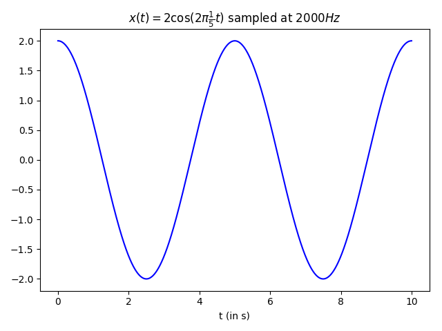
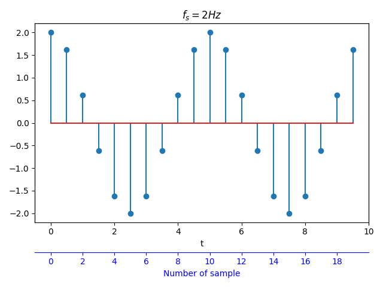
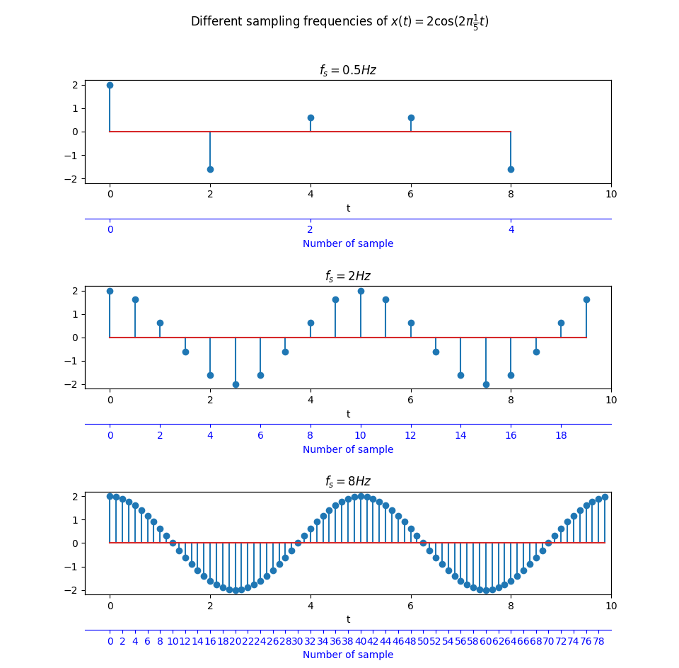

# Hors Sujet: Sampling

Let's consider the continuous periodic function $x(t) = A\cos(2\pi f_0t)$ with an amplitude of $A=2$ and a frequency of $f_0 = \frac{1}{5}$. Given that Python does not work with continuous signals, we will evaluate $x(t)$ at discrete points in time to obtain a sequence of samples $x[n]$.

In the code below, we take the sampling frequency to be $f_s = 2000s^{-1}$, equivalently $f_s = 2000Hz$. That is, every second we take 2000 samples of the continuous function.

```python
import matplotlib.pyplot as plt
import numpy as np

def sinusoid(x):
    return 2*np.cos(2*np.pi*(1/5)*x)

fs = 2000
L = 10*fs
n = np.arange(L)/fs

plt.plot(n, sinusoid(n), '-b')
plt.title(r'$x(t) = 2\cos(2\pi\frac{1}{5}t)$ sampled at 2000Hz')
plt.xlabel('t (in s)')
```

<center>
    
</center>

As the plot depicts, the interval $[0, 10]$ comprises two full periods of $x(t)$ given that $T_0 = \frac{1}{f_0} = 5$.

Since we have fixed the sampling frequency at `f_s = 2000`, the number of samples required to cover this interval is `L = 10*f_s`. Finally, we take `n` to be the points in time at which we evaluate the sinusoid. To do so, we have used the function [`np.arange(L)`](https://docs.scipy.org/doc/numpy-1.15.0/reference/generated/numpy.arange.html) which returns evenly spaced values in the interval `[0, L)` and then divided it by the sampling frequency.

With the exact same goal, we can also use the function [`np.linspace(start, stop, num)`](https://docs.scipy.org/doc/numpy-1.15.0/reference/generated/numpy.linspace.html). Its usage is different and it returns `num` evenly spaced samples, calculated over the **closed** interval `[start, stop]`.

Therefore, these two options are preferred when taking `L` samples of a continuous function at a sampling frequency of `f_s`:

-   `n = np.arange(L)/fs`
-   `n = np.linspace(0, (L-1)/fs, L)`

Whenever we sample a continuous sinusoid function into a discrete signal $x[n]$, a discrete frequency $F_0$ comes into play:

\begin{equation}
\begin{aligned}
x[n] = x(nT_s) &= A\cos(2\pi f_0 nT_s) \\\
&= A\cos(2\pi\frac{f_0}{f_s}n) \\\
&= A\cos(2\pi F_0 n)
\end{aligned}
\end{equation}

For instance, if we reduce the sampling frequency from $f_s = 2kHz$ to $f_s = 2Hz$, we will take a sample of $x(t)$ every $T_s = \frac{1}{2}s$. Hence, its discrete frequency will be $F_0 = \frac{f_0}{f_s} = \frac{1}{10}$.

The following code takes $f_s = 2Hz$ and draws a vertical line at each location where we have sampled the analog function by means of [`plt.stem()`](https://matplotlib.org/3.1.0/api/_as_gen/matplotlib.pyplot.stem.html). Besides the same temporal axis as in the previous example, a second axis (in blue) is added below and it describes the sample number.

```python
f, ax = plt.subplots()

fs = 2
# Number of samples required to cover the [0, 10) interval
L = 10*fs
n = np.arange(L)/fs
ax.stem(n, sinusoid(n))

ax.set_title(r'f_s = 2Hz')
ax.set_xlim([-0.5, 10])
ax.set_xlabel('t')

# Set second x-axis to account for number of sample
newax = ax.twiny()

# Decide the ticklabel position in the new x-axis,
# then convert them to the position in the time x-axis
labels = np.arange(0, L, 2)
positions = labels/fs
newax.set_xticks(positions)
newax.set_xticklabels(labels)

# Set the position of the second x-axis to bottom
newax.xaxis.set_ticks_position('bottom')
newax.xaxis.set_label_position('bottom')
newax.spines['bottom'].set_position(('outward', 36))
newax.spines['bottom'].set_color('blue')
newax.tick_params(axis='x', colors='blue')
newax.set_xlabel('Number of sample', color='blue')
newax.set_xlim(ax.get_xlim())
```

<center>
    
</center>

If we now repeat this procedure for different sampling frequencies, $f_s \in \\{0.4, 2, 8\\}Hz$ we obtain the following results:

| **Analog frequency** $f_0$ (in $s$) | **Sampling frequency** $f_s$ (in $s^{-1}$ or $Hz$) | **Discrete frequency** $F_0 = f_0T_s = \frac{f_0}{f_s}$ |
| :---------------------------------: | :------------------------------------------------: | :-----------------------------------------------------: |
|            $\frac{1}{5}$            |                   $\frac{1}{2}$                    |                   $\frac{2}{5} = 0.4$                   |
|            $\frac{1}{5}$            |                        $2$                         |                  $\frac{1}{10} = 0.1$                   |
|            $\frac{1}{5}$            |                        $8$                         |                 $\frac{1}{40} = 0.025$                  |

which can be graphically represented by means of [this code](/programes/sampling_frequency.py):

<center>
    
</center>

In these examples, note that the highest discrete frequency corresponds to $F_0 = 0.4$ since it is the closest to $F_0 = 0.5$ for which $\cos[2\pi\frac{1}{2}n] = [\underline{1}, -1, 1, -1, 1, -1, \dots]$.

Finally, it is important to highlight that the sampling frequencies have been chosen to fulfill _Nyquist theorem_, $f_s > 2f_0$, so as to prevent aliasing.

<Autors autors="adell"/>

<!-- If you are working with Jupyter notebooks you need to execute the command `%matplotlib notebook` for interactive plots or `%matplotlib inline` for static images of your plot. -->
