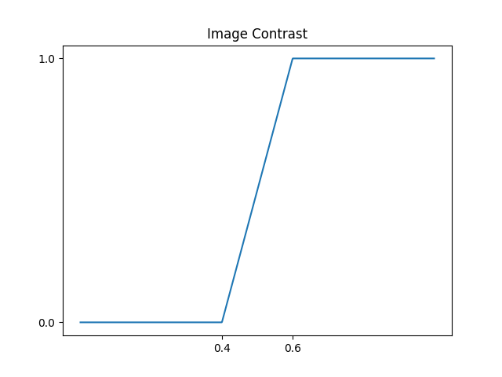
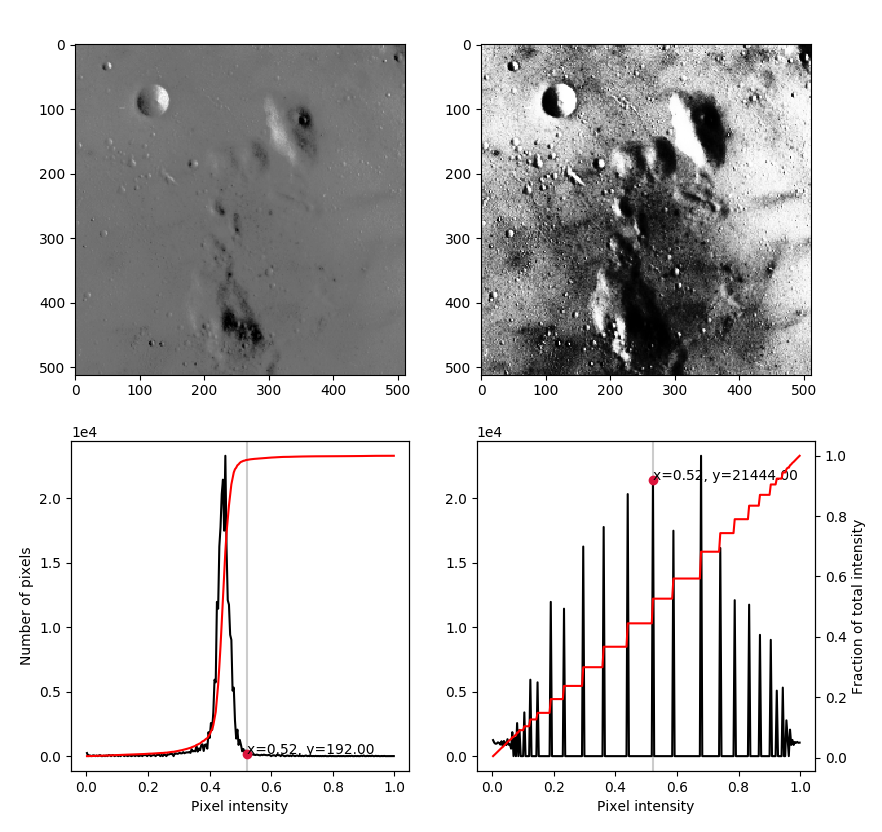
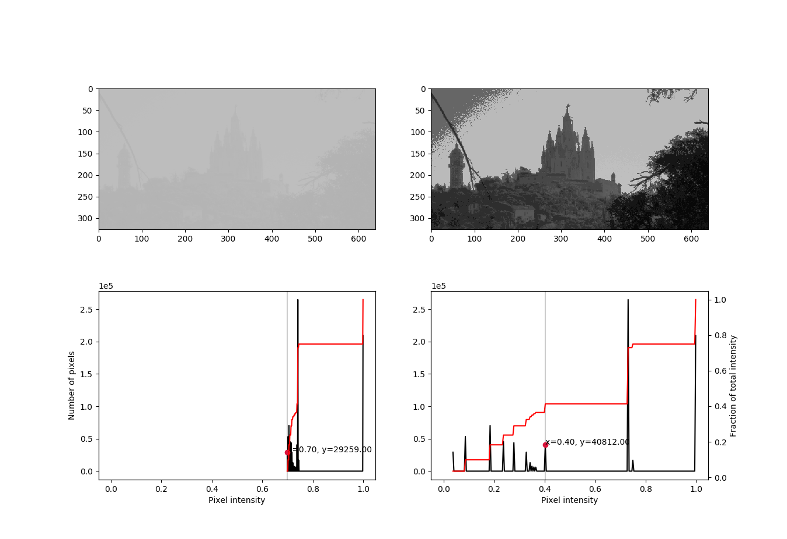

# Pointwise Transformations of Images

The function below allows us to perform a linear transformation on the image such that all pixels below a given threshold `low_in` are mapped to `low_out` and all pixels above `high_in` are mapped to `high_out`:

```python
def image_contrast(pixel, low_in, high_in, low_out, high_out):
    if pixel < low_in:
        return low_out
    elif pixel > high_in:
        return high_out
    else:
        return low_out + (high_out - low_out)/(high_in - low_in)*(pixel - low_in)

f = np.vectorize(image_contrast)
```

For instance, the following set of values

```
 low_in = 0.4,   high_in = 0.6
low_out = 0.0,  high_out = 1.0
```

corresponds to this transformation:

<center>
    
</center>

If we finally apply it to the camaraman image,

```python
>>> camera = plt.imread('camera.png')
>>> camera_transform = f(camera, 0.4, 0.6, 0.0, 1.0)
```

we observe the following effect:

``

<center>
    
</center>

## Histograms and equalization

The following function allows us to visualize a list of images, together with its histogram and cumulative distribution. Moreover, it adds a cursor to each histogram that points out the value of each bin.

<!-- Credit to https://scikit-image.org/docs/dev/auto_examples/color_exposure/plot_equalize.html -->

```python
#!/usr/bin/env python3

import matplotlib.pyplot as plt
import numpy as np
from skimage import exposure

class SnaptoCursor(object):
    def __init__(self, ax, x, y):
        self.ax = ax
        self.ly = ax.axvline(color='k', alpha=0.2)  # the vert line
        self.marker, = ax.plot([0],[0], marker="o", color="crimson", zorder=3)
        self.x = x
        self.y = y
        self.txt = ax.text(0.7, 0.9, '')

    def mouse_move(self, event):
        if not event.inaxes:
            return
        x, y = event.xdata, event.ydata
        indx = min(np.searchsorted(self.x, x), len(self.x) - 1)
        x = self.x[indx]
        y = self.y[indx]
        self.ly.set_xdata(x)
        self.marker.set_data([x],[y])
        self.txt.set_text('x=%1.2f, y=%1.2f' % (x, y))
        self.txt.set_position((x,y))
        self.ax.figure.canvas.draw_idle()

def plot_histograms(images, nbins=256):
    """ Plots each greyscale image in the list images,
    together with its histogram and cumulative distribution
    """

    n = len(images)
    f, axes = plt.subplots(2, n)
    axes = axes.reshape((2, n))

    cursors_hist = [0 for i in range(n)]
    # cursors_cdf = [0 for i in range(n)]

    for i, image in enumerate(images):
        ax_im, ax_hist = axes[:, i]
        ax_cdf = ax_hist.twinx()

        # Display image
        ax_im.imshow(image, cmap='gray')

        # Display histograms
        hist, bins = exposure.histogram(image, nbins=256)
        ax_hist.plot(bins, hist, color='black')
        ax_hist.ticklabel_format(axis='y', style='scientific', scilimits=(0, 0))
        ax_hist.set_xlabel('Pixel intensity')
        if i == 0:
            ax_hist.set_ylabel('Number of pixels')

        # Display cumulative distribution
        cdf, bins = exposure.cumulative_distribution(image, nbins=256)
        ax_cdf.plot(bins, cdf, color='red')
        ax_cdf.set_yticks([])
        if i == len(images) - 1:
            ax_cdf.set_ylabel('Fraction of total intensity')
            ax_cdf.set_yticks(np.linspace(0, 1, 6))

        # Display cursors
        cursors_hist[i] = SnaptoCursor(ax_hist, bins, hist)
        f.canvas.mpl_connect('motion_notify_event', cursors_hist[i].mouse_move)
        # cursors_cdf[i] = SnaptoCursor(ax_cdf, bins, cdf)
        # plt.connect('motion_notify_event', cursors_cdf[i].mouse_move)

    plt.show()

    return cursors_hist
```

<!--
    Why are we using `return cursors_hist`?

    For any widget to remain responsive you must keep a reference to it,
    otherwise it will be garbage collected as soon as the function returns.

        https://matplotlib.org/api/widgets_api.html#matplotlib-widgets
-->

In order to equalize a histogram we will use the [`equalize_hist()`](https://scikit-image.org/docs/dev/api/skimage.exposure.html#skimage.exposure.equalize_hist) function from the `skimage.exposure` module:

```python
>>> from skimage import exposure
>>> moon_equalized = exposure.equalize_hist(moon)
>>> moon_equalized
array([[0.74093608, 0.74093608, 0.94418847, ..., 0.0413489 , 0.04973926,
        0.04973926],
       [0.74093608, 0.74093608, 0.94418847, ..., 0.0413489 , 0.04973926,
        0.04973926],
       [0.74093608, 0.74093608, 0.94418847, ..., 0.0413489 , 0.04973926,
        0.04973926],
       ...,
       [0.23426186, 0.23426186, 0.44005065, ..., 0.787956  , 0.74093608,
        0.74093608],
       [0.5897308 , 0.5897308 , 0.52191412, ..., 0.83300147, 0.83300147,
        0.83300147],
       [0.5897308 , 0.5897308 , 0.52191412, ..., 0.83300147, 0.83300147,
        0.83300147]])

```

We can now use our previously defined function so see the effect of equalization on the image of the moon:

```python
>>> images = [moon, moon_equalized]
>>> plot_histograms(images)
```

⚡ **Plotting with Spyder:** In order to display figures in a separate window click Tools, Preferences, Ipython Console, Graphics and under Graphics Backend select _automatic_ instead of _inline_.

⚡ **Plotting with Jupyter Notebooks:** You need to execute the command `%matplotlib notebook` for interactive plots or `%matplotlib inline` for static images of your plot.

<center>
    
</center>

<!-- <center>
    
</center> -->

<Autors autors="adell"/>
