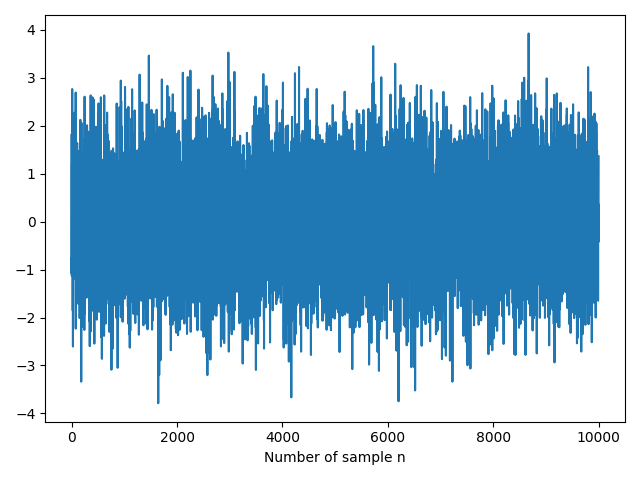
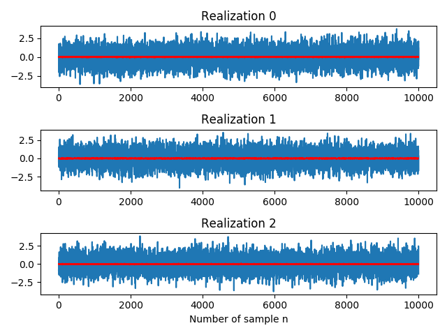
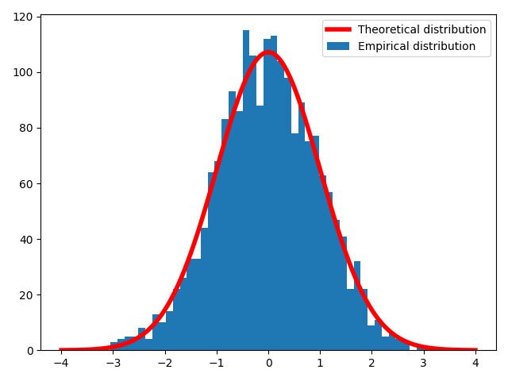
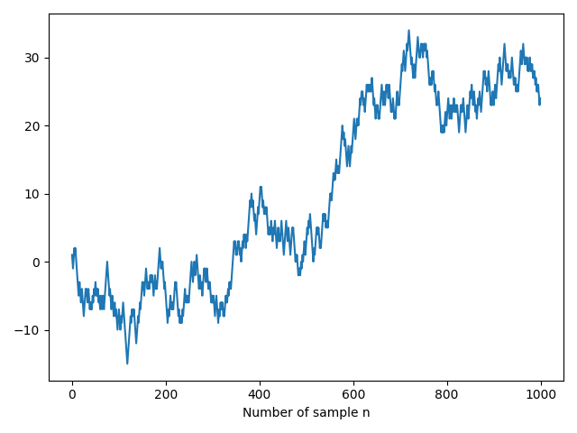
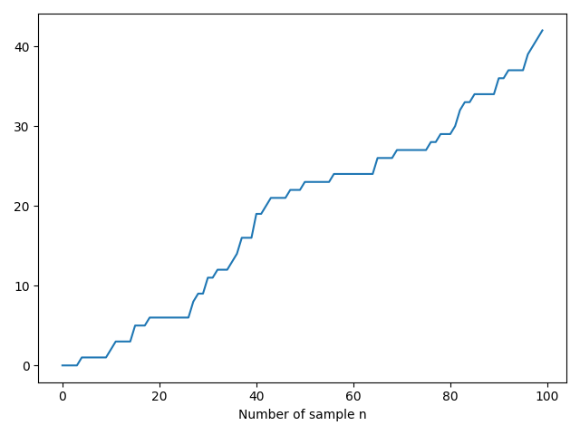

# Generation of Processes

Random variables are meant to model single outputs of random phenomena. The next step is to model processes: sequences of random outputs, which are usually viewed as evolving in time.

## White Gaussian Noise

Using the function [`np.random.normal()`](https://docs.scipy.org/doc/numpy-1.15.0/reference/generated/numpy.random.normal.html), we can generate a sequence of normal (Gaussian) independent and identically distributed samples with zero mean and unit variance,

\begin{equation}
X(n) \sim N(\mu = 0, \sigma^2=1).
\end{equation}

In the code below we generate a vector of `N = 10000` samples:

```python
N = 10000
noise = np.random.normal(size=N)

plt.plot(noise)
plt.xlabel('Number of sample n')
```

<center>

</center>

The autocorrelation in a stationary process such as the white Gaussian noise is defined as

\begin{equation}
r_x(l) = \mathbb{E}\\{X(n+l)X(n) \\} = \delta (l)
\end{equation}

and the empirical autocorrelation obtained on the vector `x` can be calculated as

\begin{equation}
\hat{r_x}(l) = \frac{1}{N-l} \sum\_{n = 0}^{N-l-1}x(n+l)x(n)
\end{equation}

which is implemented in the function below:

```python
def autocorrelation(x, l):
    if l < 0:
        l = abs(l)
    if x.size <= l:
        raise ValueError('Lag cannot exceed vector size')
    if l == 0:
        return np.dot(x, x) / x.size
    else:
        return np.dot(x[:-l], x[l:]) / (x.size - l)
```

Taking advantage of the previous function, we define the autocorrelation for all the lags in `[0, N-1]`:

```python
def full_autocorrelation(x):
    rx = np.zeros(x.size)
    for l in range(rx.size):
        rx[l] = autocorrelation(x, l)
    return rx

rx = full_autocorrelation(noise)

plt.plot(rx)
plt.title(r'Empirical r_x(l)')
plt.xlabel('Lag l')
```

<center>

</center>

Note that the estimation of $$r\_x(l)$$ seems unbiased but, as $$l$$ increases, the variance on $$\hat{r_x}$$ also increases given that we are using less samples.

Until now we have been working with just one single realization of the process. If we repeat the generation of the vector `noise` several times, we will obtain independent realizations of the process. Saving each realization in a different row, we will have an `MxN` matrix where `M` stands for the number of realizations:

```python
M = 2000
realizations = np.random.normal(size=(M, N))
```

We illustrate below the first three realizations that we have generated. Moreover, we plot the mean in red which approximately remains constant at each point in time, $$m_x(n) = m_x = \mathbb{E}\\{X(n) \\} = 0$$:

```python
mean = np.mean(realizations, axis=0)

f, axes = plt.subplots(3, 1)
axes[-1].set_xlabel('Number of sample n')

for i, ax in enumerate(axes):
    ax.set_title('Realization ' + str(i))
    ax.plot(realizations[i, :])
    ax.plot(mean, 'r-')
```

<center>

</center>

The $$n$$-th column of the matrix `realizations` corresponds to a random variable associated to the value of the random process at time $$n$$. For instance, we can plot the histogram of an arbitrary column such as `realizations[:, 1000]` and check if it matches with the theoretical normal distribution given by the [`scipy.stats.norm()`](https://docs.scipy.org/doc/scipy/reference/generated/scipy.stats.norm.html) function and scaled accordingly:

```python
from scipy import stats

column = realizations[:, 1000]

bins = 50
plt.hist(column, bins, label='Empirical distribution')

x = np.linspace(-4, 4, 1000)
theoretical = stats.norm().pdf(x)
scale = (np.max(column)-np.min(column))*M / bins
plt.plot(x, scale*theoretical, 'r-', lw=4, label='Theoretical distribution')

plt.legend()
```

<center>

</center>

Finally, we can average the estimation of the autocorrelation on each realization so as to improve the previous estimation:

```python
rx = np.zeros(N)
for m in range(M):
    rx += full_autocorrelation(realizations[m, :])
rx /= M
```

<center>

</center>

<!-- Densitat Espectral de Potència

```python
Sx = fft(rx, n=8192)

plt.subplot(1, 2, 1)
plt.plot(rx)
plt.title(r'Empirical r_x(l)')
plt.xlabel('Lag l')

plt.subplot(1, 2, 2)
plt.plot(np.abs(Sx))
plt.title(r'Empirical S_x(w)')
plt.xlabel('Frequency (number of sample in DFT)')
plt.ylim(-0.2, 1.2)
```

<center>

</center>

-->

## Random Walks

The simple random walk is the process $$\\{Z(n), n \geq 0\\}$$ where $$Z(0) = 0$$ with probability 1 and

\begin{equation}
Z(n) = \sum\_{i=1}^{n}X(n)
\end{equation}

where $$\\{X(n), n \geq 1\\}$$ is an independent identically distributed sequence with $$\text{Pr}(X(n) = 1) = p$$ and $$\text{Pr}(X(n) = -1) = q = 1-p$$. Hence, the current value of the process $$Z(n)$$ is the past value plus a random variation $$X(n)$$.

\begin{equation}
Z(n) = Z(n-1) + X(n)
\end{equation}

The following code generates a realization of a Bernouilli random walk process, whose evolution $$X(n)$$ increases or decreases a magnitude $$\pm 1$$ with probabilities $$p = q = \frac{1}{2}$$:

```python
N = 1000
x = (np.random.random(N-1) < 0.5)*2 - 1
z = np.zeros(N)
z[1:] = np.cumsum(x) # We force z[0] = 0
```

The [`np.random.random()`](https://docs.scipy.org/doc/numpy-1.15.0/reference/generated/numpy.random.random.html) function returns random floats sampled from a continuous distribution over the half-open interval $$[0, 1)$$. Therefore, we set a threshold of $$p = 0.5$$ which indicates whether the next step should be upwards or downwards. Note that (as mentioned in the [Python documentation](https://docs.python.org/3/reference/datamodel.html#the-standard-type-hierarchy)) the boolean type is a subtype of the integer type, and Boolean values behave like the values `0` and `1` in such a way that

<!-- , respectively, in almost all contexts, the exception being that when converted to a string, the strings `'False'` or `'True'` are returned, respectively. -->

```python
>>> True*2 - 1
1
>>> False*2 - 1
-1
```

Hence, by means of the [`np.cumsum()`](https://docs.scipy.org/doc/numpy-1.15.1/reference/generated/numpy.cumsum.html) we accumulate the sequence formed `+1` and `-1` so that we can now plot the realization of the random walk that we have generated:

```python
plt.plot(z)
plt.xlabel('Number of sample n')
```

<center>

</center>

In order to replicate the realization of a random walk `M` times we can update our code as follows:

```python
M = 20
X = (np.random.random(size=(M, N-1)) < 0.5)*2 - 1
Z = np.zeros((M, N))
Z[:, 1:] = np.cumsum(X, axis=1) # We force z[0] = 0 for each realization

plt.plot(Z.T, color='blue', lw=2, alpha=0.2)
```

⚡ **Note:** The following interactive visualization has been done with the [`mpld3`](https://mpld3.github.io/index.html) library inspired by [this](https://mpld3.github.io/examples/random_walk.html) example.

<center>
<iframe width="650" height="500" frameborder="0" src=".//programes/random_walks.html"> </iframe>
</center>

## Poisson Process

The Poisson process is one of the most widely used counting processes. It is usually used in scenarios where we are counting the occurences of certain events that appear to happen at a certain rate, but completely at random. A discrete-time Poisson process $$Z(n)$$ can be generated from a counting process initilized at $$Z(0) = 0$$,

\begin{equation}
Z(n) = Z(n-1) + X(n) = \sum\_{i=1}^{n}X(n),
\end{equation}

where $$X(n)$$ for $$n\geq 1$$ are independent and identically distributed Poisson random variables whose PDF is given by

\begin{equation}
\text{Pr}\bigg( X(n) = k\bigg) = \frac{\lambda^k}{k!}e^{-\lambda}, \\ \\ k \in 0, 1, 2, \dots
\end{equation}

and the parameter $$\lambda$$ somehow regulates the arrival frequency of the event that we are modelling.

Using the same pattern as in the random walk example and provided with the [`np.random.poisson()`](https://docs.scipy.org/doc/numpy-1.15.4/reference/generated/numpy.random.poisson.html) function in this case, we can plot a realization of the process with $$N=100$$ and $$\lambda = 5$$:

```python
N = 100
lam = 0.5
x = np.random.poisson(lam, N-1)
z = np.zeros(N)
z[1:] = np.cumsum(x) # We force z[0] = 0
```

<center>

</center>

We can generate several realizations of the Poisson process updating our code in this natural way:

```python
M = 20
X = np.random.poisson(lam, size=(M, N-1))
Z = np.zeros((M, N))
Z[:, 1:] = np.cumsum(X, axis=1) # We force z[0] = 0 for each realization

plt.plot(Z.T, color='blue', lw=2, alpha=0.2)
```

<center>
<iframe width="650" height="500" frameborder="0" src=".//programes/poisson_realizations.html"> </iframe>
</center>

<Autors autors="adell"/>
