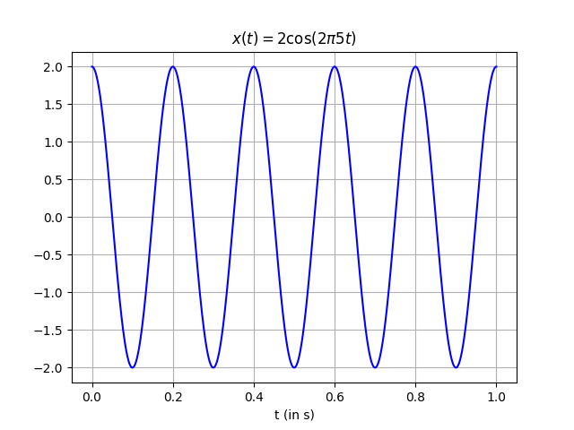
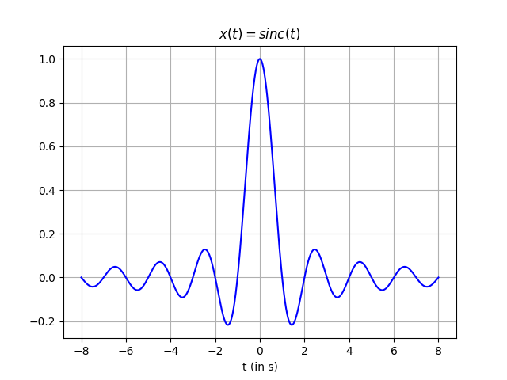
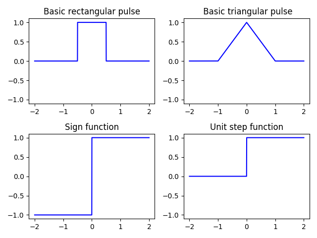
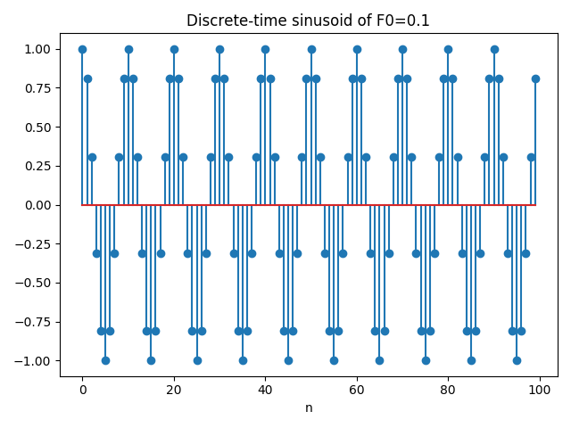
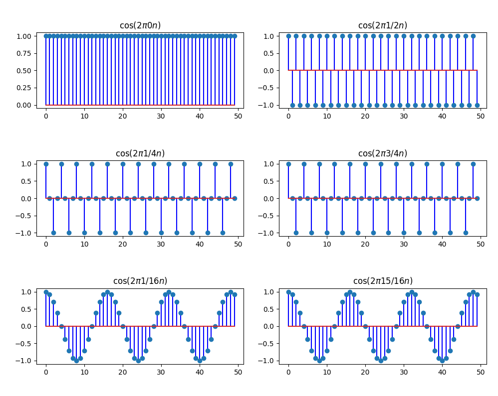
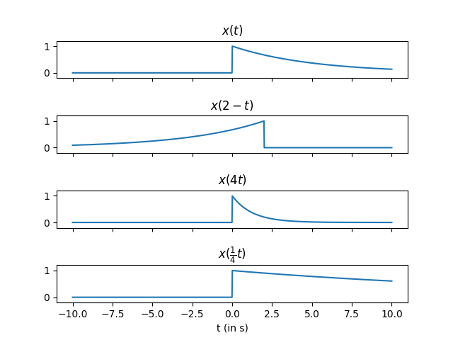
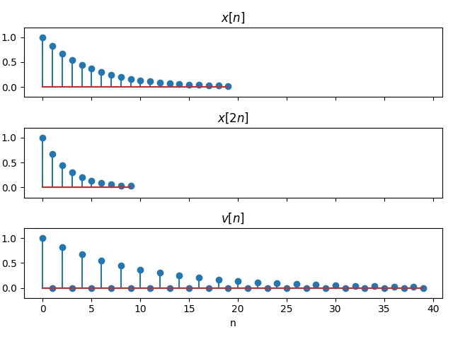

# Generation of Basic Signals

## Simulation of continuous-time signals

Let's consider the continuous periodic function $$x(t) = A\cos(2\pi f_0t)$$ with an amplitude of $$A=2$$ and a frequency of $$f_0 = 5Hz$$ (i.e. 5 cycles/second). Given that Python does not work with continuous signals, we will evaluate $x(t)$ at discrete points in time.

In the code below, we simulate our signal by means of $$1000$$ samples in a time interval between $$0$$ and $$1$$ seconds. For this purpose, the function [`np.linspace(start, stop, num)`](https://docs.scipy.org/doc/numpy-1.15.0/reference/generated/numpy.linspace.html) returns `num` evenly spaced samples, calculated over the **closed** interval `[start, stop]`.

```python
import matplotlib.pyplot as plt
import numpy as np


t = np.linspace(0, 1, 1000)
A = 2
f0 = 5

x = A*np.cos(2*np.pi*f0*t)

plt.plot(t, x, '-b')
plt.title(r'x(t) = 2\cos(2\pi 5t)')
plt.xlabel(r't (in s)')
plt.grid()
```

<center>
    
</center>

Note that the period of $$x(t)$$ is $$T\_0 = \frac{1}{5} = 0.2$ and, as the plot depicts, the interval $$[0, 1]$$ comprises five full periods.

Let us simulate more basic time-continuous signals. An important one is the `sinc` function

\begin{equation}
\text{sinc}(t) = \frac{\sin(\pi t)}{\pi t}
\end{equation}

which can be represented in the interval $$[-8, 8]$$ as follows:

```python
t = np.linspace(-8, 8, 1000)
x = np.sinc(t)
plt.plot(t, x, '-b')
plt.title(r'x(t) = sinc(t)')
plt.xlabel(r't (in s)')
plt.grid()
```

<center>
    
</center>

We can also define our own basic functions from scratch:

```python
def p(t):
    """Basic rectangular pulse"""
    return 1 * (abs(t) < 0.5)

def pt(t):
    """ Basic triangular pulse"""
    return (1 - abs(t)) * (abs(t) < 1)

def sgn(t):
    """Sign function"""
    return 1 * (t >= 0) - 1 * (t < 0)

def u(t):
    """Unit step function"""
    return 1 * (t >= 0)

functions = [p, pt, sgn, u]

t = np.linspace(-2, 2, 1000)

plt.figure()
for i, function in enumerate(functions, start=1):
    plt.subplot(2, 2, i)
    plt.plot(t, function(t), '-b')
    plt.ylim((-1.1, 1.1))
    plt.title(function.__doc__)
plt.tight_layout()
plt.show()
```

<center>
    
</center>

## Discrete-time signals

In our first example, we took samples spaced $$T\_s = 0.001$$ seconds. That is, $$1000$$ samples per second so we say that our sampling frequency is $$f_s = \frac{1}{T\_s} = 1 kHz$$.

Whenever we sample a continuous sinusoid function into a discrete signal $x[n]$, a discrete frequency $F_0$ comes into play:

\begin{equation}
\begin{aligned}
x[n] = x(nT_s) &= A\cos(2\pi f_0 nT_s) \\\
&= A\cos(2\pi\frac{f_0}{f_s}n) \\\
&= A\cos(2\pi F_0 n)
\end{aligned}
\end{equation}

Hence, many different combinations of $$f_0$$ and $$f_s$$ may give rise to the same $$F_0$$.

For instance, let us generate $$100$$ samples of a discrete-time sinusoid with $$F_0 = 0.1$$ and display it by means of [`plt.stem()`](https://matplotlib.org/3.1.0/api/_as_gen/matplotlib.pyplot.stem.html).

```python
F0 = 0.1
L = 100
n = np.arange(L)
x = np.cos(2*np.pi*F0*n)

plt.stem(x)
plt.title('Discrete-time sinusoid of F0=0.1')
plt.xlabel('n')
```

<center>
    
</center>

The code below highlights the following fact for discrete frequencies:

\begin{equation}
\cos(2\pi F_0 n) = \cos(2\pi (1-F_0) n)
\end{equation}

```python
from fractions import Fraction

n = np.arange(50)
frequencies = [0, 1/2, 1/4, 3/4, 1/16, 15/16]

for i, F0 in enumerate(frequencies, start=1):
    plt.subplot(3, 2, i)
    plt.stem(np.cos(2*np.pi*F0*n))
    plt.title(r'$\cos(2\pi {}n)$$'.format(Fraction(F0)))

plt.tight_layout()
```

<center>
    
</center>

## Basic transformations

In order to illustrate the basic transformations of the independent variable, _shifting, scaling and reversal_, we will consider the following analog function

\begin{equation}
x(t) = e^{-\frac{1}{5}t}\cdot u(t)
\end{equation}

where $u(t)$ corresponds to the unit step function (or Heaviside) whose value is zero for negative arguments and one otherwise. Hence, $x(t)$ can be written as

\begin{equation}
x(t) =
\begin{cases}
e^{-\frac{1}{5}t} & \text{if} \ \ t \geq 0 \\\
0 & \text{otherwise}
\end{cases}
\end{equation}

All of the plots are focused on the interval $[-10, 10]$ in the piece of code below:

```python
def x(t):
    return np.exp(-0.2 * t) * (t >= 0)

t = np.linspace(-10, 10, 1000)

f, (ax1, ax2, ax3, ax4) = plt.subplots(4, 1, sharex=True, sharey=True)
plt.subplots_adjust(hspace=1)
ax1.set_ylim([-0.2, 1.2])

ax1.plot(t, x(t))
ax1.set_title(r'x(t)')

ax2.plot(t, x(2-t))
ax2.set_title(r'x(2 - t)')

ax3.plot(t, x(4*t))
ax3.set_title(r'x(4t)')

ax4.plot(t, x(0.25*t))
ax4.set_title(r'x(\frac{1}{4}t)')
ax4.set_xlabel('t (in s)')

```

<center>
    
</center>

Let's consider now the discrete-time version of the signal:

```python
L = 20
n = np.arange(L)

x = np.exp(-0.2 * n) * (n >= 0)
x2 = x[::2]  # Decimation by 2: Remove one from every 2 points
v = np.zeros((2*L))
v[::2] = x   # v = x(n/2) for even n, 0 otherwise

f, (ax1, ax2, ax3) = plt.subplots(3, 1, sharex=True, sharey=True)
plt.subplots_adjust(hspace=1)
ax1.set_ylim([-0.2, 1.2])

ax1.stem(x)
ax1.set_title(r'x[n]')

ax2.stem(x2)
ax2.set_title(r'x[2n]')

ax3.stem(v)
ax3.set_title(r'v[n]')

# The discrete signals are represented versus n, not versus t
ax3.set_xlabel('n')
```

Note that when plotting $v[n]$ we are referring to the function below

\begin{equation}
v[n] =
\begin{cases}
x[\frac{n}{2}] & \text{if} \ \ n = 0, \pm 2, \pm 4, \dots \\\
0 & \text{otherwise}
\end{cases}
\end{equation}

and we take advantage of Python's list slicing when we specify `n[::2]` which reads as take all the elements in `n` with a step of 2.

We can finally visualize all of the transformations on $x[n]$. Note that $x[2n]$ has half the length of the original sequence while $v[n]$ has twice the lenght:

<center>
    
</center>

<Autors autors="adell"/>


<!-- If you are working with Jupyter notebooks you need to execute the command `%matplotlib notebook` for interactive plots or `%matplotlib inline` for static images of your plot. -->
