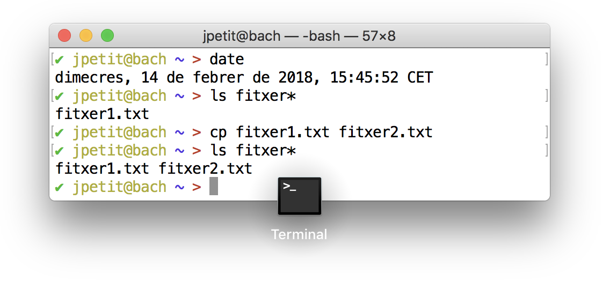

# Introducció

Aquesta lliçó mostra com treballar amb un terminal de comandes.

Malgrat que els ordinadors actuals disposen d'interfícies gràfiques que
permeten realitzar la majoria de tasques del dia a dia,
per programar solen ser útils les "velles" interfícies de comandes.
Nosaltres farem servir unes aplicacions anomenades **terminals** o **consoles**,
les quals mostren una simple finestra
on l'usuari dóna instruccions a través del teclat
i en reb les respostes de l'ordinador.
Us encoratgem a usar aquestes eines.
Encara que haureu d'aprendre a fer algunes coses de forma diferent,
considerem que en el futur estalviareu temps i esforços.

En aquesta lliçó es mostren enregistraments
de sessions de treball davant d'un terminal.
Hi ha sessions per a:

1. Interacció bàsica en el terminal
2. Operacions amb directoris i fitxers
3. Utilitats per processar textos
4. Redireccions

Tingueu en compte les observacions següents:

-   Les línies que comencen amb un sostingut (#) són comentaris i són ignorades
    pel terminal. Només les usem per explicar-vos què està passant.
-   Les coloraines del terminal fan més agradable la lectura, però no són
    essencials i difereixen entre sistemes.

Durant la reproducció del terminal podeu fer servir aquestes tecles:

| Tecla                                                       | Acció                                   |
| ----------------------------------------------------------- | --------------------------------------- |
| <kbd>Espai</kbd>                                            | aturar / reproduir                      |
| <kbd>←</kbd>                                                | retrocedir 5 segons                     |
| <kbd>→</kbd>                                                | avançar 5 segons                        |
| <kbd><</kbd>                                                | decrementar la velocitat de reproducció |
| <kbd>></kbd>                                                | incrementar la velocitat de reproducció |
| <kbd>0</kbd>, <kbd>1</kbd>, <kbd>2</kbd>, ..., <kbd>9</kbd> | saltar al 0%, 10%, 20%, ..., 90%        |

## Invocació del terminal

Com invocar el terminal depèn del sistema operatiu:

-   En Mac, busqueu l'aplicació Terminal utilitzant la Cerca Spotlight (<kbd>⌘ Espai</kbd>).
-   En Linux, busqueu l'aplicació Terminal (sistemes Gnome) o Konsole (sistemes KDE).
-   En Windows, aneu al menú d'inici, trieu Programes, trieu Accessoris i trieu Command.

Un cop us aparegui la finestra del terminal, i segons el model,
podreu obrir noves finestres, afegir-hi pestanyes...
És convenient que deixeu la icona del terminal a mà,
per exemple, mantenint-la al Dock del Mac.

<Autors autors="cristina jpetit roura"/>
